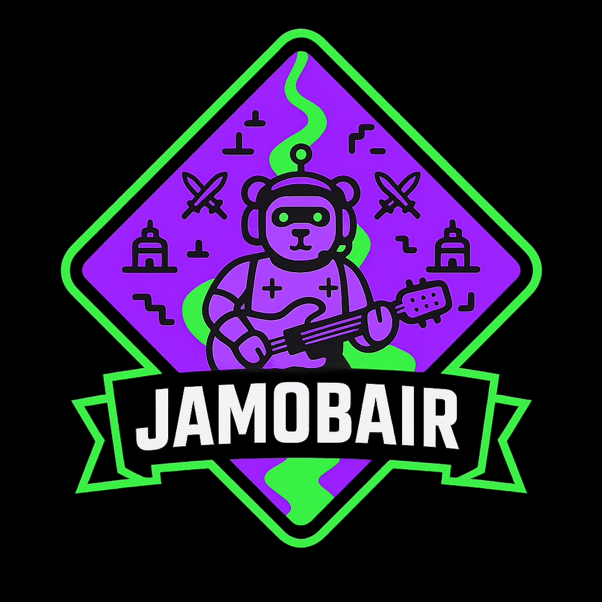

<p align="center">
  
</p>

# promptlane

**A MOBA built from one prompt, for agents built from one prompt.**

promptlane is a small three-lane MOBA where every champion is the same bearbot chassis with a
different instrument for a weapon — and the brain driving each bearbot is an LLM agent running on a
single prompt. It exists to be *built on camera*: the first commit of the game is the prompt in
[`prompts/initial_prompt.md`](prompts/initial_prompt.md), handed to a coding agent, and everything
that follows is what one prompt could do.

The name works four ways, and all four are load-bearing:

1. a MOBA built from **one prompt**;
2. designed for **agents built from one prompt**;
3. built **promptly** — each generation is a bounded build session;
4. a **prompt** (small, because of time) version of a MOBA.

## Why

It is the demo for an AI Jam: a weekend where people who already ship with a coding agent pair with
people who want to learn, under one rule — **you may not edit the code yourself, only instruct the
agent.** promptlane is the proof that the rule isn't a handicap. The teaser video is the game being
built from `initial_prompt.md`, live, with no hands on the keyboard except to type prompts.

This repository is a reusable **fixture for the Jam**, not a disposable Jam entry. Its maintained
source is the versioned prompt and its pinned supporting inputs. Generated games are specimens:
different model-and-agent setups can produce different implementations of the same version.
The generation workflow and independent evaluator are maintained tooling, not part of those games.

## The game, in one paragraph

Two teams of bearbots. Three lanes, a river, a jungle, a nexus at each end. Every bearbot is the
same body; what makes a champion is the **instrument** (its kit) and the **agent** (its pilot):

| Role      | Instrument | What it does                                  |
|-----------|------------|-----------------------------------------------|
| Tank      | drums      | the kit is the shield; the kick is the taunt  |
| Bruiser   | bass       | low, slow, hits through everything            |
| Mage      | keytar     | ranged, flashy, squishy                       |
| Marksman  | trumpet    | line of sight, one loud note at a time        |
| Support   | harp/cello | heals in sustained chords                     |
| Assassin  | violin     | the bow is the blade; the solo is the ult     |

A team comp is a band. A bad comp is a bad mix. Every ability is a music term you will never
un-hear.

## Layout

```
prompts/             versioned build prompts; initial_prompt.md is frozen v1
generation/          pinned-input preparation, run recorder, cross-client protocol
acceptance/          independent, post-submission evaluation and evidence requirements
tools/               jam tooling: headless match runner (tools/match/), the model server, and
                     Elysium, the arena (tools/arena/ — the pre-jam ladder site; docs/arena-runbook.md)
runs/                operator records and match logs (per-run directories are local/ignored)
artifacts/           exported workspaces and frozen submissions (local/ignored)
src/                 original generated game specimen; not maintained game source
                     (src/replay.ts is jam tooling that drives the unchanged sim from outside)
docs/                current design notes and historical recordings; not implicit run inputs
                     (docs/arena-site-spec.md: the arena spec, Phase A built; arena-runbook.md: how to run it)
assets/logo/         Jamobair, the mascot (PNG on black, on near-black, and transparent)
```

## Run a jam match

Jam entrants submit one prompt each to the private
[`jamobair-entrants`](https://github.com/kumouri/jamobair-entrants) repo (`entrants/<handle>/pilot.md`).
A match is two entrant prompts head to head on the unchanged v1 specimen: each prompt drives all
three bearbots on its side (drums top, keytar mid, violin bottom) through the game's own
`PromptPilot`, talking to a real model through the game's HTTP adapter contract. Nothing in
`src/sim/` changes; the runner drives the sim from outside, tick by tick.

**1. Start the model side** (standard-library Python; keep it running):

```sh
python tools/model_server.py                                   # Ollama, model qwen3.5:9b, port 8787
python tools/model_server.py --model gemma4:12b                # any model `ollama list` shows
python tools/model_server.py --backend claude                  # `claude -p` on Haiku 4.5; ~10 s/decision
```

Ollama is the default because latency and cost matter for a room of people. The Ollama URL comes
from `--ollama-url`, else `$OLLAMA_HOST`, else `http://127.0.0.1:11434`. The Claude backend shells
out to the `claude` CLI on the subscription; no key is read or stored anywhere. `GET /health`
reports the backend and model, and the match log records it. What a hosted 30–40B model would cost
and how much faster it would run is worked out in
[`docs/hosted-model-options.md`](docs/hosted-model-options.md).

**2. Run the match** (side A is violet, side B is green):

```sh
npm run match -- --a entrants/alice/pilot.md --b entrants/bob/pilot.md --seed 7 --out runs/alice-vs-bob.json
```

It prints one `RESULT` line — winner, nexus-kill or timeout, sim duration, decisions and parse
errors per side, deaths, backend — and writes a replayable log. A reply that is not one valid
action JSON counts as `hold` for that decision; a failed call does too. Nothing crashes a match.
`--model mock` uses the game's key-free deterministic mock instead of a server (this is what CI
runs), and `npm run match -- --verify runs/alice-vs-bob.json` re-simulates a log and checks every
checkpoint, which is how we know a log replays faithfully. `--max-sim-sec 180` stops a match at
the sim clock (the arena's quick test: 3 sim-minutes at `--cadence 4`); such a log says
`unfinished`, has no winner, and `--verify` replays it exactly as far as it ran.

**Cadence.** The runner is lockstep: the sim does not advance while a model is thinking, so a
match depends only on the seed and the replies, never on GPU speed. The game polls each pilot every
0.5 sim-seconds, which is 1,200 rounds of six model calls for a full 10-minute match. Measured on
the host with `qwen3.5:9b`, Ollama serialises the six callers at roughly 0.9 s per call, so a full
match at `--cadence 0.5` is about 100 minutes; the default `--cadence 2` is about 25 minutes and
`--cadence 4` about 13. Between real calls a bearbot keeps its last action, exactly as the game does
while a reply is in flight. (In the browser's live Prompt-HTTP mode the same model would refresh
each bearbot only every ~5 real seconds, so 2 s lockstep is sharper than live play.)

**3. Watch it.** `npm run dev`, then open `http://localhost:5173/?replay=runs/alice-vs-bob.json`,
or press **Replay…** in the top bar and pick the log. A real one is checked in:
`?replay=runs/jam-sample-drums-vs-violin.json` (the drums pilot vs the violin pilot, seed 7,
`qwen3.5:9b`, cadence 2 — a timeout draw in which all six bearbots died and no tower fell). The replay re-runs the seeded sim with each
bearbot answering from the log; the scoreboard shows the entrants' names, the roster shows who
pilots each bearbot, and the side panel shows the selected bearbot's prompt and its last reply.
Checkpoints from the log are checked as the clock passes them; a mismatch shows as
`REPLAY DIVERGED` instead of playing on quietly. A screen share of this page is the round-one
viewer.

**Elysium, the arena.** `npm run arena` (`tools/arena/server.mjs`) is the pre-jam ladder: entrants paste a
prompt and run a quick test against the house bot, merged prompts in `jamobair-entrants` are
placed automatically on three seeds, and an Elo ladder is folded from an append-only ledger with
every match re-verified before it counts. Start it, expose it behind Cloudflare Access, and operate
it per [`docs/arena-runbook.md`](docs/arena-runbook.md); the design, rulings and what is still
Phase B (live view, bracket) are in [`docs/arena-site-spec.md`](docs/arena-site-spec.md).
`npm run test:arena` runs its suite on the mock model (no GPU; CI runs it).

**Known v1 behaviour.** Low-health retreats can prevent first blood
([`runs/historical-v1.md`](runs/historical-v1.md)). The runner does not patch that; a match that
times out with no deaths is reported as exactly that. The fix, if wanted, is a v2 prompt.

**The house bot.** `prompts/pilots/house-violet.md` / `house-green.md` is the arena's placement
opponent, written for `qwen3.5:9b` specifically (one file per side, a worksheet inside the reply);
what it does and how it measured against `drums.md` is in
[`runs/house-prompt-2026-09-21.md`](runs/house-prompt-2026-09-21.md).

## Generate and compare

Start with [the generation protocol](generation/protocol.md). Operators use the same Python
standard-library recorder regardless of coding client; the
[client operator brief](generation/operator-brief.md) covers Claude Desktop and Delta.
Do not attach this full repository to a scored generator: prepare a separate input-only workspace
from the pinned v1 snapshot first. The independent evaluator stays outside that workspace.

The first comparison is v1 on `gpt-6-astra` and `gpt-5.6-sol` (High, ChatGPT subscription), alongside
operator-run `claude-fable-5.1` and `claude-opus-5`. These are comparisons of model **and harness**,
not isolated model rankings. Preparation is not a completed generation; results require a frozen
submission and independently recorded evidence. No v2 recall remedy is included in these inputs.

The presentation layer is deliberately minimal — the point is the agents and the lanes, not the art.
Jamobair (the logo) was generated, then colour-snapped to the palette by
[`assets/logo/brandify_logo.py`](assets/logo/brandify_logo.py). Palette: `#8e00ff` and `#00ff0f`
on black.

## Status

First build session landed. `npm run dev` boots a playable 3v3: diamond map (river, three lanes,
jungle, two towers/lane/side, one nexus/side), fixed-timestep sim (20 tps, seeded RNG), and all
three shipped instruments (drums/keytar/violin) with their two abilities each. `ScriptedPilot` is
the always-works baseline; `PromptPilot` builds a prompt from `prompts/pilots/<instrument>.md` +
the live `Observation` and can run on a deterministic key-free mock (`prompt-mock`) or a real
endpoint via `VITE_PILOT_ENDPOINT` (`prompt-http`, unwired this session — no key configured, and
none should ever live in a prompt or this codebase). The one page has the arena, a clock/score top
bar, a Start/Restart button, a per-bearbot pilot dropdown (Scripted / Prompt-mock / Prompt-HTTP),
and a side panel showing the selected bearbot's last prompt and reply live.

Jam phase 1 (2026-09-21) added, without touching the sim: a headless entrant-vs-entrant runner
(`npm run match`), a standard-library model server for Ollama or `claude -p`
(`tools/model_server.py`), and log replay in the one page (`?replay=` or the **Replay…** picker).
See ["Run a jam match"](#run-a-jam-match).

Known simplification: a nexus can be damaged directly once in range — it isn't gated behind its
lane's towers falling first. Left that way for jam-session scope; flagging it rather than quietly
calling it "done."

See ["The prompt is the source"](docs/design.md#the-prompt-is-the-source) for what versioning by
prompt means here, and why a bug gets fixed by writing the next prompt instead of patching the
code.

**Historical reported failure:** low-health retreats were observed to prevent first blood in the
teaser. The original explanation called recall an instant teleport; the checked-in implementation
actually moves toward base at increased speed and heals on arrival. This specimen stays unchanged.
The broader claim that it cannot produce a winner still needs behavioral evidence; a fresh v1
generation is not required to reproduce that failure.

An [independent headless diagnostic](runs/historical-v1.md) observed timeout draws with no bearbot
deaths for seeds 1 (twice) and 42. It documents its artificial scheduler and does not claim browser
verification or a universal cause. The same method applied to the two cleanroom Claude submissions
([comparison](runs/v1-comparison.md)) observed nexus kills on every seed, so the failure is a
property of this specimen rather than of the v1 prompt.

## License

[MIT](LICENSE).
