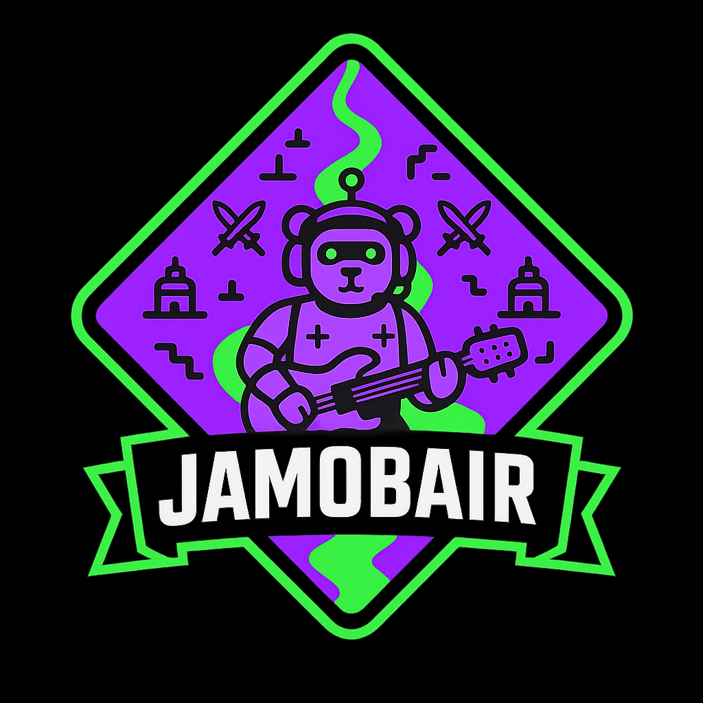

<p align="center">
  
</p>

# promptlane

**A MOBA built from one prompt, for agents built from one prompt.**

promptlane is a small three-lane MOBA where every champion is the same bearbot chassis with a
different instrument for a weapon — and the brain driving each bearbot is an LLM agent running on a
single prompt. It exists to be *built on camera*: the first commit of the game is the prompt in
[`prompts/initial_prompt.md`](prompts/initial_prompt.md), handed to a coding agent, and everything
that follows is what one prompt could do.

The name works four ways, and all four are load-bearing:

1. a MOBA built from **one prompt**;
2. designed for **agents built from one prompt**;
3. built **promptly** — each generation is a bounded build session;
4. a **prompt** (small, because of time) version of a MOBA.

## Why

It is the demo for an AI Jam: a weekend where people who already ship with a coding agent pair with
people who want to learn, under one rule — **you may not edit the code yourself, only instruct the
agent.** promptlane is the proof that the rule isn't a handicap. The teaser video is the game being
built from `initial_prompt.md`, live, with no hands on the keyboard except to type prompts.

This repository is a reusable **fixture for the Jam**, not a disposable Jam entry. Its maintained
source is the versioned prompt and its pinned supporting inputs. Generated games are specimens:
different model-and-agent setups can produce different implementations of the same version.
The generation workflow and independent evaluator are maintained tooling, not part of those games.

## The game, in one paragraph

Two teams of bearbots. Three lanes, a river, a jungle, a nexus at each end. Every bearbot is the
same body; what makes a champion is the **instrument** (its kit) and the **agent** (its pilot):

| Role      | Instrument | What it does                                  |
|-----------|------------|-----------------------------------------------|
| Tank      | drums      | the kit is the shield; the kick is the taunt  |
| Bruiser   | bass       | low, slow, hits through everything            |
| Mage      | keytar     | ranged, flashy, squishy                       |
| Marksman  | trumpet    | line of sight, one loud note at a time        |
| Support   | harp/cello | heals in sustained chords                     |
| Assassin  | violin     | the bow is the blade; the solo is the ult     |

A team comp is a band. A bad comp is a bad mix. Every ability is a music term you will never
un-hear.

## Layout

```
prompts/             versioned build prompts; initial_prompt.md is frozen v1
generation/          pinned-input preparation, run recorder, cross-client protocol
acceptance/          independent, post-submission evaluation and evidence requirements
tools/               jam tooling: headless match runner (tools/match/), the model server,
                     Elysium, the arena (tools/arena/ — the pre-jam ladder site; docs/arena-runbook.md),
                     the Jev tools (tools/jev/ — incl. the entrant compile preview, `npm run compile`;
                     docs/entrant-compile-preview.md), and the house-bot prompt-evolution harness
                     (tools/evolve/, `npm run evolve`; docs/prompt-evolution-spec.md)
runs/                operator records and match logs (per-run directories are local/ignored)
artifacts/           exported workspaces and frozen submissions (local/ignored)
src/                 original generated game specimen; not maintained game source
                     (src/replay.ts, src/live.ts, src/mapVariant.ts, src/economy.ts, src/objective.ts,
                     src/recall.ts, src/ruleset/ and src/attribution.ts are jam tooling that drive the
                     unchanged sim from outside; src/render.ts is a pure read of match state, not frozen, and is actively
                     maintained — see docs/render-spec.md)
docs/                current design notes and historical recordings; not implicit run inputs
                     (docs/arena-site-spec.md: the arena spec, Phases A+B built; arena-runbook.md: how to run it;
                     render-spec.md: isometric viewer spec — phase 1 (silhouettes, hit/death feedback,
                     live-pacing fix, HUD legibility) and phase 2 (isometric camera, depth sort,
                     elevation) both built; economy-spec.md: gold, levels, items, respawn and a neutral
                     river objective for the Jam, with the Dota 2 / League gold comparison;
                     fewer-draws-spec.md: why matches draw at 10:00, and candidate rules that decide
                     them within the 600 s; presentation-spec.md: what a spectator or entrant can't
                     read from the viewer and site today, and a ranked plan for a better presentation
                     layer, with screenshots and a GPT visual critique under docs/presentation/)
assets/logo/         Jamobair, the mascot (PNG on black, on near-black, and transparent)
assets/favicon/      the bearbot tab icon (SVG, PNG, ICO) and make_favicon.mjs, which draws them
```

## Run a jam match

Jam entrants submit one prompt each to the private
[`jamobair-entrants`](https://github.com/kumouri/jamobair-entrants) repo (`entrants/<handle>/pilot.md`).
A match is two entrant prompts head to head on the unchanged v1 specimen: each prompt drives all
three bearbots on its side (drums top, keytar mid, violin bottom) through the game's own
`PromptPilot`, talking to a real model through the game's HTTP adapter contract. Nothing in
`src/sim/` changes; the runner drives the sim from outside, tick by tick.

**1. Start the model side** (standard-library Python; keep it running):

```sh
python tools/model_server.py                                   # Ollama, model qwen3.5:9b, port 8787
python tools/model_server.py --model gemma4:12b                # any model `ollama list` shows
python tools/model_server.py --backend claude                  # `claude -p` on Haiku 4.5; ~10 s/decision
python tools/model_server.py --backend openrouter --model qwen/qwen3-32b --port 8789 \
    --provider DeepInfra --price-in-per-m 0.08 --price-out-per-m 0.28 --daily-budget-usd 5
```

Ollama is the default because latency and cost matter for a room of people. The Ollama URL comes
from `--ollama-url`, else `$OLLAMA_HOST`, else `http://127.0.0.1:11434`. The Claude backend shells
out to the `claude` CLI on the subscription; no key is read or stored anywhere. The `openrouter`
backend (and the generic `openai` preset for any other OpenAI-compatible host, via `--base-url` and
`--api-key-env`) answers all six pilots in parallel instead of serialising them, at the cost of a
real per-token bill — key from `$OPENROUTER_API_KEY` (never hardcoded, never logged, refuses to
start without it, never falls back to Ollama); what it costs and how much faster it runs is worked
out in [`docs/hosted-model-options.md`](docs/hosted-model-options.md) and proven on a real match in
[`runs/openrouter-phase-c-proof-2026-09-22.md`](runs/openrouter-phase-c-proof-2026-09-22.md).
`GET /health` reports the backend, model and (for a hosted backend) cumulative tokens and cost —
never a key — and the match log records it.

**2. Run the match** (side A is violet, side B is green):

```sh
npm run match -- --a entrants/alice/pilot.md --b entrants/bob/pilot.md --seed 7 --out runs/alice-vs-bob.json
```

It prints one `RESULT` line — winner, nexus-kill or timeout, sim duration, decisions and parse
errors per side, deaths, backend — and writes a replayable log. A reply that is not one valid
action JSON counts as `hold` for that decision; a failed call does too. Nothing crashes a match.
`--model mock` uses the game's key-free deterministic mock instead of a server (this is what CI
runs), and `npm run match -- --verify runs/alice-vs-bob.json` re-simulates a log and checks every
checkpoint, which is how we know a log replays faithfully. `--max-sim-sec 180` stops a match at
the sim clock (the arena's quick test: 3 sim-minutes at `--cadence 4`); such a log says
`unfinished`, has no winner, and `--verify` replays it exactly as far as it ran.
**On Jev, the Jam's shape:** `--a-schemas`/`--b-schemas` (the JSON `tools/jev/compile.py` wrote for
that side's prose) plus `--jev-schema http://127.0.0.1:8797/` (`tools/jev/schema_server.py`) make
that side decide on its compiled rule cascade instead of a chat model; see `tools/match/cli.mjs`.
**Map.** New matches play the PvP map `pvp-1` (towers pulled back so each lane has a stretch no
tower covers; `src/mapVariant.ts`, measured in
[`runs/balance-pvp-2026-09-30.md`](runs/balance-pvp-2026-09-30.md)); `--map v1` plays the specimen
map. The log records its map and `--verify` replays on it; logs without one are specimen-map logs.
**Resolution.** New matches resolve each tick simultaneously: both sides' bearbots and minions act
on the same start-of-step world (`--resolution simultaneous-1`, `src/resolution.ts`). The frozen sim's
own order lets violet act first, which tilted `pvp-1` toward violet
([`runs/side-fairness-2026-10-01.md`](runs/side-fairness-2026-10-01.md)). `--resolution sequential`
plays the old order. The log records the resolution, and a log without one replays sequentially.
**Targeting.** A schema side's targets resolve under `own-lane-1` (`--targeting`,
`tools/jev/target_resolve.py`). From its own fountain, "the nearest allied minion" sends a bot to the
start of its own lane, and a near-tie between targets breaks the same way for both sides. Before, the
fountain's three-way tie went to float noise and sent green's bots up the top lane
([`runs/bandstand-4-2026-10-01.md`](runs/bandstand-4-2026-10-01.md)). `--targeting first-min` plays the
old rule. The log records the rule; a log without one played `first-min`.
**Economy.** `--economy eco-2` plays the Jam economy: respawn, gold, levels, four items and a shop
at base (`src/economy.ts`, every number in `src/economy/eco-2.json`; the design is
`docs/economy-spec.md`). `eco-3` is the spec's one tuning pass on it (§13.6: 100 start gold, a
smaller kill bounty), the candidate for the Jam. `eco-1` is P1's starting values, kept so older runs reproduce. It is off
by default until the Sun 10-04 go/no-go. Under an economy, `house:<tier>` plays that tier's
economy-aware version (`prompts/pilots/README.md`). A schema side buys the
shopping list its prose compiled to (`build`), else its instrument's default. The log records the
whole ruleset and every bot's list, and `--verify` replays with it; logs without one have no economy.
**River objective.** `--objective river-1` plays the Bandstand: a neutral stage that alternates
between two river sites, taken by holding it (any enemy on it freezes the capture), paying the team a
45 s Encore buff, plus gold and XP when the economy is on (`src/objective.ts`, every number in
`src/objective/river-1.json`; the design is `docs/economy-spec.md` §9). It is off by default until its
own Sun 10-04 go/no-go. The log records the ruleset and every opening; logs without one have none.
`--objective river-2` is Ceryce's redesign after `river-1` stalemated on Jev (§9.10): sets of
7.5 / 5 / 2.5 s, the bigger group pushes the other team's progress down, and an untaken stage closes
after 30–45 s (`src/objective/river-2.json`).
**Recall.** `--recall recall-2` replaces the specimen's recall (a run home at 3× speed) with a 4 s
channel standing still, then a teleport to the fountain; damage in its first 3.5 s cancels it
(`src/recall.ts`, numbers in `src/recall/recall-2.json`, design in `docs/economy-spec.md` §9.10).
Off by default. The log records it, `--verify` replays with it, and logs without one keep the
specimen's recall.
**Finale.** `--finale final-chorus-1` plays the Final Chorus: a team ahead on towers at 8:00 wins on
the spot; if towers are level, the last two minutes are sudden death, structures take ×3 damage and
the first tower to fall wins (`src/finale.ts`, numbers in `src/finale/final-chorus-1.json`, design and
measurement plan in `docs/fewer-draws-spec.md`). Nothing gets longer than 600 s. Off by default. The
result says why a match ended (`by=chorus-lead`, `by=sudden-death`, as well as `nexus-kill` and
`timeout`), the log records the rule, `--verify` replays with it, and logs without one play to 10:00.
Measured on Jev in [`runs/final-chorus-2026-10-01.md`](runs/final-chorus-2026-10-01.md).
**Metrics.** `npm run metrics -- --group <label> <log.json>… [--group …] --md out.md --heatmaps pfx`
replays logs and reports how they were played: PvP vs PvE damage and time, team fights, team
proximity, where fights and deaths happen relative to towers, a gold proxy and its swinginess,
first blood / first tower, per-bot numbers vs the others in their position, position heatmaps, and
seed-paired differences against the first group (`tools/match/metrics.ts` has the definitions).
Logs played with the river objective add the Bandstand's numbers (openings, captures, contested
share, team fights at an open Bandstand, capture split, Encore uptime) and its sites on the
heatmaps. Every log reports its recalls (started, got home, interrupted, share of bot-time spent
recalling), under either recall rule; logs with a finale add how many it ended at 8:00 and in
sudden death; `--prereg bandstand` appends the pre-registered verdict of
[`docs/economy-spec.md`](docs/economy-spec.md) §9.8, the first group read as P and each later one as O.

**Cadence.** The runner is lockstep: the sim does not advance while a model is thinking, so a
match depends only on the seed and the replies, never on GPU speed. The game polls each pilot every
0.5 sim-seconds, which is 1,200 rounds of six model calls for a full 10-minute match. Measured on
the host with `qwen3.5:9b`, Ollama serialises the six callers at roughly 0.9 s per call, so a full
match at `--cadence 0.5` is about 100 minutes; the default `--cadence 2` is about 25 minutes and
`--cadence 4` about 13. Between real calls a bearbot keeps its last action, exactly as the game does
while a reply is in flight. (In the browser's live Prompt-HTTP mode the same model would refresh
each bearbot only every ~5 real seconds, so 2 s lockstep is sharper than live play.)

**3. Watch it.** `npm run dev`, then open `http://localhost:5173/?replay=runs/alice-vs-bob.json`,
or press **Replay…** in the top bar and pick the log. A real one is checked in:
`?replay=runs/jam-sample-drums-vs-violin.json` (the drums pilot vs the violin pilot, seed 7,
`qwen3.5:9b`, cadence 2 — a timeout draw in which all six bearbots died and no tower fell). The replay re-runs the seeded sim with each
bearbot answering from the log; the scoreboard shows the entrants' names, the roster shows who
pilots each bearbot, and the side panel shows the selected bearbot's prompt and its last reply.
Checkpoints from the log are checked as the clock passes them; a mismatch shows as
`REPLAY DIVERGED` instead of playing on quietly. `&speed=4` (or the top-bar control: 1×/4×/16×)
plays it faster than real time. The same page watches a match the arena is *still running*:
`?live=<matchId>` (served by the arena as `/play/?live=…`) streams the log as it is written and
steps the sim only up to the last completed round, so the clock runs at the model's pace and a
late joiner catches up in seconds (`src/live.ts`). This same page, opened directly in each
spectator's own browser whenever they choose, *is* the round-one viewer — there is no shared screen.

**Elysium, the arena.** `npm run arena` (`tools/arena/server.mjs`) is the pre-jam ladder and the
jam-day bracket: entrants paste a prompt and run a quick test against the house bot, merged
prompts in `jamobair-entrants` are placed automatically on three seeds, an Elo ladder is folded
from an append-only ledger with every match re-verified before it counts, every match can be
watched live (`/play/?live=<id>`), and the organizer seeds a single-elimination bracket from the
ladder, pre-runs the early rounds, and plays the semis and final live. `/teams` lists every team
with its members, status and standing. On `/team` a team can create itself, take its learner in
by join code, and submit its `pilot.md` from the browser. The arena runs the entrants validator,
then commits the file into `jamobair-entrants`, so the repo stays the one record (runbook §1d).
The ladder plays both sides
on Jev, as the Jam does: entrant prose is compiled once by `tools/jev/compile.py`, and the house
plays its tier's compiled schemas (spec §9). Start it, expose it behind
Cloudflare Access, and operate it — including the jam-day sequence — per
[`docs/arena-runbook.md`](docs/arena-runbook.md); the design and rulings are in
[`docs/arena-site-spec.md`](docs/arena-site-spec.md). `npm run test:arena` runs its suite on the
mock model (no GPU; CI runs it). Making the canvas viewer itself look better is specced in
[`docs/render-spec.md`](docs/render-spec.md): phase 1 (readable creep/tower/nexus/bearbot
silhouettes, per-instrument markers, hit/death/ability feedback, a live-view motion-pacing fix, HUD
legibility) and phase 2 (the isometric 2.5D camera, depth-sorted draw order, elevation, a team-fight
count badge) are both built.

**Known v1 behaviour.** Low-health retreats can prevent first blood
([`runs/historical-v1.md`](runs/historical-v1.md)). The runner does not patch that; a match that
times out with no deaths is reported as exactly that. The fix, if wanted, is a v2 prompt.

**The house bot.** `prompts/pilots/house-violet.md` / `house-green.md` is the arena's placement
opponent, written for `qwen3.5:9b` specifically (one file per side, a worksheet inside the reply);
what it does and how it measured against `drums.md` is in
[`runs/house-prompt-2026-09-21.md`](runs/house-prompt-2026-09-21.md). It is the *medium* of three
strategy tiers (easy / medium / hard, [`prompts/pilots/README.md`](prompts/pilots/README.md));
`npm run match -- --a house:hard --b house` plays any two. On Jev (the arena's ladder) each tier
plays its compiled `prompts/pilots/house-<tier>.schemas.json` instead.

## Generate and compare

Start with [the generation protocol](generation/protocol.md). Operators use the same Python
standard-library recorder regardless of coding client; the
[client operator brief](generation/operator-brief.md) covers Claude Desktop and Delta.
Do not attach this full repository to a scored generator: prepare a separate input-only workspace
from the pinned v1 snapshot first. The independent evaluator stays outside that workspace.

The first comparison is v1 on `gpt-6-astra` and `gpt-5.6-sol` (High, ChatGPT subscription), alongside
operator-run `claude-fable-5.1` and `claude-opus-5`. These are comparisons of model **and harness**,
not isolated model rankings. Preparation is not a completed generation; results require a frozen
submission and independently recorded evidence. No v2 recall remedy is included in these inputs.

The presentation layer is deliberately minimal — the point is the agents and the lanes, not the art.
Jamobair (the logo) was generated, then colour-snapped to the palette by
[`assets/logo/brandify_logo.py`](assets/logo/brandify_logo.py). Palette: `#8e00ff` and `#00ff0f`
on black.

## Status

First build session landed. `npm run dev` boots a playable 3v3: diamond map (river, three lanes,
jungle, two towers/lane/side, one nexus/side), fixed-timestep sim (20 tps, seeded RNG), and all
three shipped instruments (drums/keytar/violin) with their two abilities each. `ScriptedPilot` is
the always-works baseline; `PromptPilot` builds a prompt from `prompts/pilots/<instrument>.md` +
the live `Observation` and can run on a deterministic key-free mock (`prompt-mock`) or a real
endpoint via `VITE_PILOT_ENDPOINT` (`prompt-http`, unwired this session — no key configured, and
none should ever live in a prompt or this codebase). The one page has the arena, a clock/score top
bar, a Start/Restart button, a per-bearbot pilot dropdown (Scripted / Prompt-mock / Prompt-HTTP),
and a side panel showing the selected bearbot's last prompt and reply live.

Jam phase 1 (2026-09-21) added, without touching the sim: a headless entrant-vs-entrant runner
(`npm run match`), a standard-library model server for Ollama or `claude -p`
(`tools/model_server.py`), and log replay in the one page (`?replay=` or the **Replay…** picker).
See ["Run a jam match"](#run-a-jam-match).

Known simplification: a nexus can be damaged directly once in range — it isn't gated behind its
lane's towers falling first. Left that way for jam-session scope; flagging it rather than quietly
calling it "done."

See ["The prompt is the source"](docs/design.md#the-prompt-is-the-source) for what versioning by
prompt means here, and why a bug gets fixed by writing the next prompt instead of patching the
code.

**Historical reported failure:** low-health retreats were observed to prevent first blood in the
teaser. The original explanation called recall an instant teleport; the checked-in implementation
actually moves toward base at increased speed and heals on arrival. This specimen stays unchanged.
The broader claim that it cannot produce a winner still needs behavioral evidence; a fresh v1
generation is not required to reproduce that failure.

An [independent headless diagnostic](runs/historical-v1.md) observed timeout draws with no bearbot
deaths for seeds 1 (twice) and 42. It documents its artificial scheduler and does not claim browser
verification or a universal cause. The same method applied to the two cleanroom Claude submissions
([comparison](runs/v1-comparison.md)) observed nexus kills on every seed, so the failure is a
property of this specimen rather than of the v1 prompt.

## License

[MIT](LICENSE).
