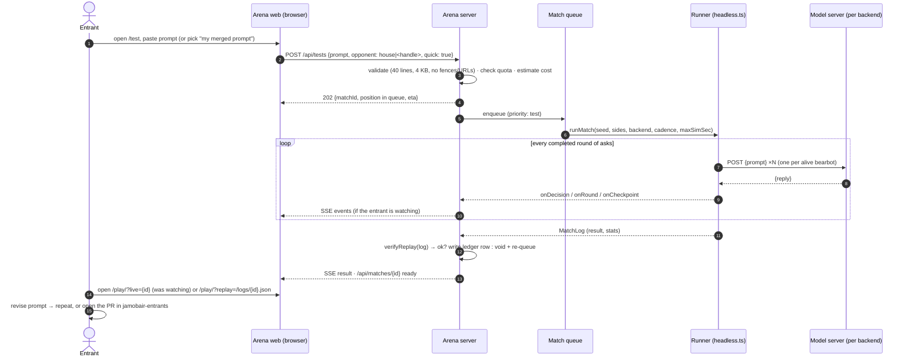
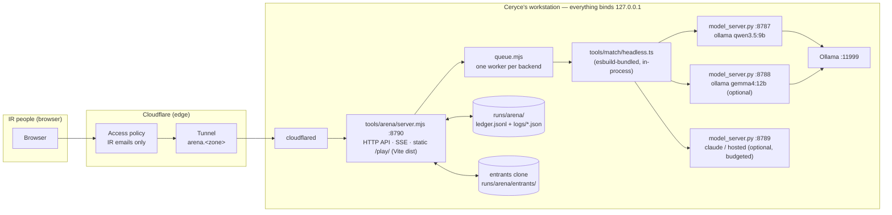

# promptlane ARENA — website spec

**Status: PHASE A BUILT — 2026-09-22.** Markdown is canonical. Written 2026-09-21 for the
InRhythm AI Jam round one (Fri 2026-10-02, IR-only; entrant cutoff Thu 2026-10-01 17:00 CT).
Phase A (§6, the ladder) is checked in under `tools/arena/` and runs on the mock in CI; how to
start it, expose it and operate it is [`arena-runbook.md`](arena-runbook.md). Phases B and C
are still proposals: in §3 every path marked *new* that is not in the §6 "Phase A — as built"
list does not exist yet.

Read with: [`../README.md`](../README.md) ("Run a jam match"), [`design.md`](design.md),
[`../tools/match/`](../tools/match/), [`../tools/model_server.py`](../tools/model_server.py),
[`../src/replay.ts`](../src/replay.ts), the private
[`jamobair-entrants`](https://github.com/kumouri/jamobair-entrants) README.

---

## 1. Purpose

The site is the **arena, not the form**. Ceryce's words (Notion task "Jamobair/promptlane
website", 2026-09-20 23:13/23:14 CT):

> "Submit agents, set up tournaments, explain the thing, link to repo, blah blah blah."

The four reasons that define what gets built, verbatim:

1. **"live match viewing"**
2. **"a bracket"**
3. **"a leaderboard"**
4. **"LIVE-TESTING your prompt against others before the jam"**

Everything else on the site (the explainer, the repo link, the submit instructions) is a paragraph
and a hyperlink. The four reasons are the product. The accepted scope sketch:

1. a hosted arena server running matches on demand;
2. an entrant uploads a prompt and queues a test match vs the house bot or another entrant;
3. match logs → bracket + leaderboard;
4. the spectator page **is** promptlane's own canvas UI (replay and live).

What already exists and is reused wholesale: the headless runner (`npm run match`), the model
server, the replayable match-log schema, and the one-page canvas UI with `?replay=`. The arena is
the *scheduler and the front door* for those; it does not re-implement any of them.

Hard constraints carried from phase 1:

- `src/sim/`, `src/rng.ts`, `src/pilots/`, `src/types.ts`, `src/render.ts` are the frozen v1
  specimen. The arena drives the sim from outside exactly as `tools/match/headless.ts` does.
  `src/main.ts` and the additive `src/replay.ts` are jam tooling and may change.
- The model backend is a **per-tournament setting with a cost/latency budget**, not a constant. A
  sibling job is benchmarking local 12–27B models and pricing hosted 30–40B ones; this spec must not
  bake `qwen3.5:9b` in anywhere but a default.
- Matches are lockstep and seeded, so a log replays bit-for-bit (§5.5). The arena never counts a
  log toward standings until it has re-simulated it.

---

## 2. Users and flows

Three roles. In the IR-only round, all three are InRhythm people; the roles are about what the
page lets you *do*, not who you are.

| Role | Who | Can |
|---|---|---|
| **Entrant** | someone with a merged `entrants/<handle>/pilot.md` (or about to have one) | submit a scratch prompt, queue a test match, watch their own and anyone's matches, see the ladder |
| **Organizer** | Ceryce | everything an entrant can, plus: create/edit a tournament, choose its backend and budget, seed the bracket, run a round, pause/resume the queue, void or re-run a match, rule on a tie |
| **Spectator** | an IR coworker with the link | watch live and replay, see the bracket and ladder |

### 2.1 Entrant: submit → test → watch

The *official* prompt is the one merged into `jamobair-entrants` (that repo's validator CI is the
gate; see §3.2). The arena adds a **scratch** path so an entrant can iterate on a prompt in minutes
without a PR round-trip: paste text, run a test, read the result, then open the PR when it is good.



Rules the diagram hides:

- A **scratch** prompt is never ranked and never stored past the match log that used it (the log
  keeps `promptText`, as it does today, so a replay still shows what was played). The ledger row
  is marked `scratch: true` and excluded from ratings.
- A **merged** prompt is fetched from the entrants repo by the arena (§3.2). When the arena sees a
  new content hash for `entrants/<handle>/pilot.md`, it queues the ladder placement matches
  automatically (§3.5). The entrant does nothing but merge.
- "Test vs another entrant" uses that entrant's *merged* prompt, never their scratch text.
- `quick: true` runs 3 sim-minutes at cadence 4 (~4 wall-minutes on the 9b model); `quick: false`
  is a full 10-minute match (~25 wall-minutes at cadence 2). Quick tests are the default and the
  quota is per kind (§5.2).

### 2.2 Organizer: create tournament → seed → run round → pause

```mermaid
sequenceDiagram
    autonumber
    actor O as Organizer (Ceryce)
    participant W as Arena web (/admin)
    participant A as Arena server
    participant P as Prompt store (entrants clone)
    participant Q as Match queue
    participant L as Ledger

    O->>W: New tournament {name, kind: ladder|bracket, backend, cadence, seeds, budget}
    W->>A: POST /api/tournaments
    A->>P: sync entrants repo (git fetch; hash every pilot.md)
    A-->>W: tournament + roster (handles with a merged prompt)
    O->>W: Seed bracket from ladder (top seed vs bottom, byes to top seeds)
    W->>A: POST /api/tournaments/{t}/bracket {seeding: ladder}
    A->>L: read Elo standings → write bracket rounds
    O->>W: Run round 1
    W->>A: POST /api/tournaments/{t}/rounds/1/run
    A->>Q: enqueue every round-1 match (priority: bracket)
    Note over Q: one worker per backend; bracket > placement > test
    O->>W: Pause
    W->>A: POST /api/queue/pause
    Note over Q: in-flight match finishes; nothing new starts
    O->>W: Resume · Void match · Re-run with seed N · Rule tie
    W->>A: POST /api/queue/resume · /api/matches/{id}/void · /api/matches/{id}/rerun · /api/matches/{id}/ruling
    A->>L: append (never edit) a ruling row; bracket re-derives
```

Every organizer action is an appended ledger row (§3.3), so the bracket page is always a pure
function of the ledger and a wrong click is undone by another row, not by editing history.

### 2.3 Spectator: live and replay

```mermaid
sequenceDiagram
    autonumber
    actor S as Spectator
    participant W as Canvas page (/play/, src/main.ts + src/live.ts)
    participant A as Arena server

    S->>W: open /bracket → click a match → /play/?live={id}
    W->>A: GET /api/matches/{id}/events (SSE, Last-Event-ID: 0)
    A-->>W: backlog: every decision/round/checkpoint so far, then live tail
    loop as events arrive
        W->>W: feed ReplayPilot buffers · step sim to the last completed round tick
        W->>W: compare checkpointOf(match) at each checkpoint tick → "REPLAY DIVERGED" if not equal
    end
    A-->>W: result event
    W->>W: "<HANDLE> WINS (nexus|timeout)" exactly as today
    S->>W: later: /play/?replay=/logs/{id}.json (finished log; speed 1×/4×/16×)
```

The live viewer is a **replay whose log is still being written**. Because the runner is lockstep,
the browser can only ever be *behind* the server, never ahead, so it steps the sim only up to the
last tick for which every decision has arrived. Lag is one round of asks (0.5 sim-seconds).

---

## 3. Architecture

### 3.0 Stack, in one picture

The smallest thing that runs on Ceryce's workstation (Windows 10, RTX 4090, Ollama at
`127.0.0.1:11999`) and is reachable to IR through a Cloudflare Tunnel.



- **One Node process** (`tools/arena/server.mjs`, Node ≥ 20 to match CI; the host has 26) using
  only `node:http`, `node:fs`, `node:crypto`, `node:child_process` and the `esbuild` dev-dependency
  the runner already needs. No framework, no database server, no new npm dependency. Static pages
  are server-rendered HTML in the brand palette (`#8e00ff` / `#00ff0f` on black); the canvas page is
  the existing Vite build served under `/play/`.
- **One `model_server.py` per backend**, started by the organizer (or by the arena as child
  processes from `config.json`; recommended so `/health` and the port are never guessed). The
  runner already records `/health` into every log, so which model played is always in the record.
- **Storage is files**: an append-only JSONL ledger and one match-log JSON per match under
  `runs/arena/` (already gitignored via `/runs/*/`). A 10-minute match is ~230 KB; a jam of 200
  matches is ~50 MB. Standings are derived in memory at startup by folding the ledger.
- **Tunnel rule** (from margo's cockpit spec): everything binds `127.0.0.1` until exposed
  deliberately. The only listener the tunnel points at is `:8790`. The model servers, Ollama, and
  the Vite dev server are never tunnelled. Consequence the code must respect: once tunnelled, a
  request arriving from loopback is *not* trusted as the organizer — `cloudflared` itself connects
  from loopback. Role comes from the Access JWT only (§4), with an explicit `--dev-user <email>`
  flag for local development that is refused whenever `ARENA_ACCESS_AUD` is set (as built).

Why not Python for the arena (the model server is Python)? The runner is TypeScript bundled by
esbuild and the live stream needs per-decision callbacks *in-process*; spawning `cli.mjs` per match
and tailing stdout would work but would lose the callbacks and add a parsing layer. Node in-process
reuses `headless.ts` directly. Python stays where it is: the model side.

Why not Cloudflare Workers / D1 / Durable Objects? The GPU is on the workstation; the arena must be
where the runner is. A Worker could front the ledger for Phase C (public, read-only), but for the jam
it is an extra deploy for nothing. Revisit in Phase C.

### 3.1 Match orchestrator (queue)

`tools/arena/queue.mjs` — *new*.

- **One worker per backend.** Ollama serialises concurrent requests (measured: six callers ≈ 0.9 s
  per call throughput), so two matches on the same Ollama backend would each run at half speed and
  gain nothing. A backend entry in config carries `concurrency` (default 1; a hosted API backend can
  set 4). `OLLAMA_NUM_PARALLEL` may change the Ollama picture — that is a question for the benchmark
  job, and if it pays off it is a one-line config change here, not a design change.
- **Priority classes**, highest first: `organizer` (re-runs, rulings), `bracket`, `placement`
  (ladder matches auto-queued on a merged prompt change), `test` (entrant scratch tests). Within a
  class, FIFO. A running match is never pre-empted; `pause` stops new starts.
- **A job** is `{id, tournamentId, kind, sides: {violet: PromptRef, green: PromptRef}, seed,
  backendId, cadenceSec, maxSimSec, requestedBy, priority, createdAt}`. `PromptRef` is either
  `{handle, hash}` (merged prompt at a content hash, resolved from the entrants clone) or
  `{scratch: true, text, submittedBy}`.
- **Runs** by importing `headless.ts` through the same esbuild bundle `cli.mjs` builds today
  (`loadHeadless()` moves into `tools/match/load.mjs` — *small change* — so both the CLI and the
  arena import it). `runMatch` gains three **additive** options in `RunOptions`:
  `onDecision(decision)`, `onRound({tick, asks})` (fired when a tick's asks have all settled — the
  point where `inflight` empties), and `maxSimSec` (quick tests; a log stopped early keeps
  `endReason: null`, which `resultLine` already prints as `unfinished`). Nothing about the sim or
  the log schema changes.
- **Wall-clock cap** per job: `3 × expected` where expected = rounds × asks × backend `avgSec`
  (from `/health`). Past the cap the worker aborts the call adapter (the `AbortSignal` in
  `httpCallModel`), the log is written with `endReason: null`, and the job is marked `timed-out`;
  it is not re-queued automatically.
- **After the run**: `verifyReplay(log)` (exists in `headless.ts`). `ok` → write the log to
  `runs/arena/logs/<id>.json` and append a `match` row to the ledger. Not ok → write the log as
  `<id>.diverged.json`, append a `void` row with the divergence tick, and re-queue once. A diverged
  log today means a changed sim or a bug; the arena refuses to count it.
- **Crash recovery**: the queue is itself persisted as ledger rows (`queued`, `started`,
  `finished|void|timed-out`). On restart, any `started` without a terminal row is re-queued at the
  same priority; nothing is lost but the wall time.

### 3.2 Prompt store: git-backed vs upload

**Git-backed (the entrants repo is the store).** The arena keeps a clone of
`kumouri/jamobair-entrants` at `runs/arena/entrants/` and syncs `main` every 60 s (or on a GitHub
webhook — the tunnel makes that possible, but polling is simpler and 60 s is fine).

- For: one source of truth; the validator CI (`tools/validate_entry.py`: 40 lines, 4 KB, no
  fences, no URLs, handle pattern) already gates it; "merged by cutoff plays" is already the rule in
  the entrants README; every prompt revision is a commit with an author, so identity and audit come
  free; the jam-day roster is `git ls-tree`, not a database export.
- Against: iteration goes through a PR (minutes, plus a reviewer if branch protection requires
  one), which defeats reason 4 — you cannot *live-test* at PR speed.

**Upload (the arena is the store).** Entrants paste text into the site; the arena validates and
stores it under the authenticated handle.

- For: seconds per iteration; no git knowledge needed (the IR audience includes people learning to
  work with agents, not necessarily git users).
- Against: a second source of truth that will drift from the repo unless the arena also *writes*
  the repo (a bot committing on entrants' behalf — more machinery, and it moves the validator
  gate out of CI where everyone can see it); the cutoff rule becomes "whatever the arena had at
  17:00", which lives on one workstation; identity has to be built (§4) instead of inherited from
  the PR author.

**Recommendation: git-backed store of record, with scratch uploads that are not a store.** The
merged `pilot.md` is the only thing that is ever ranked, seeded, or bracketed. The `/test` page
accepts pasted text for a *scratch* match (§2.1) that is validated with the same rules, played,
logged, and never persisted anywhere but that one log. This keeps one truth, keeps the CI gate
visible, and still gives reason 4 at paste speed. The cost is a small one: to get *on the ladder*
you have to merge, and the page says so in one line next to the paste box.

Merged-prompt identity is `{handle, sha256(text)}`. The ledger stores the hash on every match row;
the leaderboard shows the record of the *current* hash and the all-time record separately, so a
revised prompt is visibly a revision.

### 3.3 Match-log store and ledger

- `runs/arena/logs/<matchId>.json` — the unchanged `promptlane-match-log-1` schema written by
  `runMatch` (*reused*: `src/replay.ts` `MatchLog`). Served read-only at `/logs/<id>.json` so the
  canvas page's existing `?replay=` fetch works with no change.
- `runs/arena/ledger.jsonl` — append-only, one JSON object per line, `{ts, type, ...}`. Types:
  `tournament`, `backend`, `prompt-seen` (handle, hash, commit), `queued`, `started`, `finished`
  (matchId, sides with hashes, seed, backend, result summary, stats), `void`, `ruling` (matchId,
  winner, reason, by), `bracket` (tournamentId, rounds). Standings, ladder, bracket and queue state
  are all folds over this file. Rotating it is not needed for a jam; if it ever is, a snapshot row
  is the mechanism.
- `matchId` is `<tournament>-<yyyymmdd>-<seq>`, human-readable in a URL and in a Slack message.

### 3.4 Live stream

**SSE, not WebSocket.** The stream is one-directional (server → browser), the API is otherwise
plain request/response, `node:http` does SSE with no library, `EventSource` reconnects on its own
with `Last-Event-ID`, and it passes through Cloudflare Tunnel and Access with nothing to configure.
WebSocket also works through the tunnel but buys nothing here.

`GET /api/matches/<id>/events` emits, with monotonically increasing ids:

| event | payload | source |
|---|---|---|
| `meta` | `{seed, sides (names, promptText), backend, cadenceSec, tickDt, idBase}` | log header |
| `decision` | one `LogDecision` (tick, bot, reply, action, cached, ms) | `onDecision` |
| `round` | `{tick, asks}` — every ask on this tick has been answered | `onRound` |
| `checkpoint` | `{tick, state}` | log checkpoints |
| `death` | `{tick, bot}` | `log.result.deaths` growth |
| `progress` | `{clockSec, calls, elapsedMs}` | `onProgress` (once per sim-minute) |
| `result` | `MatchResult` | end of `runMatch` |

A late joiner receives the whole backlog first (the server keeps the in-progress log in memory; it
*is* the log being built), then the tail. The event stream is exactly the log's own content in
arrival order, so nothing has to be reconciled at the end.

**Browser side — `src/live.ts` (*new*, jam tooling alongside `src/replay.ts`):** builds a `Match`
from `meta` with six `ReplayPilot`s (*reused*) whose decision arrays grow as `decision` events
arrive; drives the sim by calling the private `tick(TICK_DT)` from outside (the same accepted pattern
as `headless.ts` and the acceptance adapters — `Match.start()`'s real-time `setInterval` is not used
for live, because the server's pace is the truth); steps only while `tickOf(match) < lastRoundTick`;
compares `checkpointOf(match)` at every checkpoint tick and shows `REPLAY DIVERGED` exactly as the
replay does; `recordPromptTrace` is called per decision so the side panel shows each bearbot's last
reply as it does today. `src/main.ts` gains `?live=<id>` next to `?replay=` — a small, additive
change in the file phase 1 already touched. The renderer (`src/render.ts`) is untouched.

Two consequences worth stating on the page: the live clock runs at the model's pace (about 2.5×
slower than real time on the 9b model at cadence 2 — an honest "live"), and a replay of a finished
log can run faster than real time (a `speed` control: 1×/4×/16×, stepping N ticks per frame — the
same external-tick driver, so this is one function, not two).

### 3.5 Bracket and leaderboard

**Pre-jam ladder: Elo.** Swiss needs synchronised rounds over a fixed roster; the pre-jam period
is asynchronous — entrants merge on different days, revise, and queue tests at odd hours. Elo
handles a match whenever it happens and a roster that changes.

- Start 1000, K = 32, draw = 0.5. Both sides of every non-scratch match update.
- **Placement.** When a merged prompt's hash first appears, the arena queues it against the house
  bot (`prompts/pilots/drums.md`, *reused*, rated as a fixed 1000 that never updates) on three
  fixed seeds (7, 11, 42), alternating sides (violet, green, violet). Everyone gets the same three
  placements, so the ladder is comparable even before anyone plays anyone.
- **Challenges.** An entrant's test "vs `<handle>`" using *their own merged prompt* (not scratch)
  counts for Elo. Scratch tests never count. Placement and challenge matches both use the
  tournament's backend and cadence (default: `qwen3.5:9b`, cadence 2, full 10 minutes) — the
  ladder's currency is the real match, quick tests are for iteration only.
- **Revision.** A new hash keeps the entrant's Elo (rewards iterating) but re-runs the three
  placements, and the leaderboard shows "current prompt: W-D-L" beside the rating. (Ceryce may
  prefer a reset — §7 Q5.)
- **Leaderboard columns**: rank, handle, Elo, current-prompt W-D-L, all-time W-D-L, nexus kills,
  timeout wins, draws, avg parse-error rate (a prompt that the model cannot answer is visible as
  such), last match link.

**Jam day: single elimination, seeded by ladder Elo.** Top seed vs bottom seed, byes to the top
seeds when N is not a power of two, one match per pairing. Round robin is fairer but costs
N(N−1)/2 matches; at ~25 wall-minutes each and one at a time on one Ollama backend, 12 entrants is
27 hours. Single-elim with 16 is 15 matches ≈ 6.5 hours at cadence 2 — **still too long for a jam
day.** Two levers, both in the tournament config: (a) `cadence 4` (≈13 min per match, the README's
own measurement) and (b) **pre-run rounds 1–2 Thursday night after the cutoff** and replay them at
4× on the day, with semis and the final genuinely live. With a hosted backend at `concurrency 4`
the early rounds also run in parallel; that is the cost/latency trade the per-tournament backend
setting exists for.

**Tie rules.** The sim already breaks a 10-minute timeout by towers standing, then nexus hp
(`src/sim/match.ts` `decideByTiebreak`); a `winner: null` means both were equal, which phase 1
observed when nobody lost a tower. The arena's order for a bracket match with `winner: null`:

1. fewer deaths (`result.stats.<team>.deaths`);
2. more total tower hp remaining (from the final checkpoint's `t` array — the log has it);
3. fewer parse+call errors (the prompt the model could actually follow);
4. the higher ladder seed advances;

and if it is still level — the seeds are integers, so (4) cannot be — the organizer's `ruling` row
decides. A re-run on a new seed is always available to the organizer but costs a full match of
wall time, so it is a button, not the default. Ladder (Elo) draws are simply draws.

### 3.6 Reuse-first: exact file map

| Path | Status | Role in the arena |
|---|---|---|
| `tools/match/headless.ts` | **reused, additive change (A: done)** | `runMatch` + `verifyReplay`; Phase A added `maxSimSec` and `signal` (wall cap) to `RunOptions`, and `verifyReplay` stops at the logged tick count for an unfinished log. `onDecision`/`onRound` are Phase B |
| `tools/match/cli.mjs` | **reused, small change (A: done)** | `loadHeadless()` and the HTTP/result helpers moved to `tools/match/load.mjs`; CLI behaviour unchanged |
| `tools/match/load.mjs` | *built (A)* | the esbuild loader (bundled once per process), `httpCallModel`, `probeBackend`, `resultLine` |
| `tools/model_server.py` | **reused unchanged** (Phase A/B) | one process per backend; `/health` recorded in every log. Phase C option: `--backend openai` (OpenAI-compatible hosted endpoint, key from env) |
| `src/replay.ts` | **reused unchanged** | `MatchLog`, `ReplayPilot`, `checkpointOf`, `JAM_ROSTER`, `decisionsByBot` |
| `src/main.ts` | **reused, additive change** | `?live=<id>` mode and replay speed control |
| `src/live.ts` | *new* | external-tick driver for live and fast replay; SSE client |
| `src/style.css` | reused, tiny change | speed control and live badge |
| `src/sim/*`, `src/rng.ts`, `src/pilots/*`, `src/types.ts`, `src/render.ts` | **frozen, untouched** | the specimen |
| `prompts/pilots/drums.md` | **reused unchanged** | the house bot |
| `runs/` (`/runs/*/` ignored) | **reused layout** | `runs/arena/{ledger.jsonl,logs/,entrants/}` |
| `tools/arena/server.mjs` | *built (A)* | HTTP API, static pages, Access JWT check, entrants poller, serves Vite `dist/` at `/play/` and logs at `/logs/`. SSE is Phase B |
| `tools/arena/queue.mjs` | *built (A)* | priority queue, one worker per backend, wall cap, verify-then-commit, crash recovery |
| `tools/arena/ledger.mjs` | *built (A)* | append + fold (claims, prompt index, queue state, quota, standings). Bracket fold is Phase B |
| `tools/arena/rating.mjs` | *built (A: Elo + placements)* | Elo, placement scheduling. Single-elim bracket + tie order are Phase B |
| `tools/arena/prompts.mjs` | *built (A)* | entrants sync by `gh api` (tree walk on `main`, blobs fetched once), content-addressed cache under `runs/arena/prompts/`, scratch validation (port of `validate_entry.py` rules) |
| `tools/arena/auth.mjs` | *built (A)* | Cloudflare Access JWT verification (`node:crypto`, JWKS from `<team>.cloudflareaccess.com/cdn-cgi/access/certs`); the claim table is `claim` ledger rows |
| `tools/arena/pages/*.mjs` | *built (A)* | server-rendered HTML: home/explainer, `/test`, `/ladder`, `/matches`, `/matches/<id>`, `/admin`. `/bracket` is Phase B |
| `tools/arena/config.example.json` | *built (A)* | tournament (backend, cadence, quick shape, seeds, quota), backends, entrants source, house files, organizer email. Access AUD/team are environment variables |
| `tools/arena/test_*.mjs` | *built (A)* | `node --test`: Elo + placements, ledger folds, validator port, JWT refusal, verify gate + wall cap, headless end-to-end on the mock. Bracket tests are Phase B |
| `.github/workflows/ci.yml` | **reused, additive (A: done)** | `npm run test:arena` after the match smoke |
| `jamobair-entrants` `tools/validate_entry.py` | **reused unchanged** | remains the CI gate for merged prompts |
| `cloudflared` config | ops, not in repo | ingress `arena.<zone>` → `http://127.0.0.1:8790`, nothing else |

---

## 4. Auth for the IR-only round

The site must be reachable to InRhythm people and nobody else, entrants must be tied to a handle so
quotas and "vs my merged prompt" work, and Ceryce must be the only organizer. Spectators need the
least: the link.

| Option | How | Identity you get | Effort | Cost | Against |
|---|---|---|---|---|---|
| **A. Cloudflare Access, one-time PIN to email, domain rule** | Access application on `arena.<zone>`; policy `emails ending in @<IR domain>` + Ceryce's address; Access emails a 6-digit code; the arena verifies the `Cf-Access-Jwt-Assertion` JWT on every request | verified email → handle claimed once from the unclaimed list (first-come; organizer can reassign) | ~1–2 job-hours (Access app + JWT check + claim table) | $0 (Zero Trust free tier covers 50 users) | needs the IR email domain confirmed; handle ↔ email is a self-claim (fine for 20 coworkers) |
| B. GitHub OAuth gated on entrants-repo collaborator | OAuth app; callback on the tunnel hostname; after login, `gh api /repos/kumouri/jamobair-entrants/collaborators/<login>` | GitHub login → handle via the merged PR's author | ~4–6 job-hours (OAuth flow, sessions, CSRF, collaborator check, PR-author mapping) | $0 | handles are *Slack* handles per the entrants README, so a mapping table is needed anyway; spectators who are not collaborators are locked out; more code on the trust boundary |
| C. Shared link + token | one bearer token in the URL / a cookie, posted in Slack | none — entrants pick a handle from a dropdown | ~1 job-hour | $0 | the token is in Slack forever; quotas are honour-system; no way to lock the organizer page except a second token |

**Recommendation: A.** It is the same mechanism as the tunnel rule (Access sits in front of the
tunnel, so *nothing* reaches `:8790` unauthenticated — spectators included), it needs no IdP
integration because OTP is built in, identity is a verified email, and the same Access policy is
what changes for Phase C (add `Everyone` on the read-only paths). The organizer role is an Access
*group* (Ceryce's email) surfaced as a claim; `/admin` and every mutating `/api/tournaments`,
`/api/queue`, `/api/matches/*/{void,rerun,ruling}` route require it. If IR already uses Google
Workspace, switching the Access login method from OTP to Google later is a policy change, not code.

Local development: `--dev-user <email>` treats every request as that organizer *and* is refused
when `ARENA_ACCESS_AUD` is set, so the trust-loopback mistake cannot ship (§3.0). There is no
third mode: unset AUD is dev, set AUD verifies every request.

---

## 5. Safety and limits

### 5.1 Prompt size and content

Scratch prompts are held to exactly the entrants validator's rules — **40 lines, 4 KB, no code
fences, no URLs, non-empty UTF-8** — ported verbatim into `prompts.mjs` and cross-checked in
`test_prompts.mjs` against the same fixtures the Python validator uses. A prompt is text handed to
a local model and never executed, so the risk is cost and nuisance, not code execution; the size cap
is what bounds the per-call token count (~1–1.5 k tokens including the observation).

### 5.2 Per-entrant queue quota (defaults; per-tournament config)

- 1 queued or running test at a time per handle.
- 6 quick tests (3 sim-min, cadence 4) and 2 full tests per handle per day (CT).
- Challenges against another entrant count as full tests and also need the target's merged prompt
  to exist. There is no "challenge cooldown" for the challenged side — being played costs them
  nothing.
- The organizer's queue actions are exempt. Quota state is a fold over `queued` rows, so it
  survives a restart.

### 5.3 Match time cap

- Per model call: `--timeout 60` s exists in the runner; a timed-out call is a `hold` and a
  `callError` in the log (never a crash).
- Per match: wall cap `3 × expected` (§3.1). Expected for a full match at cadence 2 on the 9b model is
  ~25 min, so the cap is ~75 min; a quick test's cap is ~12 min.
- Per sim: 600 s is the specimen's own limit, unchanged; quick tests use `maxSimSec: 180`.

### 5.4 Model cost cap per day

Every backend in config carries `{kind, model, endpoint, concurrency, avgSecPerCall, usdPerMToken,
dailyBudgetUsd, dailyMinutesBudget}`. Before enqueueing, the arena estimates a job as
`rounds × 6 × ~1.4 k tokens` (a full match at cadence 2 is ≈ 1,800 calls ≈ 2–3 M input tokens; the
sample log in `runs/jam-sample-drums-vs-violin.json` is 420 real calls because bearbots died early)
and refuses with a clear message when the day's committed estimate would exceed either budget.
Local Ollama backends have `usdPerMToken: 0` and are bounded by `dailyMinutesBudget` (GPU time is
the cost). Actuals are folded from `finished` rows (`stats.calls`, `avgMs`) and shown on `/admin` per
backend per day, so the estimate can be corrected after the first real day.

### 5.5 Replay determinism

- The sim's only randomness is `src/rng.ts` (`Rng`, mulberry32) seeded by `Match(seed, …)`; the
  seed is recorded in every log (`MatchLog.seed`) and shown on every match page.
- The runner is lockstep (`headless.ts`): the sim does not advance while a model is thinking, so
  the outcome depends on the seed and the replies only, never on latency or GPU load.
- Every log carries checkpoints every 100 ticks (`CHECKPOINT_EVERY_TICKS`, `checkpointOf` in
  `src/replay.ts`) and the arena runs `verifyReplay` on every log before it counts (§3.1). The
  browser re-checks at every checkpoint during both replay and live and shows `REPLAY DIVERGED`
  rather than playing on.
- Entity ids are remapped by `idBase` (`remapId`) so a replay in a page that has already run a
  match still resolves targets.
- What determinism does **not** cover: the model. The same prompt on the same seed can produce
  different replies on a different run. The ledger therefore keys every result to the exact log,
  and a "re-run" is a *new* match with a new id, never a replacement.

### 5.6 Operational

- Everything binds `127.0.0.1`; only `:8790` is tunnelled; `--dev-user` cannot coexist with
  `ARENA_ACCESS_AUD` (§3.0, §4).
- The arena never reads or stores a model API key. A hosted backend's key lives in the model
  server's process environment (as today for the Claude CLI's subscription), and `/health` reports
  the backend and model, never a key.
- The entrants clone uses a read-only deploy key or the host's `gh` auth; the arena never pushes.
- Logs are served read-only under `/logs/`; scratch prompt text inside a log is visible to anyone who
  can watch the match, which is the same rule the replay page has today and the page says so.

---

## 6. Phased plan

Today is 2026-09-21. Cutoff is Thu 10-01 17:00 CT; jam is Fri 10-02. Phase A has to be *usable*
by about Fri 09-25 for entrants to get a week of iteration; Phase B has to be *rehearsed* by Wed
09-30. Effort is in job-hours (one agent session-hour of focused work), ranges are honest.

### Phase A — "ladder" (submit + test vs house bot + leaderboard, no live view)

The minimum for entrants to try prompts before Oct 2.

**Files.** `tools/match/load.mjs` (extract), `headless.ts` (+`maxSimSec`, `onDecision` no-op ok),
`tools/arena/{server,queue,ledger,rating,prompts,auth}.mjs`, `tools/arena/pages/{home,test,ladder,matches,admin}.mjs`,
`tools/arena/config.example.json`, `tools/arena/test_{ledger,rating,prompts,auth}.mjs`, CI step,
README section "Arena". Watching a finished match uses the existing `/play/?replay=/logs/<id>.json`
— no `src/` change in Phase A.

**Effort.** 10–14 job-hours: server + pages 4, queue + runner integration + verify 3, ledger + Elo
+ placements 2, entrants sync + scratch validation 1, Access JWT + claim table 1–2, tests + CI 1,
tunnel + Access app + first smoke with a real IR account 1 (this last one needs Ceryce present).

**Needs from Ceryce (rulings only — §7):** Q1 auth, Q2 IR email domain, Q3 store, Q4 rating,
Q5 revision, Q10 quick-test shape, Q11 quota, Q12 hosted budget, Q13 house bot, Q14 placement
seeds, Q16 zone/hostname.

**Done when:** an IR coworker can open the link on their phone, get an OTP, paste a prompt, see a
result line and a replay link within ~5 minutes, merge a PR and see themselves on the ladder within
~2 hours (three placements), all with the arena running unattended on the workstation overnight.

#### Phase A — as built (2026-09-22)

Checklist against the file list above:

- [x] `tools/match/load.mjs` extracted; `headless.ts` gained `maxSimSec` + `signal`; `verifyReplay` handles unfinished logs
- [x] `tools/arena/{server,queue,ledger,rating,prompts,auth}.mjs`
- [x] `tools/arena/pages/{layout,home,test,ladder,matches,admin}.mjs`
- [x] `tools/arena/config.example.json`
- [x] `tools/arena/test_{rating,ledger,prompts,auth,queue,e2e}.mjs` — 37 tests; CI step `npm run test:arena`
- [x] README "Arena" pointer (Layout row) and `docs/arena-runbook.md`
- [x] Real path proven on the host: scratch quick test on `qwen3.5:9b` through `model_server.py`, verified and replayable
- [ ] Access application, tunnel ingress `arena.<zone>`, first smoke with a real IR account — **by hand, Ceryce** (runbook §2)

Where this document was silent, the smallest thing was chosen and is now the rule:

- **Prompt store is a cache, not a clone.** `prompts.mjs` walks the entrants repo's tree on `main`
  with `gh api` and fetches each `pilot.md` blob once; texts are cached content-addressed under
  `runs/arena/prompts/<handle>/<sha256>.md`. No git clone, no deploy key — the host's `gh` auth.
- **Scratch text lives in `runs/arena/scratch/<matchId>.md` until its match ends**, then is
  deleted; the ledger's `queued` row never carries it (§2.1 "never persisted"). A restart mid-match
  re-runs the job from the side file.
- **Ranked = full length and both sides merged** (house counts as merged, pinned at 1000). So a
  placement, a full test of "my merged prompt" vs the house, and a full challenge vs another
  entrant's merged prompt all count; anything scratch or quick never does.
- **Tests put the requester on violet**; placements alternate per Q15. Quick tests use seed 7
  (`tournament.quick.seed`); full tests use the first placement seed.
- **Wall cap** is `3 × (maxSimSec / cadenceSec) × 6 × backend.avgSecPerCall`, 60 s floor; a job
  past it is written `unfinished`, marked `timed-out`, and not re-queued (§3.1). `avgSecPerCall`
  is config because a shared GPU doubles it.
- **A diverged replay is re-queued once as a *new* match id** with `retryOf` pointing at the void
  one, so an id never maps to two logs.
- **A new hash cancels that handle's not-yet-started placements** before queuing the new three,
  so a fast revision does not cost the GPU six matches.
- **Match ids** are `<tournament>-<yyyymmdd CT>-<seq>`; the sequence is folded from the ledger, so
  it survives a restart.
- **Config vs environment:** the tournament and backends are `runs/arena/config.json`; the Access
  AUD, team and organizer email are `ARENA_ACCESS_AUD`, `ARENA_ACCESS_TEAM`,
  `ARENA_ORGANIZER_EMAIL` (organizer email also accepted in config). With the AUD unset the arena is
  in dev mode (`--dev-user`, organizer) — there is no `--tunnel` flag to guard against because the
  listener is `127.0.0.1` in every mode; the tunnel is the only way in, and Access is the only role.
- **The logo is the one path served without identity** (`/assets/logo/*`), so the 401 page can show it.
- **Pages do not auto-refresh.** A match page says "reload for progress"; the live view is Phase B.

### Phase B — live spectator + bracket (jam day)

**Files.** `headless.ts` (+`onRound`), `tools/arena/server.mjs` (SSE endpoint + backlog),
`tools/arena/rating.mjs` (single-elim + byes + tie order), `tools/arena/pages/bracket.mjs`,
`/admin` round controls, `src/live.ts`, `src/main.ts` (`?live=`, speed control), `src/style.css`,
`tools/arena/test_bracket.mjs`, README "Arena" update.

**Effort.** 10–12 job-hours: SSE + backlog 2, `src/live.ts` external-tick driver + checkpoint
check + speed 3, bracket seeding/byes/ties + admin controls 3, a full dress rehearsal (Thursday
night pre-run of two rounds, Friday replay at 4×, one live semi on a projector) 2–4.

**Needs from Ceryce:** Q6 format, Q7 tie order, Q8 jam-day cadence, Q9 pre-run early rounds,
Q15 side assignment, Q18 spectator gating, Q19 organizer list.

**Done when:** the bracket page shows round 1 seeded from the ladder; a match started from
`/admin` appears live on `/play/?live=` for two browsers at once, both showing the same clock
within one round; a Thursday-night log replays at 4× with no divergence; pause/resume and a
ruling row all round-trip on the bracket page.

### Phase C — public

**Files.** Access policy change (read-only paths → Everyone, or a separate public hostname);
`tools/model_server.py` `--backend openai` if a hosted 30–40B model is chosen; rate limits on
`/api/tests` per Access identity (Q17 decides whether the public can *test* or only *watch*);
optional Cloudflare Worker/R2 mirror of `runs/arena/logs/` and the ladder JSON so the workstation
is not the origin for a public replay page; home-page explainer with the teaser video.

**Effort.** 6–8 job-hours, most of it the hosted-backend adapter and the public rate limits.

**Needs from Ceryce:** Q17 when/whether, Q12 budget (again, at public scale), the hosted model
choice from the benchmark job.

---

## 7. Open questions for Ceryce — ANSWERED 2026-09-21 23:39–23:44 CT

Every question below was put to Ceryce as a Telegram picker (decisions topic, one per question,
recommendation marked) and answered by tap the same evening. The answers are the rulings; the
original wording is kept beneath for the record. **One departure from the recommendations: Q13.**

| # | Ruling |
|---|---|
| 1 | **Cloudflare Access one-time PIN** |
| 2 | IR email domain **`inrhythm.com`** (settled by Margo — Ceryce's own work address) |
| 3 | **Git-backed + scratch tests** — the entrants repo is the record; the paste-to-test lane is never ranked or persisted |
| 4 | **Elo** (1000 start, K = 32, draw = 0.5) |
| 5 | A revised prompt **keeps its Elo and re-places** |
| 6 | Jam day: **single elimination seeded by the ladder** |
| 7 | Full-draw tie order: **deaths → tower HP → errors → seed** |
| 8 | Jam-day cadence **2** (≈25 min/match) |
| 9 | **Yes** — pre-run rounds 1–2 Thursday night, replay at 4× on the day |
| 10 | Quick test = **3 sim-minutes at cadence 4** |
| 11 | Daily quota per handle: **6 quick + 2 full** |
| 12 | Hosted-model budget for tests: **$0 — Ollama only** (jam day itself is priced separately in `hosted-model-options.md`) |
| 13 | **Write a stronger house prompt FIRST** — not the drums pilot as-is (the one non-recommended pick) |
| 14 | **Three** placement matches per merged prompt, seeds 7 / 11 / 42 |
| 15 | Placement sides **alternate** violet/green |
| 16 | **Hostname `elysium.` on the cockpit tunnel's zone is CANONICAL; `arena.` on the same zone 301-redirects to it.** Ceryce, 2026-09-21 23:52 CT: *"Elysium"*; 23:53: *"elysium is canonical, have arena redirect there."* The name — the title on the door, the standings page and the README — is **Elysium** (the stadium in *Hades* where the dead fight for glory forever). Supersedes the 23:43 tap (`arena.`). |
| 17 | Phase C public **after the jam** |
| 18 | Spectators **behind Access too** (round one) |
| 19 | Organizer: **Ceryce only** |

### Original questions (as asked)

Each is answerable with one word or a pick. Recommendations are marked.

1. **Auth:** Cloudflare Access OTP *(rec)* / GitHub OAuth / shared token?
2. **IR email domain for the Access rule:** `inrhythm.com`? (yes / other)
3. **Prompt store:** git-backed + scratch tests *(rec)* / upload is the store / git only, no scratch?
4. **Ladder rating:** Elo *(rec)* / Swiss / house-bot placements only?
5. **Revised prompt keeps its Elo?** keep + re-place *(rec)* / reset to 1000?
6. **Jam-day format:** single-elim seeded by ladder *(rec)* / round robin / Swiss?
7. **Full-draw tie order:** deaths → tower hp → errors → seed *(rec)* / re-run on a new seed / organizer ruling only?
8. **Jam-day cadence:** 2 (≈25 min/match) *(rec for semis+final)* / 4 (≈13 min)?
9. **Pre-run rounds 1–2 Thursday night and replay at 4× on the day?** yes *(rec)* / all live?
10. **Quick test shape:** 3 sim-min at cadence 4 *(rec)* / full match only?
11. **Daily quota per handle:** 6 quick + 2 full *(rec)* / other numbers?
12. **Hosted-model budget per day for tests:** $0, Ollama only *(rec until the benchmark lands)* / $10 / $25?
13. **House bot:** `prompts/pilots/drums.md` *(rec)* / write a stronger house prompt first?
14. **Placement seeds:** 7, 11, 42 — three matches *(rec)* / one / five?
15. **Side assignment on placements:** alternate violet/green *(rec)* / fixed violet?
16. **Hostname:** `arena.` on the same zone as the cockpit tunnel *(rec)* / a different zone?
17. **Phase C public:** after the jam *(rec)* / never / before?
18. **Spectators also behind Access?** yes *(rec for round one)* / public read-only during the jam?
19. **Organizer role:** Ceryce only *(rec)* / an `organizers` list?
