# Elysium presentation layer — what a spectator can't read yet, and a better one

**Status: SPEC, 2026-10-01. Nothing here is built.** Docs only: no code changes, no Jev or other
model spend, no deploy. Written in response to Ceryce (Telegram, Thu 2026-10-01 18:06 CT,
verbatim): *"Also spec out an even better presentation layer, just for funsies, see what it can find
to improve on."* Her follow-up at 18:07 CT: *"Ooo send it to GPT maybe? Since it has stronger visual
capabilities?"* So the visual critique in §4 is GPT-6.1-Sol's. Its full answer is
[`presentation/gpt-visual-critique.md`](presentation/gpt-visual-critique.md), verbatim. The hands-on
study, the findings, the ranking and the phase plan are mine. Where they come from GPT, they say
so.

Read with: [`render-spec.md`](render-spec.md) (the canvas viewer as built: silhouettes, feedback,
live pacing, iso camera), [`arena-site-spec.md`](arena-site-spec.md) (the site and the live
stream), [`entrant-compile-preview.md`](entrant-compile-preview.md) and
[`translator-transparency.md`](translator-transparency.md) (rule → prose provenance),
[`fewer-draws-spec.md`](fewer-draws-spec.md) §4.1 (the Final Chorus), [`economy-spec.md`](economy-spec.md)
§9 (the Bandstand), [`design.md`](design.md) (palette, the "players fight players" principle).

---

## 0. In one screen

**The five findings that matter most:**

1. **The top-bar score credits each tower to the team that lost it.** "HARD 1 — 0 MEDIUM" sits
   beside "MEDIUM WINS". Under the Final Chorus, where the tower lead at 8:00 wins, that becomes the
   wrong team shown as winning at the moment the match is decided (§3 F1).
2. **A match ends without saying why.** A seven-minute siege that dropped a tower at the 10:00
   buzzer reads "MEDIUM WINS (timeout)". A 4–1 Bandstand rout reads "NOBODY WINS (timeout)" (F2).
3. **What each bot is "thinking" is already in every log, and nobody can read it.** Each Jev
   decision records the rule that fired and the model's yes-probability for every rule. The viewer
   prints it as one line of raw JSON (F3). Which lines of the entrant's prose those rules came from
   can be computed after the fact, for free (F4).
4. **Nothing on screen tracks momentum.** Gold, tower hp and captures over time are all in the
   log's 5-second checkpoints. None of it is drawn, so a slow siege can't be seen (F5,
   [mock](#f5-nothing-summarises-momentum)).
5. **The layout is a debugger, not a broadcast.** The field fills about a third of a 1440×900
   window, bots are 11 px, economy labels are 9 px gold monospace, and operator buttons compete
   with the match. On a phone in portrait the map is about 320×180 px (F6, F7).

**Recommended phase 1 before the Jam** (its date is unsettled: [the Jam calendar](arena-runbook.md#the-jam-calendar)): a truthful scoreboard, a match-end card that
says why, a decision card that replaces the raw JSON with the fired rule in words, pause, palette
and type fixes, and a `?cast=1` presentation preset. All of it is viewer- and template-only, with
no sim or replay-verification change (§6). Everything else is ranked in §5.

---

## 1. Method

- **Worktree** `docs/presentation-layer`, fast-forwarded to `origin/develop` (`074e454`). The live
  arena checkout was not touched.
- **A scratch arena** ran from the worktree's own build (`npm run build`, `tools/arena/server.mjs`)
  on the mock backend. It had three made-up entrants (`alice`, `bob`, `cass`, playing copies of the
  reference pilots), `eco-3` + `river-2-set10` + `recall-2` pinned, and a demo bracket. No real
  entrant's handle or prompt appears in any screenshot. This repo is public and
  `jamobair-entrants` is not.
- **Real matches**, replayed for free: Jev match logs from the `data-bandstand-5-2026-10-01` and
  `data-economy-eco3-check-2026-10-01` prereleases (`gh release download`). Two of them carry most
  of this document:
  - **eco-3 seed 7, hard vs medium** (`economy-measure-2026-10-01-check-B1-hard-vs-medium-seed7`):
    green (medium) sieged violet's outer mid tower (`tw-9`) from 2:25 elapsed, and it fell at the 10:00
    buzzer for a timeout win on towers. Its hp at the 9:55 checkpoint was 5.8 of 900. (The GPT prompt
    calls it the *inner* tower. That was my error: tower order in the checkpoints is per lane, per
    tier, violet then green, and this is tier 2, which is outer.)
  - **Bandstand-5 seed 7, medium vs hard** (`bandstand-5-2026-10-01-O2-medium-hard-seed7`): violet
    took the Bandstand 4–1 and the match was a draw.
- **Live view**: a scratch SSE server dripped the Bandstand-5 log into `?live=` as if it were
  running. It joined at 1:45 elapsed and released one round per 250 ms, using the arena's own
  `eventsFromLog`/`sseFrame`.
- **Screenshots**: Python Playwright with its bundled Chromium, at 1440×900, 1920×1080 (the
  projector case), 390×844 and 844×390. They live in [`presentation/`](presentation/) as
  palette-quantized PNGs (16 files, ~470 KB).
- **Colour**: WCAG contrast computed, and the field simulated for protanopia, deuteranopia and
  tritanopia (Machado 2009, full severity, in linear sRGB). The momentum-graph mock's team colours
  were validated with the dataviz palette checker.
- **GPT**: 14 of the screenshots went to `gpt-6.1-sol` through `codex exec --sandbox read-only -i …`
  on the ChatGPT subscription (no API key). The prompt asked for a senior game-UI /
  esports-broadcast critique. §4 covers it.

---

## 2. What exists today

| Surface | What it is | Where |
|---|---|---|
| Canvas viewer | One page, three modes: local match, `?replay=<log>`, `?live=<matchId>`. Iso 2.5D field, a top bar (clock, `TEAM N — N TEAM`, Bandstand count, LIVE/REPLAY badge, speed 1/4/16×), and a side panel (roster; the selected pilot's prompt and last reply) | `src/main.ts`, `src/render.ts`, `src/live.ts`, `src/style.css` |
| Economy overlay | `L3 336g MA` under each bot (level, unspent gold, item initials) and a respawn countdown over a husk | `render.ts` `drawEcoTag` |
| Bandstand overlay | The stage on the river, a capture ring, `BANDSTAND IN 74s` / `CONTESTED` labels, a gold Encore glow | `render.ts` `drawStage`, `drawStageLabel`, `drawEncoreGlow` |
| Site | Server-rendered pages (no client script): Home, Contract, Compile, Test, Ladder, Matches, match page, Bracket, Admin | `tools/arena/pages/*.mjs` |
| Final Chorus (in flight) | Appends `· SUDDEN DEATH ×3` to the clock. End labels: `tower lead at 8:00`, `first tower in sudden death`, `timeout tiebreak` | `origin/feat/final-chorus`, `src/finale.ts` |

**The palette is already Ceryce's brand palette.** `design.md` defines the arena as `#8e00ff` and
`#00ff0f` on black, and those are the team colours. So the brief's "use her palette where the site
doesn't define one" resolves to *keep it*. The work is in how those two hexes are used: text,
luminance balance, and what else is colour-coded gold (F8).

**What is genuinely good, kept as-is:** the iso field reads as a MOBA at a glance. Structures are
unambiguous by team. The Bandstand's `BANDSTAND IN 74s` pre-announcement builds anticipation. The
bracket's `cass advances (draw · fewer deaths)` is exactly the causal labelling the rest of the
product lacks. The live view's catch-up pacing (`LivePacer`) works: no freeze-then-teleport was
visible while dripping.

---

## 3. Findings

Each finding says who it hurts: **S** = a first-time Jam spectator, **E** = an entrant debugging
their prompt, **B** = the boss-rush finale.

### F1. The scoreboard credits towers to the wrong team (S, B) — a bug

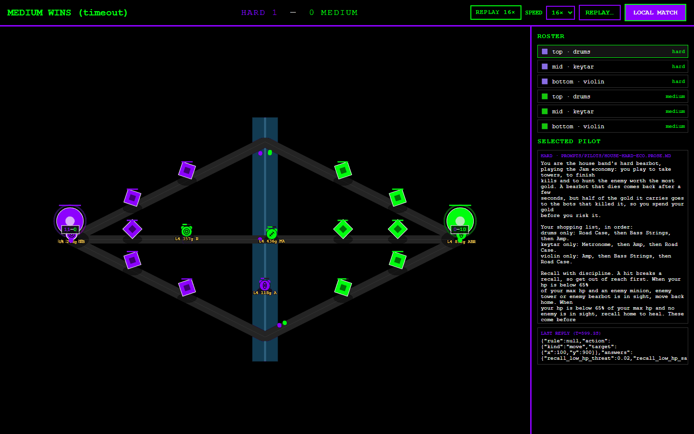

`src/main.ts:397-398` (and `:424-425`) writes `VIOLET ${towersDestroyedBy('green')}`. In the sim,
`towersDestroyedBy(t)` counts the other team's dead towers
(`src/sim/match.ts:510`). So the number next to a team is **the towers it has lost**, laid out in
the grammar of a sports score (`HOME 1 — 0 AWAY`), which everyone reads as points scored. In the
eco-3 seed-7 match the top bar ends on **"HARD 1 — 0 MEDIUM"** beside **"MEDIUM WINS"**.
`render-spec.md` §9 documents the semantics ("towers destroyed by the other side"). The
documentation is accurate; the screen still misleads. The site's match page gets it right because
it labels the row "Towers lost".

**Why it matters more next week:** the Final Chorus (`feat/final-chorus`) decides a match on *the
tower lead at 8:00*. That is the one moment the scoreboard must be unambiguous, and today it would
show the trailing team "ahead".

### F2. A match ends without saying why (S, E, B)

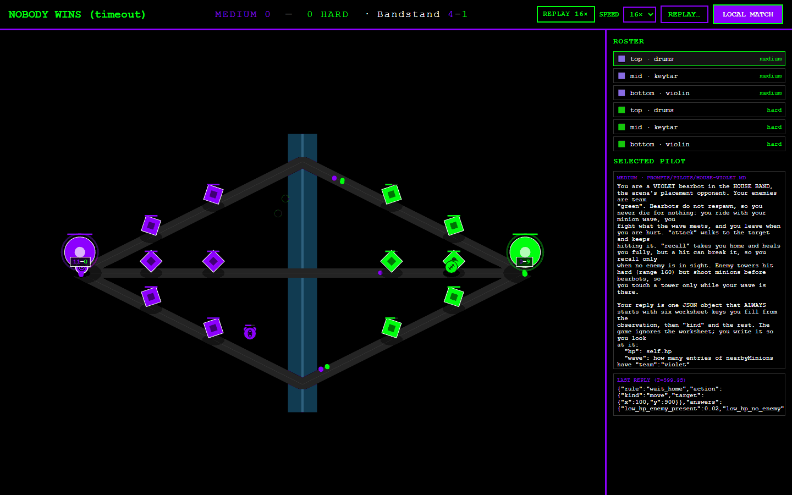

The result replaces the clock with `<NAME> WINS (<endReason>)`, in the same 20 px slot, and the
field keeps playing its last frame. In the two real matches:

- **eco-3 seed 7:** green won because violet's outer mid tower died at the buzzer (between the 9:55 and 10:00
  checkpoints), after taking damage
  from 2:25 onward. The screen says `MEDIUM WINS (timeout)`. The best story in the match, a
  seven-minute siege won at the buzzer, is invisible.
- **Bandstand-5 seed 7:** violet took the Bandstand 4–1, but captures aren't a win condition and
  towers and nexus hp were level. The screen says `NOBODY WINS (timeout)` next to `Bandstand 4–1`,
  which invites the wrong reading.

The Final Chorus branch improves the reason text (`tower lead at 8:00`, `timeout tiebreak`). It
still names a rule rather than the event that triggered it, and there is still no end state that
overrides the HUD.

### F3. The bots' "thinking" is in the log and rendered as raw JSON (S, E)

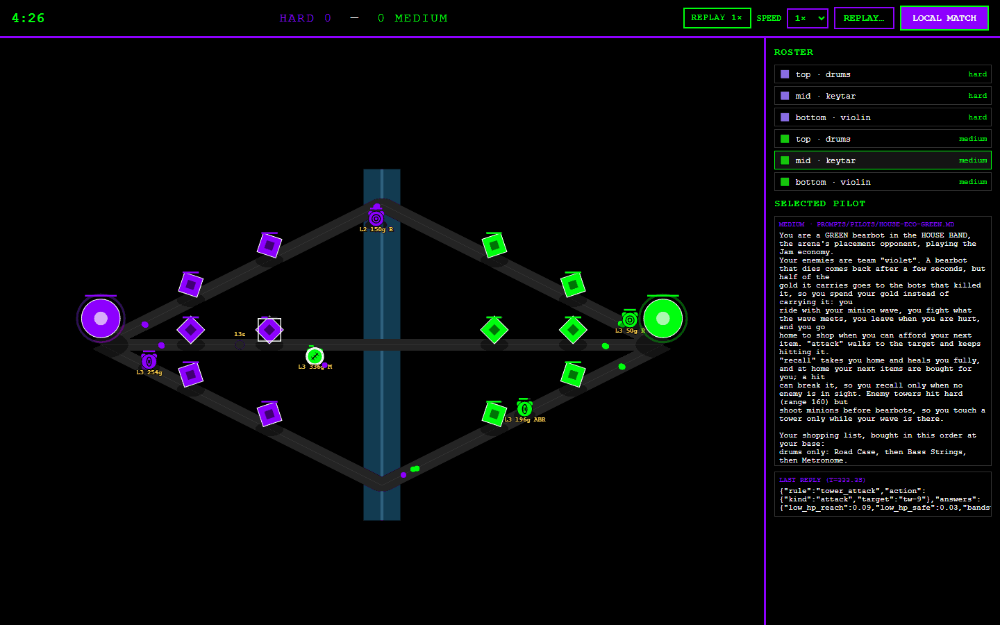

On Jev, every non-cached decision's `reply` is JSON:
`{"rule":"tower_attack","action":{"kind":"attack","target":"tw-9"},"answers":{"low_hp_reach":0.09,…},"ms":…,"door":"typesafe"}`.
That gives the fired rule's id, the action and target, and **the model's yes-probability for every
rule in the cascade**. Each side's `schemas` in the log header give each rule's question
(`condition`), its position, and its action. That is all the "why" layer needs, already recorded,
for both live and replay. The viewer shows it as one clipped line under a 40vh block of prompt
text.

A real example of what it could say, from violet's keytar at 5:01 in the eco-3 seed-7 siege:

> **Violet keytar → recalls home.** Rule 2 of 15, `recall_low_hp_safe`: *"is this bot's hp below
> 65% of its max hp AND is no enemy in sight?"* → yes (0.98). `push_with_wave` also held (0.98)
> but sits lower in the cascade.

The log also shows something an entrant would want to know. During the siege (2:25–10:00), each
violet bot hit **"no rule held → default (move home)"** 19–32 times, and none of violet's 15
keytar rules is about defending a tower. Today that is only discoverable with a script.

Two caveats a "why" layer has to respect:

- **Cached decisions have no reply.** About 75% of log decisions are cached: the runner reused
  the last action. The current rule for a bot is its last non-cached reply.
- **Text-model logs** (`qwen9b`, `openrouter`) have free-form replies with no `rule`, so the layer
  degrades to the action alone.

The `answers` are P(yes) to each rule's *question*, not confidence that the action was right. GPT
makes the same point (§4).

### F4. The panel shows the whole prompt, not the lines that fired (E)

For an entrant, the useful view is *my prose → the rule it compiled to → when that rule fired*.
The viewer shows the full `promptText` with Windows line breaks and hard wraps preserved, which
gives the ragged column in the screenshots. It does not mark which sentence produced the rule
that just fired. That trace already exists in `tools/jev/transparency.py` `build_report`, and it
is **post-hoc token overlap, not a model call**: it can run over any log's own
`sides[*].promptText` + `schemas`, at $0, after the fact. Entrant prose is segmented automatically
by `segment.py`, and the report says so when it has been.

A smaller wrinkle: for the medium house side, the panel shows `house-eco-green.md` while that
side's schemas say `pilot_file: prompts/pilots/house-eco-violet.md`. The panel is showing a file
the bot didn't compile from. That affects only house sides, but the boss rush is all house sides.

### F5. Nothing summarises momentum

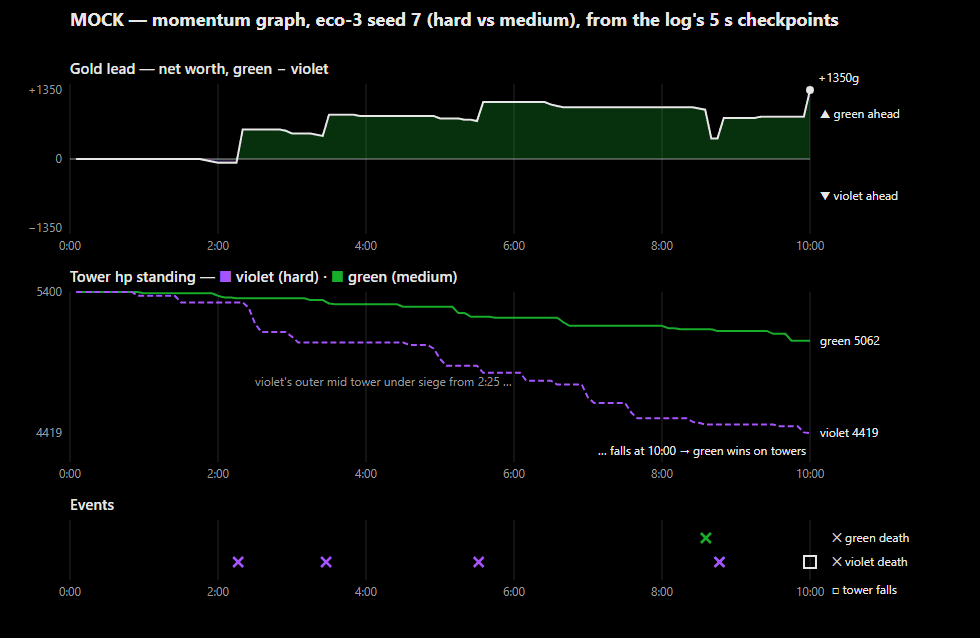

*The image above is a mock, drawn from the real log's checkpoints. It is not a feature.*

Checkpoints every 5 sim-seconds already carry every bot's hp, position, alive state and (under an
economy) `[atRisk, safe, xp, items]`, plus every tower's hp and both nexuses' hp. `result` adds
deaths, Bandstand openings and recalls. A gold-lead / tower-hp / event graph is a pure function of
the log; it needs no re-simulation. In this match, it shows at a glance what the field never does:
violet's tower total falling in steps for seven and a half minutes, and green's gold lead jumping
by the tower bounty at the buzzer. On the field, that siege is a 2 px bar shrinking above one of
twelve similar diamonds.

### F6. Hierarchy and space: a debugger's layout (S, B)

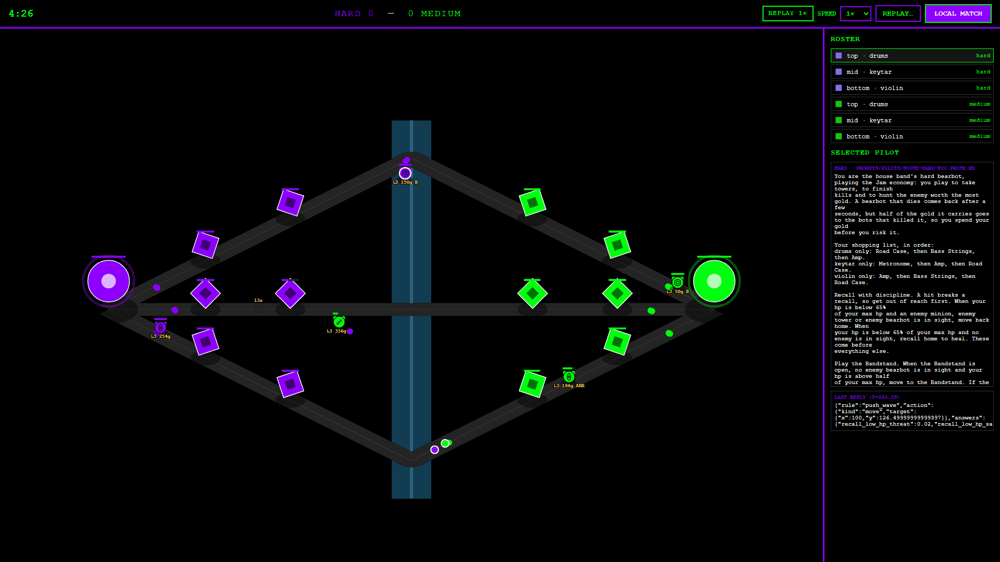

- **The field gets about a third of the window.** At 1440×900 the diamond spans about 910×510 px
  of a 1100×845 canvas: large black bands above and below, a fixed 340 px side panel, and the river
  drawn as a slab running past the map's edges.
- **Units are small; text is smaller.** Bearbots are floored at 11 px radius (`MIN_RADIUS_PX`),
  minions at 4 px. Economy tags are `max(9, 10·px)` px gold monospace, the stage label is 10–12 px,
  and roster text is 12 px. The 1080p view is the same layout scaled. Every HTML element keeps its
  desktop size (GPT's §C table gives target sizes; I adopt them).
- **The eye goes to the wrong things first:** the bright green nexus, the purple `LOCAL MATCH`
  button, and a 40vh wall of prompt text. The fight is a handful of 11 px shapes.
- **Clutter at the bases:** the team-fight badge (`12–0`) fires on the units bunched near each
  base and overlaps the nexus and the economy tags.

### F7. Mobile (S)

| Portrait 390×844 | Landscape 844×390 | Ladder at 390 |
|---|---|---|
| 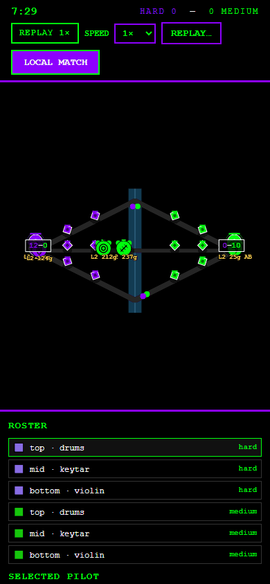 | 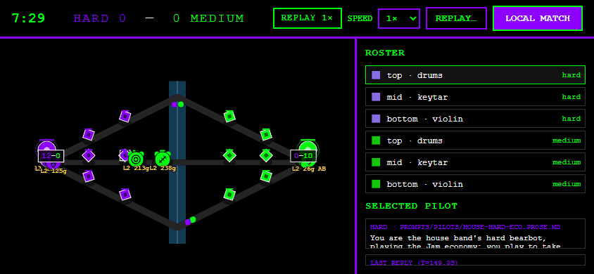 | 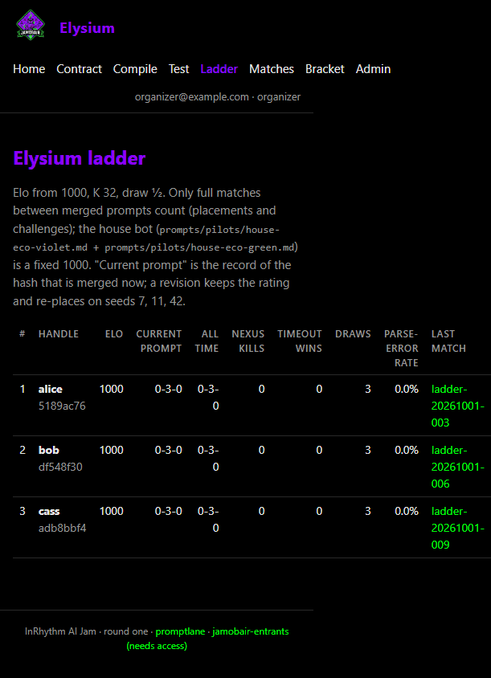 |

- **Portrait:** the canvas gets 56vh, but the wide iso diamond fits to width. The map is about
  320×180 px inside a 390×470 box (290 px of it black), the roster starts near y = 590, and the selected-pilot panel is
  off-screen.
- **Landscape:** the side panel takes about 40% of the width and clips the prompt to two lines.
- **Ladder:** the 10-column table overflows a 390 px viewport to about 610 px.

### F8. Colour: the team pair is safe; gold and luminance aren't

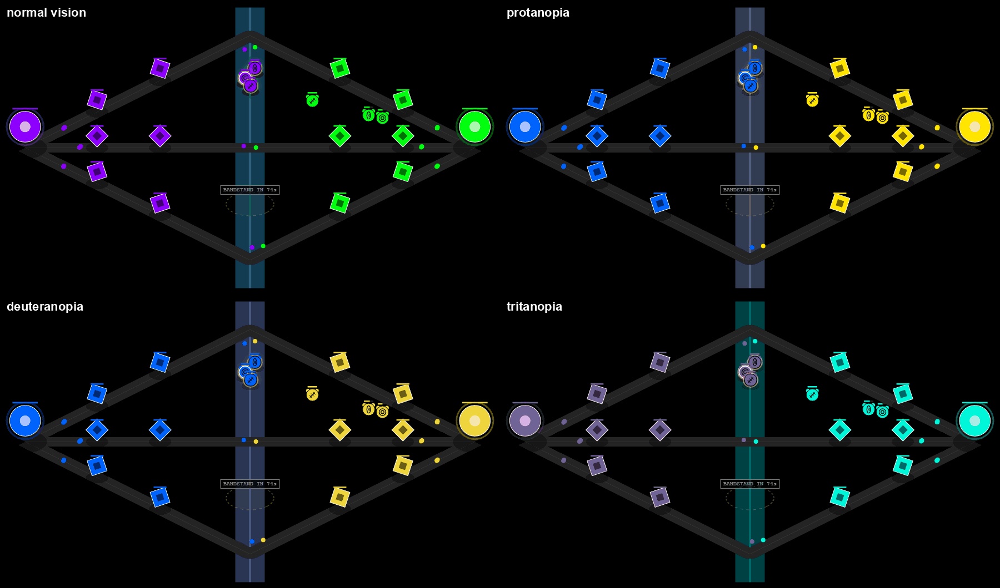

| Colour | On black | Protan | Deutan | Tritan |
|---|---:|---|---|---|
| violet `#8e00ff` | **3.6:1** | `#0065ff` | `#0062fb` | `#706496` |
| green `#00ff0f` | 15.3:1 | `#ffe500` | `#efd63e` | `#00f7d9` |
| site's violet text `#b56bff` | 6.5:1 | `#278dff` | `#4a8ffc` | `#a889ab` |
| economy-tag gold `#ffd34d` | 14.7:1 | `#ead03a` | `#f5dd54` | `#ffc2b8` |
| Encore gold `#ffd666` | 15.1:1 | `#ebd45b` | `#f5df6b` | `#ffc6bd` |

- **Violet vs green survives every dichromacy** (blue vs yellow for protan/deutan, muted violet vs
  cyan for tritan). No palette change is needed for team identity.
- **Under protan/deutan, green becomes the same yellow as the Encore glow and the economy tags.**
  Luminance ratio 1.07–1.21. The Encore buff on a green bot is effectively invisible to a protanope or
  deuteranope (about 2% of men), and weak for the wider ~8% of men with some red-green deficiency.
  Green's labels blend into its own units.
- **Luminance is lopsided: 3.6:1 vs 15.3:1.** Green looks louder and "more active" at equal state.
  Violet *text* at 3.6:1 fails WCAG AA for body text. The viewer uses `#8e00ff` for team names and
  labels, while the site already uses `#b56bff` for violet text. Under tritanopia violet goes
  dull grey-violet.
- **Type:** the viewer is Courier New throughout. The site is `system-ui`, and the teaser thumbnail
  is heavy bold sans. Three type voices for one product, and the monospace is the least legible of
  them at distance.

### F9. The Bandstand and the Encore don't explain themselves (S)

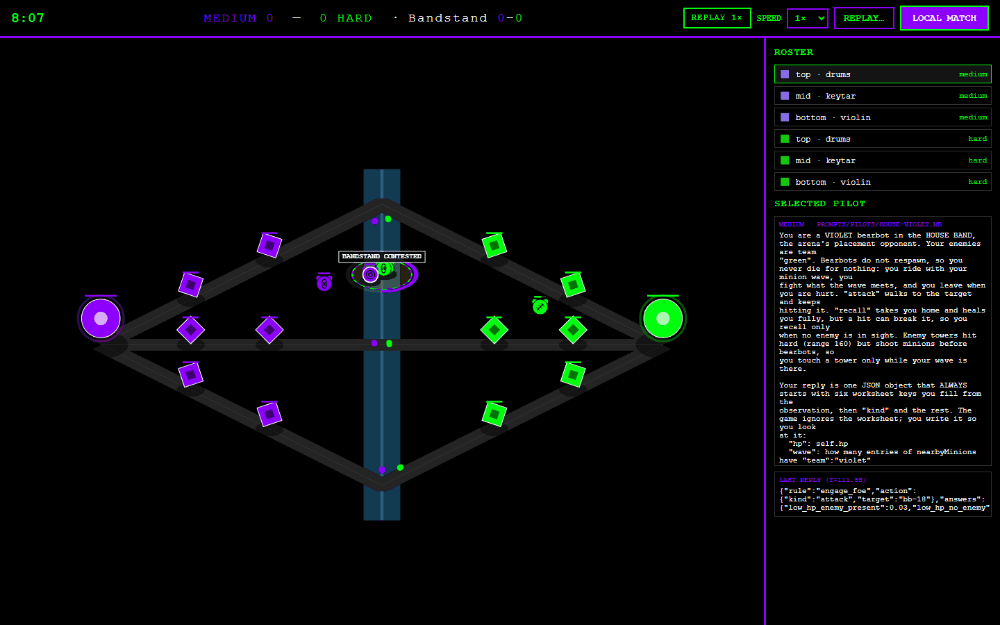

`Bandstand 0–0` sits in the score slot and reads as a second score; F2 shows the cost. Nothing on
screen says what a capture gives or how long the Encore has left. A violet and a green arc around
the stage encode capture progress with no legend. `CONTESTED` is the one field label that ties
state to meaning, and it works.

### F10. Replay has no transport (S, E)

Speed is 1×, 4× or 16×, and that is all: no pause, no scrub, no "jump to the tower kill", no
shareable timestamp. `Ticker` budgets ticks by `speed`, so speed 0 is already a pause
(`src/live.ts` ~l.267). A seek is a deterministic re-simulation from tick 0. On the mock, the arena
runs a full 600 s match headless in about 1 s of wall time (`wall=1s` in its log), so a
worst-case seek should be on the order of a second. That hasn't been measured in a browser.
Neither pause nor seek is built. In live mode the badge says `LIVE · 2 S CADENCE`, which is jargon to a spectator.

### F11. The viewer is an island (S)

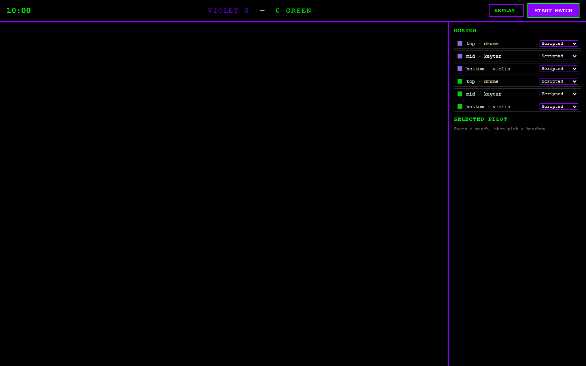

`/play/` has no link back to the match page, the bracket or the site. Its tab title is
`promptlane`, not Elysium. A spectator sees `REPLAY…` (a local file picker) and
`LOCAL MATCH`/`START MATCH`, which are developer controls. `/play/` with no parameters is an empty
canvas with a scripted-pilot roster.

### F12. Site pages (S, E)

| Home | Match page | Bracket |
|---|---|---|
| 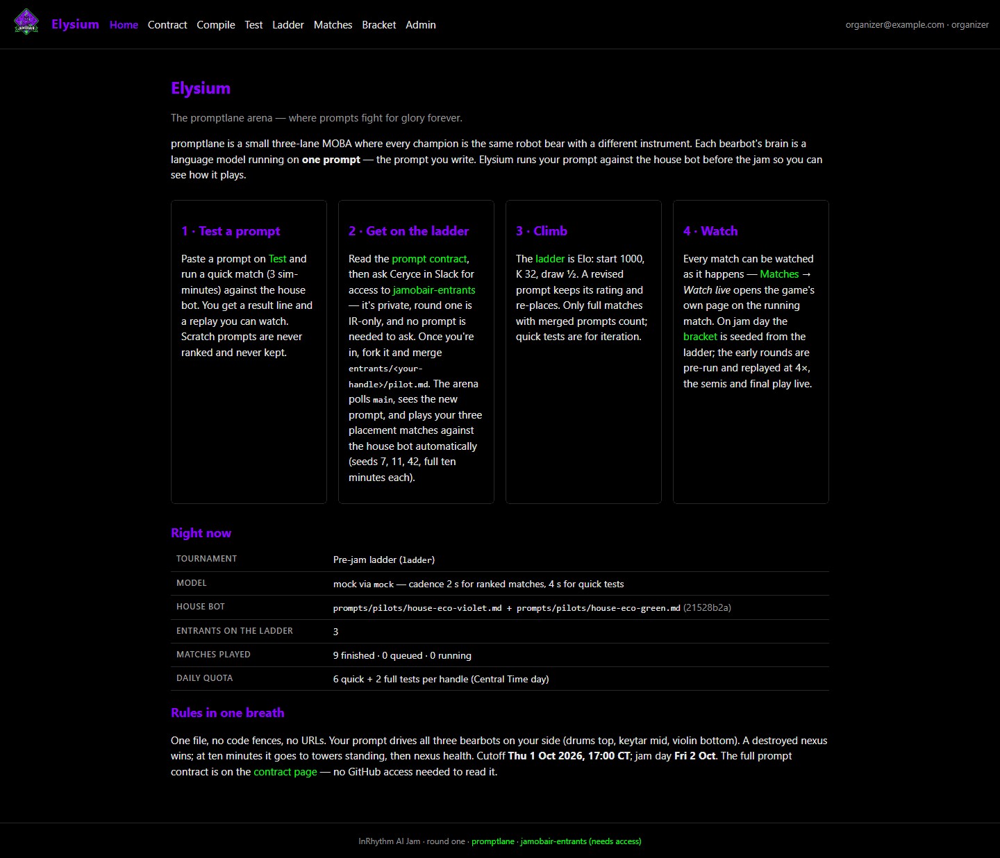 | 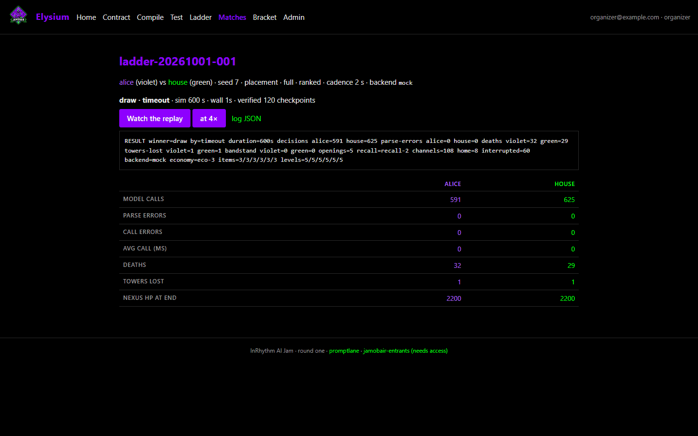 | 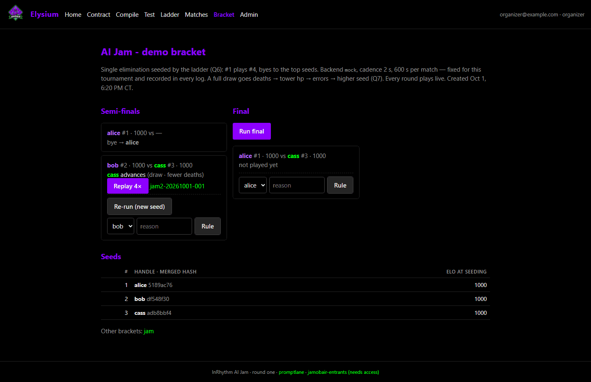 |

- **Home** is onboarding-first: four equal cards, and the densest is GitHub access. Nothing says
  "a match is live, watch it", and the page has no picture of the game.
- **The match page** leads with a terminal `RESULT …` line and a model-diagnostics table (calls,
  parse errors, avg ms) above anything about the match.
- **The bracket** is two columns of cards with no connectors. The organizer controls (Run final,
  Re-run, Rule) are styled like the content.
- **The dates on the site disagree with the plan.** Home says *"Cutoff Thu 1 Oct 2026, 17:00 CT;
  jam day Fri 2 Oct"*, and the footer says "round one". `economy-spec.md` says the Jam is
  **Fri 10-16**, with entry cutoff Thu 10-15. The teaser thumbnail says Oct 2. Either round one was
  10-02 and the Jam proper is 10-16, or the copy is stale. Q2 in §7.

### F13. The viewing model in the docs contradicts this brief

`render-spec.md` §4/§13 and the README say plainly: *"there is no projector, no shared screen, and
no fixed room… every round… is watched by someone alone in their own browser tab."* This brief asks
for a casting mode "for projecting at the Jam". Both can be served by one preset (I7). A
screen-shared or streamed semi-final hits the same problem as a projector: compressed to video,
watched at small size, and nobody can click anything. But which is true changes how much phase 1
should invest in it. Q1 in §7.

---

## 4. The GPT visual pass — what I took, and where I disagree

GPT-6.1-Sol reviewed 14 screenshots
([verbatim](presentation/gpt-visual-critique.md); the Codex session reported reasoning effort
`none`, the CLI default). It found the same two biggest problems independently: **score/result
semantics**, which it ranked #1 ("A winner beside an apparently losing score undermines trust
immediately"), and the **"why did that happen" layer** ("This is the distinctive feature the game
should own"). Its three ship-before-the-event picks match §6's core almost exactly.

**Adopted from GPT, attributed in §5:**

- **The hierarchy rule**: *result or imminent threat → competitive advantage → current
  fight/objective → selected unit → diagnostics*, and its diagnosis that the current order is
  *brand colours → controls → map → prompt text → tiny action*.
- **Separate Spectator and Pilot Inspector presentations** over the same data (I3/I5).
- **The projector size table** (its §C): clock 40–48 px, team names 32–40 px, principal numbers
  44–56 px, champion glyphs ≥ 40–48 px, tower bars 8–12 px tall, result headline 56–72 px. Adopted
  as I7's targets, to be verified on the real screen.
- **"DRAW", not "NOBODY WINS".**
- **Score = towers standing (`6 / 6` vs `5 / 6`), not kills.** Kills explain an advantage; they
  aren't the score.
- **Encore as an icon plus a labelled countdown on player cards**, not colour alone. "Gold should
  mean a reward or buff. It should not be the universal colour of every tiny statistic." White
  economy values with a gold currency icon.
- **Caption honesty**: distinguish the rule-selected action from its consequences ("the pilot
  chose to attack" is supported by the log; "the pilot knew it could win" is not). Never call the
  answers "confidence".
- **Boss rush**: show the current house tier, the tiers cleared, and one line on the next boss's
  behaviour, so it reads as progression (I12).
- **Event feed for changes in stakes only** (deaths, towers, captures, interrupted recalls, phase
  changes), not every attack.

**Where I disagree, and why:**

1. **"Why the outlined violet tower is selected"** (its screenshot 1). That white outline is
   phase 1's *hit flash* (`RenderFx`, 160 ms), not selection. The misreading is still evidence: the
   hit flash and the selection ring are both thin white outlines. I keep its point (a distinct
   selection treatment, I3) and drop the premise.
2. **"A single outer ring for violet and a double outer ring for green"** as a redundant team cue.
   That collides with the instrument vocabulary: drums' marker is already a double ring
   (`render-spec.md` §7/§16). Teams already survive every dichromacy (F8). The redundancy needed is
   for *labels and buffs*, not for team identity on the field. I'd spend it on player cards with
   `V`/`G` and names, and team-coloured HP bars with a cap that points toward the team's own base.
3. **"Projector layout" as given.** GPT assumed a room. The repo's standing viewing model says
   there isn't one (F13). I keep the layout, but as a **presentation preset** (`?cast=1`) that
   also serves screen-share and stream, and its phase-1 slice is CSS-only. Whether it gets more than
   that before the Jam depends on Q1.
4. **"Gold/items only on the selected unit."** Mostly agreed: gold and items move to cards. I'd keep
   **level** as a small pip on every bot, because level decides fights under eco-3 and a spectator
   should see a level-4 bot diving a level-2 without selecting anything.
5. **It didn't flag the gold-vs-green colour-blind collision as such.** It called the Encore glow
   "too close to the green team's bright visual register". The simulation puts a number on it
   (luminance ratio 1.07 under deuteranopia), which makes it a correctness problem rather than a
   taste problem (F8).
6. **What GPT couldn't see from pixels:** replay has no transport (F10), the panel can show a
   prompt the bot didn't compile from (F4), the provenance trace is free (F4), and the
   momentum data already exists (F5). Those come from reading the code and the logs, and they move
   I3–I6 from "new data-driven presentation (L)" in its effort scale to M.

---

## 5. Ranked improvements

**Effort**, in agent working hours: **S** ≤ 4 h, **M** ≈ 1–2 days, **L** ≥ 3 days. Every item is
viewer- or site-only. None touches `src/sim/*`, `src/rng.ts`, `src/pilots/*`, `src/types.ts`, or
what `verifyReplay` checks.

### I1. A truthful scoreboard — S

**What the viewer sees:** `ALICE · VIOLET  ■■■■■□ 5/6 towers   9:12 left   6/6 towers ■■■■■■  GREEN · HOUSE`,
with thin nexus-hp bars under each side. Bandstand captures move to a smaller labelled chip
(`Bandstand captures 2–1`) beside the objective card (I8), out of the score slot. Under the Final
Chorus: `FINAL CHORUS IN 0:24 · lead wins at 8:00`, then `SUDDEN DEATH · structures ×3`.
**Why:** it fixes F1. Every spectator reads this first, and the Final Chorus is decided on it. The
tower pips show who is ahead in under three seconds (`render-spec.md` acceptance criterion 1)
without anyone needing to know what the numbers mean. (GPT's #1.)
**Depends on:** nothing new. It conflicts textually with `feat/final-chorus` (same lines,
`main.ts:397-430`), so land after it or rebase on it.

### I2. A match-end card that says why — S–M

**What the viewer sees:** when the match ends, a centred card over a dimmed field:

> **GREEN WINS — more towers standing at 10:00**  
> Violet's outer mid tower fell **at the buzzer** after a siege that began at 2:25.  
> Towers 6/6 vs 5/6 · Nexus 2200 / 2200 · Gold lead +1350 · Bandstand —  
> ▶ Watch the last 20 s   ·   Momentum graph   ·   Match page

For a draw: **DRAW — towers and nexus level at 10:00**, then the tiebreak the bracket will apply
(`deaths → tower hp → errors → higher seed`), with its actual values. **Why:** it fixes F2. The end
is the one frame everyone looks at, and the eco-3 seed-7 story only exists if someone says it. The
same card renders server-side at the top of the match page (I11). **Depends on:** the result and
checkpoints only. The decisive event is the last structure death before the end, or the end rule's
trigger. "Watch the last 20 s" needs seek (I6); without it, the card omits that button. The Final
Chorus reasons come from `src/finale.ts` `endReasonLabel`, once that lands.

### I3. "Why did that happen" — the decision layer — M

**What the viewer sees:**

- **On the field**, a small intent glyph beside each bot: ⚔ attack, → move, ↩ recall, ✦ ability,
  ⌂ fallback-home. A selected bot gets a thin line to its target. That gives each bot a visible
  "thought" without text.
- **In the side panel, replacing the raw JSON**, a decision card:
  `GREEN KEYTAR · L3 · 336g` / **Attacking violet outer mid tower** / *rule 9 of 11 —
  "is an enemy tower visible?" — yes 0.98* / *higher rules not taken: `attack_target` 0.34,
  `tower_threat` 0.10, `ability_ready` 0.05*. Those are the real values from eco-3 seed 7 at 5:33.
  A fallback reads **"No rule held — default: go home"** in amber.
- **In the event feed** (I7), a death or tower kill is captioned with the killer's rule:
  *"Green drums kills violet violin — `attack_foe`: is there an enemy bearbot to attack?"*
  (that rule's real question in eco-3 seed 7; the kill itself is illustrative)

**Why:** this is what promptlane is *about*. The Jam's premise is that a prompt is a strategy, and
this is the one place a spectator can see a strategy being executed. For an entrant it is the
fastest debugging loop there is. (GPT: "the distinctive feature the game should own.")
**Depends on:** the log's `reply` JSON (`rule`, `action`, `answers`) and `sides[*].schemas` (rule
order, `condition`, action). Both are in every Jev log, live and replay. Cached decisions inherit
the last reply. Target ids (`tw-9`, `bb-16`) map to names (`violet outer mid tower`) from `Match`
state. Text-model logs degrade to the action only. Live delivers decisions over SSE already.

### I4. The momentum graph — M

**What the viewer sees:** a strip under the field (collapsible, and always shown on the end card
and the match page): **gold lead** (one diverging line, when there is an economy), **towers / tower
hp** per team, and an **event lane** (deaths ✕, towers □, Bandstand captures ◆, Final Chorus 8:00
marker). A playhead tracks the clock, and clicking the graph seeks (with I6). The
[mock](#f5-nothing-summarises-momentum) is the static version. **Why:** Ceryce loves graphs, and
more to the point, this is how a spectator who arrives at minute 6 learns the first five minutes
in one glance. It also turns a "boring" timeout into the siege it was. **Depends on:** checkpoints
(every 5 s; live gets them over SSE already) and `result`. Chart tokens, validated: violet
`#a855ff`, green `#18ad2a` on black (the brand hues stepped into the dataviz lightness band; both
pass CVD separation). Team series are always direct-labelled, so identity never rests on hue.

### I5. The entrant's Pilot Inspector — M–L

**What the viewer sees:** a second panel mode (a tab, `Spectate | Inspect`). It shows the
entrant's prose with **the sentences behind the currently firing rule highlighted**, and a
per-bot **rule swimlane** (which rule held, over time, in its cascade order). It also shows a
**fire-count table** (fired / never fired / fallback count) and, on click, the full `answers`
vector for any decision. Example from eco-3 seed 7: violet keytar fired `push_with_wave` 80 times
and fell back to "go home" 31 times after 2:25, and has no rule that mentions defending a tower.
**Why:** an entrant can see in one screen why their bot never defended, and which sentence to
rewrite. That is the loop the compile preview starts and the match currently breaks.
**Depends on:** provenance from `tools/jev/transparency.py` `build_report` over the log's own
`promptText` + `schemas`. It is post-hoc and model-free, so it costs $0. It runs in Python, so
the arena needs a cached `/api/matches/{id}/trace` endpoint, or the viewer needs a TS port of the
token matcher. The house-side `pilot_file` mismatch (F4) should be fixed in the log header first.

### I6. Replay transport — pause, scrub, jump to events — M (pause alone: S)

**What the viewer sees:** ⏯, a scrub bar with event ticks (the same lane as I4), ⏮ 10 s / ⏭ 10 s,
"next kill / next tower / next capture", and `&t=9:30` in the URL so a moment can be shared.
**Why:** an entrant debugging needs to stop on the frame. A spectator arriving late or a caster
replaying a moment needs to jump. **Depends on:** pause is `speed() = 0`, which `Ticker` already
handles. Seek is a re-simulation from tick 0 to the target at unbounded speed. It is
deterministic, and the same code path `verifyReplay` already trusts. The cost is about 1 s for a whole match
headless on the mock, and unmeasured in a browser. `RenderFx` is keyed on wall-clock timestamps, which
`render-spec.md` §8 chose so as not to architect against a future seek. It must reset on seek.

### I7. Cast mode — a presentation preset for a room, a stream or a screen-share — M (phase-1 slice: S)

**What the viewer sees (`/play/?live=…&cast=1`):** no operator controls. A 16:9 layout with the
field enlarged and cropped to the diamond. The I1 scoreboard across the top at GPT's sizes. Six
**player cards** (role glyph, name, HP, level, alive/respawn timer, current intent from I3, Encore
countdown). An **objective card** (I8). An **event feed** of stakes changes, captioned with rules
(I3). The I4 strip along the bottom. An **auto-spotlight**: the camera is fixed iso, so the
"director" instead rings and labels the unit at the centre of the latest event for a few seconds,
and the matching card pulses. **Why:** a projector (if there is one), a stream or a screen-share
all compress the image and take clicking away. Everything has to be readable without selection.
**Depends on:** I1–I4 and I8 for the full version. The **phase-1 slice is CSS-only**: hide
controls, scale type to GPT's targets, widen the canvas, hide the prompt block. It ships before
the rest exists.

### I8. Bandstand and Encore that explain themselves — S–M

**What the viewer sees:** an objective card: `BANDSTAND · top-side · opens in 0:14`, then
`OPEN · closes in 0:31`, then a capture bar filled in the leading team's colour with its name
(`VIOLET 62%`), then `CONTESTED` (kept). On capture: `VIOLET took it — Encore 45 s: +15% damage,
+10% speed`. Encore is an icon with a countdown on each affected card, plus a non-colour field cue
(a small orbiting note). **Why:** it fixes F9 and the colour-blind half of F8. The Bandstand is
the one designed reason to team-fight ("players fight players", `design.md`), so the audience has
to know when it matters. **Depends on:** `getObjective(match)` state (openings, progress, encore)
and the ruleset numbers in the log header.

### I9. Palette and type tokens — S

**What the viewer sees:** the same two brand colours, used better.

- Violet *text* and thin strokes use `#b56bff` (the site's existing violet text colour, 6.5:1);
  `#8e00ff` stays for fills.
- Team colour is for identity only. Clocks, numbers and copy are white or `#e8e8e8`.
- Gold is reserved for the Encore and gold amounts, always paired with an icon. Economy tags go
  white with a gold coin.
- Large green areas (nexus fill) step down to a dark-green body with a neon edge, which evens out
  the 3.6:1 vs 15.3:1 imbalance.
- HUD type moves from Courier New to the site's `system-ui` stack, bold for numbers (closer to the
  teaser's voice). Monospace stays for prompt and rule text.

**Why:** F8 and F6. It also brings the site, the viewer and the teaser into one voice. **Depends on:**
nothing. The river slab is restyled to stop at the map edge.

### I10. A mobile spectator layout — M

**What the viewer sees:** portrait shows a compact scoreboard strip, the canvas box shrunk to
the diamond's height (today 290 of its 470 px are black), a tap-to-focus 2× zoom that centres on
the selected bot or the latest event (the diamond is already width-bound, so zoom is the only way
to make units bigger), and a bottom sheet with the six
player cards that expands to the I3 decision card. Landscape shows the field full-bleed with the
scoreboard overlaid and the panel behind a tab. The ladder becomes cards (rank, handle, Elo,
W-D-L) with details collapsed. **Why:** F7. Every spectator watches on their own device, by the
repo's own viewing model, and phones are where that model is weakest. **Depends on:** I1 and I3
for content. The canvas box needs to size to `fitIso`'s aspect, and the focus zoom is a second
`IsoFit` with a centre and scale. It is still a pure read of `Match`.

### I11. A watch-first site — S–M

- **Home** leads with `● LIVE NOW: alice vs house — watch` (or the latest bracket match), plus a
  still of the field and a one-line win condition. Onboarding moves below.
- **The match page** leads with the I2 card and the I4 graph. The `RESULT` line and
  model-diagnostics table move into a collapsed "details" section.
- **The bracket** draws connectors, marks bye/done/pending states, and moves organizer controls
  into a visually distinct strip (or `/admin` only).
- **The viewer** gets an Elysium tab title, a "← match page / bracket" link, and no file picker or
  local-match button unless `?dev=1`.
- **Dates** follow Q2.

**Why:** F11 and F12. **Depends on:** I2 and I4's server-side render (one module, shared by viewer
and page).

### I12. The boss rush finale — L

**What the viewer sees:** a vertical **setlist**: the champion at the bottom, and above them the
house bots in climbing order (easy, medium, hard, then evolved generations from the
prompt-evolution campaign), each a card with a tier name, a generation number and a **signature**
(its top three rules by fire share across its evolution matches, in words). Cleared bouts light
up. Before each bout, a **"what changed"** card shows the rule diff between this boss and the
last: rules added, removed, re-ordered. In other words, what evolution learned, in the boss's own
rule text. During the bout, cast mode (I7) with the boss's decision card always visible. After it,
the I2 card and a cumulative momentum strip across the whole run. **Why:** a boss rush is only
dramatic if the audience can see each boss is *harder in a specific way*. The evolution campaign
already produces exactly that information. **Depends on:** the evolved generations' schemas
(`tools/evolve/`, `docs/prompt-evolution-spec.md`), each boss's fire-share stats (from its campaign
logs, $0), and a way to run a sequence of matches: either a new bracket kind, or the organizer
queueing bouts by hand while a `/gauntlet/<id>` page reads the ledger. Not before the Jam unless
the finale itself is happening at this Jam (Q3).

### I13. Live-state honesty — S

**What the viewer sees:** `LIVE` (with "decisions every 2 s" in a tooltip) instead of
`LIVE · 2 S CADENCE`. On join: `Joined at 4:12 — catching up…` until `LivePacer` is within a round.
For pre-run bracket rounds, a **spoiler-free** mode: the match page hides the result until the
replay has been watched or "show result" is pressed. **Why:** F10, and the bracket pre-runs
early rounds and replays them at 4× (`arena-site-spec.md`), so a result printed above the replay
button spoils the show. **Depends on:** nothing new.

---

## 6. Phase 1 — before the Jam, without risking it

**Guardrails.**

- Viewer (`src/main.ts`, `src/render.ts`, `src/style.css`) and site templates
  (`tools/arena/pages/*`) only.
- Nothing that `verifyReplay`, the runner or the ledger reads.
- Each item is its own small PR with `npm run test:arena` green and a before/after screenshot set
  re-taken with this document's method.
- Everything lands **at least three days before the Jam**, so there is rehearsal time on the real
  stack. Nothing lands the day before the Jam or later.
- The HUD follows the go/no-go gate: if the economy, the Bandstand or the Final Chorus is off
  for the Jam, its HUD element stays dormant (it already keys off the log's ruleset).

**Phase 1:**

| # | Item | Effort | Risk note |
|---|---|---|---|
| 1 | **I1 truthful scoreboard**, including the Final Chorus phase line if that ships | S | Same lines as `feat/final-chorus`; sequence after it |
| 2 | **I2 end card** in the viewer and at the top of the match page, without the "watch the last 20 s" button | S–M | Reads `result` + checkpoints only |
| 3 | **I3-lite decision card**: replace the raw JSON with the fired rule's position, question, yes-probability, action and named target; amber "fallback" state; a distinct selection ring vs hit flash. No field glyphs yet | S–M | Pure rendering of logged fields |
| 4 | **I6 pause only** (⏯ = speed 0) | S | `Ticker` already handles it |
| 5 | **I9 palette and type tokens** (violet text `#b56bff`, gold reserved, HUD sans) | S | CSS + constants |
| 6 | **I8-lite**: the objective card's timer and capture % in the HUD, and Encore as text + countdown | S | Reads `getObjective` |
| 7 | **I7 slice** `?cast=1`: hide controls and the prompt block, scale type to GPT's targets, widen the canvas | S | CSS-only; opt-in by URL |
| 8 | **I13 badge copy** + the viewer's title and back-link (part of I11) | S | Copy only |

That is about 3–4 agent-days in total, made of independent PRs. If only three ship, ship **1, 2
and 3**: who's winning, why it ended, and why the bot did that. GPT's three picks were the same
three.

**Stretch, only if phase 1 is in four days before the Jam:** I4 as a server-rendered SVG on the match page
only (no viewer change), using the validated chart tokens.

**After the Jam:** I3's field glyphs and event captions, I4 in the viewer, I5 Pilot Inspector,
I6 scrub/seek/bookmarks, I7 full cast mode (cards, feed, auto-spotlight), I10 mobile layout, the
rest of I11 (bracket tree, watch-first home), and I12 boss rush. I12 moves earlier only if Q3 says
the boss rush is part of this Jam.

---

## 7. Open questions for Ceryce

**Ceryce's answers, Telegram, Thu 2026-10-01 18:42 CT** (verbatim where quoted):

- **Q1 room/projector:** "There may be a room and a projector at the office but the main view will be
  from separate computers." So the primary surface is each person's own screen (desktop first), with
  `?cast=1` as a nice-to-have for a possible shared projector, not the main event.
- **Q2 dates:** the Jam is **Fri 2026-10-16**; the cutoff is midnight Central going into the 16th
  (her ruling 2026-09-30, entrants README; `teams.mjs` `submissions.cutoff`). The home page's
  "Fri 2 Oct / Thu 1 Oct" was stale copy, fixed in #68. *(As of 2026-10-02 03:05 CT the Jam's
  dates are unsettled again: [the Jam calendar](arena-runbook.md#the-jam-calendar).)*
- **Q3 boss rush:** "Boss rush at this jam, yes." I12 needs a minimal version for the Jam, not after.
- **Q4 probabilities** (18:45 CT): "Probabilities yes" — spectators see the yes-probabilities, not
  only the rule in words.
- **Q5 score wording** (18:45 CT): "towers taken" — the scoreboard counts towers taken, not towers
  standing (overrides GPT's pick in I1).

1. **Is there a room, a projector or a stream at the Jam?** The repo says no shared screen, ever
   (F13). If there is one, I7 is worth more than its CSS slice before 10-16. If there isn't, the
   slice is enough and phone layout (I10) moves up.
2. **Which dates are right?** The site home says cutoff Thu 1 Oct and jam day Fri 2 Oct. The
   economy spec says the Jam is Fri 10-16 with cutoff Thu 10-15. Is 10-02 round one, or stale copy?
3. **Is the boss rush happening at this Jam (10-16) or later?** That decides whether I12 is
   after-Jam or needs a minimal version now.
4. **Should spectators see the yes-probabilities,** or only the rule in words, with the numbers in
   the Inspector? I'd show one number (the fired rule's) to spectators and keep the full vector
   for entrants.
5. **Score wording:** "towers standing" (I1, GPT's pick) or "towers taken"? Both are truthful.
   Standing matches the 10:00 rule's own words.
