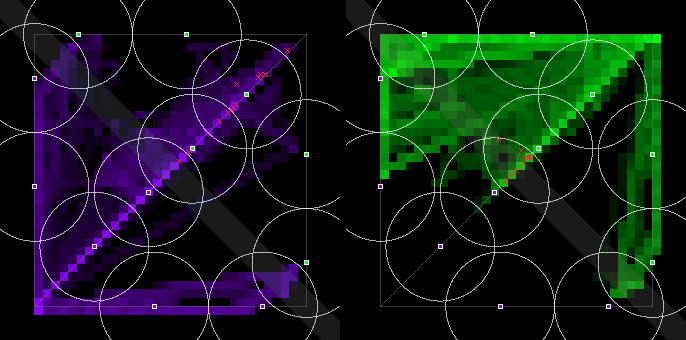
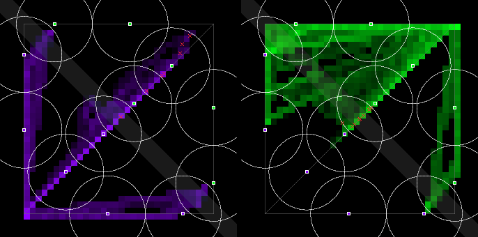
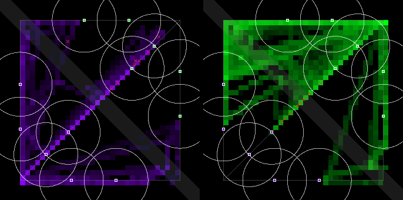
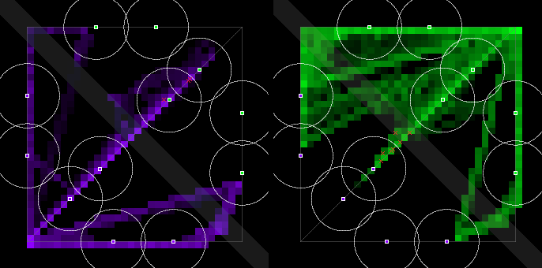

# PvP balance: tower range and placement, measured on Jev — 2026-09-30

**Question.** Ceryce (Telegram, 2026-09-30 19:43 CT), after watching old matches played on
`qwen3.5:9b`: *"imo the tower range is too large. There should be room between the towers for the
opposing players to fight."* At 19:46 she set the criterion that balance changes are judged against.
It is now recorded in [`docs/design.md`](../docs/design.md#design-principle-players-fight-players):
the game should enable exciting play by encouraging player-vs-player interaction, and even its
player-vs-environment parts should encourage team fights.

**Verdict.**

- **The qwen matches did not mislead.** The problem is in the geometry, so it is the same on any
  model. On the specimen map no stretch of any lane is outside both outer towers' range: the two
  coverage circles overlap by 139 units. On Jev:
  - 29 of 32 deaths in the 22 house medium-vs-hard matches came under the killer team's tower.
  - Only 2 came on neutral ground.
  - 34 of the 52 team fights started inside BOTH mid outer towers' range at once.
- **Top proposal, implemented as `pvp-1`.** Every tower moves back toward its own base: tower
  fractions go from 0.22 / 0.42 to 0.16 / 0.30, and the range stays at 160. That leaves a neutral
  stretch in every lane: 132 units in mid and 320 in top and bottom.
- **Results on 8 seed-paired Jev matches against the specimen map** (95% bootstrap intervals over
  pairs; "8/0" means all 8 pairs moved the same way):
  - PvP damage rose from 143 to 180 per minute (+26%, CI +6 to +73; 6 pairs up, 2 down).
  - The share of PvP damage taken on neutral ground went from 21% to 62% (8/0).
  - Deaths under the killer team's tower fell from 96% to 55%.
  - Bot-time under an enemy tower fell from 17.0% to 10.4% (8/0).
  - Bot-time on the opponent's side rose from 17.4% to 21.5% (8/0).
  - First blood came 83 s earlier (6 pairs earlier, 1 later).
  - Swinginess rose from 96 to 127 per minute (7 pairs up, 1 down).
- **Two costs, both measured.**
  - **Fewer team fights:** 4.6 → 2.75 a match (CI −3.4 to −0.4). The old team fights were mostly
    the mid tower overlap pulling every bot into one spot. Take the overlap away and nothing pulls
    the teams together yet.
  - **More minion farming, less tower damage:** bots dealt +106 per minute to minions and −98 per
    minute to towers (8/0 both ways), and 0.75 fewer towers fell per match.
- **The literal suggestion — cut the range — was measured too, and rejected.** That variant,
  `pvp-1r` (range 120, fractions 0.20 / 0.34), opens a similar neutral stretch. It did not raise
  PvP (−9 per minute, CI −40 to +24). Towers hit bearbots 81% harder (+183 per minute, 8/0). The
  bots spread apart: time near a friendly bot fell 15 pp.
- **The default map is now `pvp-1`.** New matches use it, whether started from the CLI, the arena,
  or the evolution harness. Logs written before this change have no `map` field and still replay
  on the specimen map. The sim itself is untouched (below).

## 1. Geometry, model-independent

Tower range is centre to centre (`dist(unit.pos, tower.pos) <= attackRange` in the frozen
`src/sim/match.ts`). "Neutral" means the stretch of lane path between the two outer towers that
neither of them covers. Computed by `laneCoverage()` in [`src/mapVariant.ts`](../src/mapVariant.ts)
at 4,000 samples per lane.

| map | range | fractions | lane | lane length | outer-tower distance | circle gap | neutral path | overlap path |
|---|---:|---|---|---:|---:|---:|---:|---:|
| **v1 (specimen)** | 160 | 0.22 / 0.42 | mid | 1131 | 181 | **−139** | **0 (0%)** | 139 |
| | | | top, bottom | 1600 | 181 | −139 | **0 (0%)** | 192 |
| **pvp-1** | 160 | 0.16 / 0.30 | mid | 1131 | 453 | +133 | **132 (11.7%)** | 0 |
| | | | top, bottom | 1600 | 453 | +133 | **320 (20.0%)** | 0 |
| pvp-1r | 120 | 0.20 / 0.34 | mid | 1131 | 362 | +122 | 122 (10.8%) | 0 |
| | | | top, bottom | 1600 | 362 | +122 | 272 (17.0%) | 0 |

Things the table does not show:

- **On v1, the midpoint of mid is 90 units from both outer towers.** So any 1-v-1 over the
  minion wave happens under both towers. Whichever bot has stepped past the centre is the one being
  shot.
- **The top and bottom lanes bend at their corner (fraction 0.5).** On v1 the two outer towers in
  those lanes are 181 apart in a straight line, as in mid. The corner itself sits inside both
  circles.
- **`pvp-1` keeps the range at 160, which is also the keytar's attack range.** Three reasons:
  1. Under 160, a keytar can hit a tower from outside the tower's reach.
  2. Every house prompt states "range 160" (`prompts/pilots/house-*.md`, `tools/evolve/mutate.py`),
     and those prompts stay correct.
  3. Measured below, cutting the range did not make towers safer anyway.

  Inner towers move from 0.22 to 0.16. That keeps them 158 units behind the outer tower in mid
  (224 in top and bottom), less than two 160 ranges, so each team's own coverage stays continuous
  back to the nexus. In mid, 0.16 puts the inner tower 181
  units from the nexus.

## 2. Behaviour before any change: the house-tier Jev logs

These are the 42 Jev matches from PR #40 (release
[`data-house-tiers-2026-09-30`](https://github.com/kumouri/promptlane/releases/tag/data-house-tiers-2026-09-30),
zip sha256 `51489a12…`). All are full length at cadence 2, and all replay-verified while being
measured. Full tables: [`balance-pvp-2026-09-30-baseline-metrics.md`](balance-pvp-2026-09-30-baseline-metrics.md).

| | medium vs hard (22) | vs easy (20) |
|---|---:|---:|
| PvP share of bearbot damage | 20.2% | 22.2% |
| bot-time engaged in PvP / in PvE only | 7.9% / 14.8% | 5.7% / 10.2% |
| bearbot damage/min to bots / minions / towers + nexus | 115 / 193 / 259 | 81 / 144 / 139 |
| deaths under the killer team's tower (mean per match) | **93.5%** (29 of 32 pooled) | 93.8% |
| deaths dealt by a tower | 60.2% | 62.5% |
| PvP damage taken on neutral ground | 26.7% | 38.4% |
| team fights / match (mean length ≈ 2.5 s) | 2.36 | 2.20 |
| team fights starting inside both mid outer towers | **34 of 52** | 2 of 44 |
| team fights starting before 5:00 | 0 of 52 | 1 of 44 |



*How to read every heatmap here:*

- Violet's positions are on the left, green's on the right. Both are log-scaled alive-bot time over
  25 × 25 cells, summed over the condition's matches.
- Violet's base is bottom-left. The grey band is the river.
- White circles are tower coverage. Each tower marker is filled with its team's colour.
- Red ✕ marks where a bot of that panel's team died.

**Reading.** In this baseline, bearbots mostly hit structures and minions; bearbot-vs-bearbot is
a fifth of their damage and under a tenth of their time. When someone dies it is almost always a
tower dive, and a tower usually lands the last hit. The team fights that do happen are short, start
after 5:00, and two thirds of them are the two teams meeting in the mid overlap. That fits
Ceryce's read of the qwen matches: there is no room between the towers, so the only fights are
fights under them.

## 3. The experiment

- **Same matches on three maps.** Each map got the same 8 matches: medium vs hard and hard vs hard,
  each on seeds 7, 11, 42 and 101. That is 24 matches.
- **Run the Jam way.** Every match was full length at cadence 2, with both sides playing their
  compiled prose (`runs/house-tiers-schemas-{medium,hard}-2026-09-30.json`) on Jev. Jev was served
  from a private `schema_server.py --port 8821` on the TypeSafe backend.
- **Pairing.** For each pairing and seed, the three maps ran side by side, so each pair also shares
  the same time window on the backend.
- **Clean run.** 38,649 Jev calls: 0 errors, 0 Workers AI failovers, 0.24 s mean. Every one of the
  24 logs replay-verifies, 120 of 120 checkpoints.
- **Spend: $1.44.**
- **Pairing caveat.** Jev is not deterministic (PR #40 saw same-seed reruns diverge about a minute
  in), so a seed fixes minion jitter and entity ids, not the match. That is why the comparison is
  paired, with intervals.
- **Logs.** The 24 logs are not in git. They are on the
  [`data-balance-pvp-2026-09-30`](https://github.com/kumouri/promptlane/releases/tag/data-balance-pvp-2026-09-30)
  prerelease as `runs/balance-pvp-2026-09-30-<map>-<pairing>-seed<N>.json`.

Full tables, per-bot "vs position" rows, and both paired tables:
[`balance-pvp-2026-09-30-metrics.md`](balance-pvp-2026-09-30-metrics.md). Raw numbers:
[`balance-pvp-2026-09-30-metrics.json`](balance-pvp-2026-09-30-metrics.json).

### Results, per condition (means over 8 matches) and seed-paired Δ for `pvp-1`

In the last column, the bracket is the 95% bootstrap interval of the paired mean difference, and
"u/d" counts how many pairs went up and down.

| metric | v1 | **pvp-1** | pvp-1r | pvp-1 − v1, paired [95% CI] u/d |
|---|---:|---:|---:|---|
| deaths / min | 0.213 | 0.200 | 0.125 | −0.01 [−0.09, +0.06] 1/2 |
| damage / min, all sources | 2880 | 2842 | 2981 | −38 [−103, +16] 3/5 |
| damage / min, **PvP** (bot → enemy bot) | 143.0 | **179.9** | 134.2 | **+36.8 [+6.0, +72.7] 6/2** |
| damage / min, bot → minions | 133.5 | 239.9 | 215.1 | +106 [+85, +126] 8/0 |
| damage / min, bot → towers + nexus | 277.4 | 179.4 | 230.7 | −98 [−112, −82] 0/8 |
| damage / min, towers → bots | 226.0 | 274.8 | 408.9 | +49 [+24, +75] 7/1 |
| PvP share of bot damage | 26.1% | 29.9% | 23.2% | +3.8 pp [−0.4, +8.6] 6/2 |
| bot-time engaged in PvP | 9.7% | 10.9% | 8.9% | +1.2 pp [−0.5, +3.3] 6/2 |
| bot-time engaged in PvE only | 14.5% | 18.2% | 19.2% | +3.7 pp [+2.1, +5.4] 8/0 |
| bot-time near ≥1 friendly bot | 72.2% | 67.5% | 57.4% | −4.6 pp [−7.7, −1.7] 1/7 |
| bot-time on the opponent's side | 17.4% | 21.5% | 20.1% | **+4.1 pp [+2.6, +5.7] 8/0** |
| …of which near a friendly (gank proxy) | 67.5% | 63.8% | 44.3% | −3.7 pp [−8.1, +0.1] 2/6 |
| bot-time under an enemy tower | 17.0% | 10.4% | 8.8% | **−6.7 pp [−7.8, −5.4] 0/8** |
| team fights / match | 4.63 | 2.75 | 2.13 | **−1.9 [−3.4, −0.4] 2/6** |
| team-fight seconds / match | 11.3 | 8.9 | 6.0 | −2.4 [−6.9, +2.3] 2/6 |
| PvP damage taken on neutral ground | 20.7% | **62.3%** | 65.9% | **+41.6 pp [+31.0, +52.4] 8/0** |
| PvP damage taken under the victim's own tower | 24.0% | 14.9% | 14.7% | −9.1 pp 0/8 |
| PvP damage taken under an enemy tower | 43.1% | 22.8% | 19.4% | −20.3 pp 0/8 |
| PvP damage taken where both teams' towers cover | 12.2% | 0.0% | 0.0% | −12.2 pp 0/8 |
| deaths under the killer team's tower | 95.8% | 54.8% | 61.1% | −40.5 pp [−64, −21] 0/6 |
| deaths dealt by a tower | 54.2% | 23.8% | 30.6% | −23.8 pp [−67, +14] 2/3 |
| gold proxy / min, both teams | 144 | 164 | 130 | +20 [−4, +46] 6/2 |
| swinginess, \|d(gold diff)/dt\| per min | 96 | 127 | 110 | **+31.5 [+16.9, +45.4] 7/1** |
| swing ratio (swinginess ÷ gold/min) | 0.66 | 0.76 | 0.84 | +0.1 [+0.0, +0.2] 6/2 |
| lead changes / match | 1.25 | 1.88 | 1.63 | +0.6 [−0.4, +1.6] 5/2 |
| \|gold diff\| at 3:00 / 6:00 | 30 / 140 | 68 / 296 | 110 / 294 | +38 / +156 (intervals include 0) |
| first blood happened / at, s | 100% / 443 | 88% / 360 | 75% / 348 | first blood **−83 s [−152, −10] 1/6** |
| towers destroyed / match | 2.25 | 1.50 | 1.75 | −0.75 [−1.0, −0.4] 0/6 |
| decided (not a draw) | 25% | 50% | 25% | +25 pp [−38, +75] 4/2 |

Heatmaps for the same three conditions:





### What moved, and why (inferred from the numbers, not traced)

- **`pvp-1` moved PvP out from under the towers and raised it.**
  - Three fifths of PvP damage now lands on neutral ground. Before, it was one fifth.
  - Deaths are no longer mostly tower executions.
  - Bots spend more time on the enemy half and less under enemy towers.
  - Games get their first kill earlier, and the gold lead swings more.
- **The violin, the assassin, gained most.** Hard's violin went from 15.6 to 34.9 PvP damage per
  minute. The bottom lane's 320-unit neutral stretch is where a melee duel can happen without a
  tower joining in.
- **More farming and fewer fallen towers are the other side of the same move.** Bots now meet the
  minion wave in neutral ground, so they spend longer killing minions and reach towers less often.
- **Team fights went down, and section 2 says why.** On v1 the mid overlap was a shared place both
  teams walked into. `pvp-1` removes it and adds nothing to replace it. The second clause of the
  principle ("even the player vs environment parts should encourage team fights") is the one
  `pvp-1` does not satisfy.
- **Cutting the range (`pvp-1r`) backfired on the towers.**
  - Drums took 125 tower damage per minute on `pvp-1r`, against 70 on v1 and 85 on `pvp-1`.
  - Violin took 68, against 27 on v1 and 33 on `pvp-1`.
  - The likely mechanism: towers shoot minions first. A 120 circle holds fewer of them, so a melee
    bot hitting the tower is more often the only target.
  - `pvp-1r` also spread the team apart: time near a friendly bot fell 15 pp, and the gank proxy
    fell 23 pp.

### Per bot, vs others in their position

From the per-bot tables in the metrics file; n is 4 for medium, whose prompt only plays violet, and
12 for hard.

- **Hard's violin.** Its PvP share of team damage went from 21% to 40%. It was the first-blood
  killer in 25% of matches on `pvp-1`, against 33% on v1. Its kill participation stayed about the
  same (75% → 76%).
- **Hard's drums.** Still the passive position: 8.7 PvP damage per minute on `pvp-1`, 3.4 below the
  drums average. It was never the first-blood killer on v1 or `pvp-1`.
- **Medium's drums.** It took first blood in 3 of 4 matches on v1, its prose's early aggression
  under the mid towers. On `pvp-1` that fell to 1 of 4, while its PvP damage went from 13.4 to
  22.4 per minute.

## 4. Proposals, and which the data supports

1. **Pull the towers back, keep the range** (`pvp-1`). Supported: see §1–§3. Implemented and made
   the default.
2. **Cut tower range** (`pvp-1r`). Measured and rejected (§3). It is kept in `MAP_VARIANTS` so its
   logs replay by name.
3. **A neutral objective that pulls the teams together.** This is supported as the next step, but
   it is not implemented.
   - On v1, two thirds of team fights formed at the one point both teams had a reason to stand on.
   - `pvp-1` removed that point, and team fights fell by 40%.
   - A river objective would put the shared point back, on neutral ground.
   - It needs a new mechanic, such as a capturable point or a buff. Like the map change, that can
     be built outside the frozen sim, but it is a design decision first.
4. **Kill rewards.** Not actionable as a balance constant. The specimen has no gold economy and no
   respawn: a dead bearbot stays dead, which is already the largest reward a kill can give.

## 5. What this change touches, and what it invalidates

- **The sim is not edited.** `src/sim/*`, `src/rng.ts`, `src/pilots/*` and `src/types.ts` are
  unchanged, so the hashes in `historical-v1.md` hold.
- **How the variant is applied.** It is a constant in `src/mapVariant.ts`. `applyMapVariant()` moves
  and re-ranges the towers of a freshly built `Match` before its first tick. These callers do that:
  - the headless runner and `verifyReplay` (`tools/match/headless.ts`);
  - the browser replay and live view (`src/live.ts`, with the arena's `meta` event carrying `map`);
  - the metrics tool.
- **Logs record their map.** A variant log carries `map`. A specimen-map log is byte-for-byte what
  it was before.
- **Still on the specimen map:** the acceptance adapters and the browser's local demo match
  (`src/main.ts`).
- **What the default flip invalidates for Jam purposes:**
  - The house-tier results in `runs/house-tiers-2026-09-30.md` were measured on v1. The tier
    ordering, and the medium = hard finding, need re-running on `pvp-1`. Here, medium beat hard in
    2 of 4 matches on both v1 and `pvp-1` (the rest were draws); the sample is too small to say
    more.
  - Evolution campaign 1 runs from a pinned checkout, so it still plays v1. Its genomes and fitness
    are v1 numbers. Re-tuning after merge is expected.
  - Anything already scored in the arena was scored on v1.

## 6. Metric definitions

Every definition is a named constant at the top of
[`tools/match/metrics.ts`](../tools/match/metrics.ts), with its reason beside it.

- **Near a friendly bot:** within 200. That is keytar's chord reach (180 + 60) less a step, or
  about 3 s of walking.
- **Team fight:** ≥ 2 bots of each team engaged within 250 of one engaged bot. "Engaged" means the
  bot dealt or took bearbot damage in the last 3 s. Fight moments less than 5 s apart merge into
  one fight.
- **Kill credit:** League's rule — the last-hitting bearbot, else the last bearbot that damaged the
  victim within 10 s. Assists are other damagers in that window.
- **Gold proxy:** there is no gold in the sim, so this counts the value of what a team destroyed.
  A bearbot kill is 300 and a tower 250, credited to the team that destroyed them by any means. A
  minion is 20, and only when a bearbot last-hit it.
- **Swinginess:** mean |Δ(violet − green gold proxy)| per minute, over 30 s windows.
  - The window is one minion wave. A 1 s derivative would just reproduce gold per minute, because
    gold arrives in lumps, one team at a time.
  - The swing ratio divides swinginess by gold per minute: 0 means the teams always earned evenly,
    1 means every window went one way.
- **Opponent's side:** across the river (x = y).
- **Tower coverage:** uses the towers alive at that tick.
- **Not computed:** objective control. The only objectives are towers, so it would be "share of
  destroyed towers" (`objectiveControl` in the JSON), which is too thin to tabulate at 1–2 towers a
  match.

## 7. Reproduce

```sh
# a match on a given map (the default is now pvp-1)
npm run match -- --a prompts/pilots/house-violet.md --a-schemas runs/house-tiers-schemas-medium-2026-09-30.json \
    --name-a medium --b prompts/pilots/house-hard.prose.md --b-schemas runs/house-tiers-schemas-hard-2026-09-30.json \
    --name-b hard --jev-schema http://127.0.0.1:8821/ --cadence 2 --seed 7 --map v1 --out runs/x.json
# metrics; the first --group is the paired baseline
npm run metrics -- --group v1 runs/balance-pvp-2026-09-30-v1-*.json --group pvp-1 runs/balance-pvp-2026-09-30-pvp-1-*.json \
    --group pvp-1r runs/balance-pvp-2026-09-30-pvp-1r-*.json --md out.md --json out.json --heatmaps runs/out-heatmap
```

## Follow-ups

- **Re-run the house tiers on `pvp-1`.** Check whether hard still fails to beat medium.
- **Design and measure a neutral river objective.** It is the open half of the principle: team
  fights.
- **Larger samples.** n = 8 pairs resolves the big effects (location, PvP damage, time under
  towers) but not deaths per minute, lead changes or decided rate.
