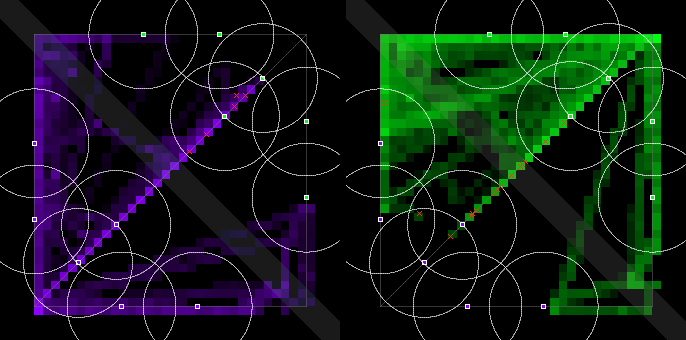
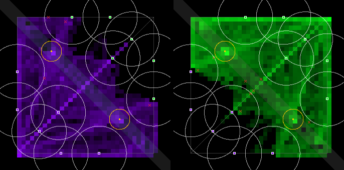
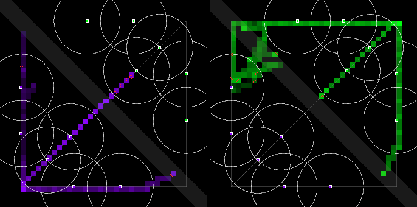
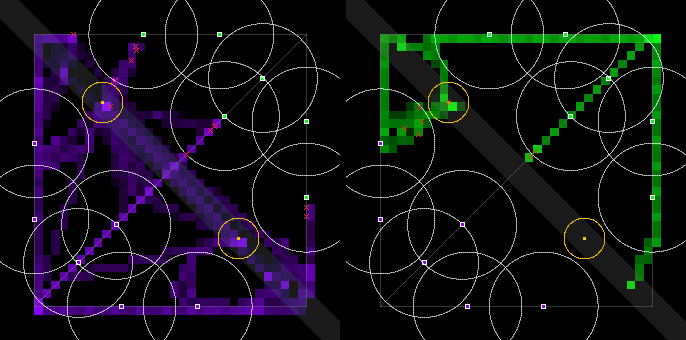

# The Bandstand, redesigned: `river-2` and `recall-2` on Jev (2026-09-30)

This run re-measures the river objective after Ceryce's redesign (2026-09-30 23:00 CT, corrected
23:02; [`docs/economy-spec.md`](../docs/economy-spec.md) §8 Q18 and §9.10). The first measurement,
[`runs/bandstand-2026-09-30.md`](bandstand-2026-09-30.md), failed: every hard-vs-hard match froze on
one stage. The pre-registered lines are §9.8's, unchanged.

## Verdict

- **As briefed (P2 vs O2, `recall-2` on in both arms): FAIL, 7 of 10 lines.** The objective is not
  the cause. `recall-2` is, together with today's house tiers.
  - The tiers recall at low hp in the middle of a lane, and minions interrupt every channel. So the
    bot stands still, channels again, is hit again, and dies.
  - With no respawn in the map-only game, **31 of 65 deaths in P2 come before the first stage opens at
    1:30**, and every match ends as a draw with 2–4 bots left.
  - P2 and O2 both have 0 team fights. Their numbers describe a near-empty map, not the Bandstand.
- **`river-2` alone (R, the specimen recall, against the first run's P on the same seeds): 8 of 10
  lines pass.** The stalemate is gone.
  - Hard vs hard went from 0 captures and 6 of 6 stages frozen for the whole match to 1.83 captures
    per match. The stage now closes and moves on.
  - Captures per match: median 3.5 (line ≥ 3, PASS). The capture split is 50 % (line ≥ 50 %, PASS).
    Fights at an open stage: 1.08 per match (line ≥ 1, PASS). All five keep-lines pass.
  - **Two lines miss narrowly.** Team fights are 3.92 a match against a line of 4.6 (Δ +1.50, CI
    [+0.42, +2.75], wholly above 0). The contested share is 49.2 % against 50 %.
  - **A new one-sidedness, in hard vs hard.** Violet took all 11 captures, every one uncontested:
    no green bot was on the stage at any tick of those openings. Every contested opening ran to its
    close untaken. The 50 % split comes entirely from medium vs hard.
- **What `recall-2` alone did (P2 against the first run's P, same seeds and tiers).**
  - Deaths went from 2.25 to 5.42 a match, and first blood from 4:50 to 0:59.
  - PvP damage fell from 186 to 26 a minute. Team fights fell from 2.42 to 0, decided matches from
    100 % to 0 %, and towers from 1.0 to 0.
  - Of 38.5 recalls started a match, 5.0 got home and 26.6 were interrupted by damage.
- **The design check:** three bots beat every *walking* enemy by at least 0.47 s. The keytar's dash
  and the violin's solo from an adjacent lane get there first, and two bots or one bot do not meet
  the goal from an adjacent lane. The margins are below.
- **Spend: $1.39** (budget about $2.10, ceiling $3).

## The pre-registered table, as briefed: P2 (`pvp-1` + `recall-2`) vs O2 (+ `river-2`)

Δ is O2 − P2, seed-paired, with a 95 % bootstrap CI over the 12 pairs. The table is printed by
`--prereg bandstand`. The full tables are in
[`bandstand-2-2026-09-30-metrics-recall2.md`](bandstand-2-2026-09-30-metrics-recall2.md).

| line | metric | P2 | O2 | Δ [95 % CI] | pass line | result |
|---|---|---:|---:|---|---|---|
| target | team fights / match | 0.00 | 0.00 | +0.00 [+0.00, +0.00] | O mean ≥ 4.6 and Δ CI wholly above 0 | **FAIL** |
| keep | damage / min, PvP | 25.7 | 28.8 | +3.08 [−2.88, +9.67] | O ≥ 161 and CI not wholly below 0 | **FAIL** |
| keep | PvP damage taken in neutral ground | 51.7 % | 52.1 % | +0.4pp [−4.2pp, +5.2pp] | O ≥ 41.5 % and CI not wholly below 0 | PASS |
| keep | bot-time under an enemy tower | 8.2 % | 6.0 % | −2.2pp [−4.3pp, −0.0pp] | O ≤ 13.7 % and CI not wholly above 0 | PASS |
| keep | deaths under the killer team's tower | 80.0 % | 64.7 % | −15.3pp [−23.3pp, −4.4pp] | O ≤ 75.3 % and CI not wholly above 0 | PASS |
| keep | first blood at, s | 59 | 59 | −0.12 [−0.79, +0.52] | O ≤ 402 and CI not wholly above 0 | PASS |
| in use | Bandstand captures / match, median | – | 1.0 | – | median ≥ 3 | **FAIL** |
| in use | openings contested, pooled | – | 10.0 % | – | ≥ 50 % | **FAIL** |
| in use | team fights at an open Bandstand / match | – | 0.00 | – | mean ≥ 1 | **FAIL** |
| in use | capture split | – | 0.0 % | – | ≥ 50 % | **FAIL** |
| reported | decided (not a draw) | 0.0 % | 0.0 % | – | – | reported |
| reported | towers destroyed / match | 0.00 | 0.00 | – | – | reported |
| reported | Jev decisions from a Bandstand rule (P2: about nothing) | 0 | 586 | – | – | reported |

**Are any lines meaningless under her rules?** No. Every line still measures what it measured on
`river-1`, and none was changed. What the lines cannot do here is separate the objective from
`recall-2`'s early deaths. First blood is at 59 s in both arms, half a minute before any stage exists.
That is why the run adds the R arm.

## `river-2` alone: P (first run) vs R (`pvp-1` + `river-2`)

The P logs are the first run's own, on the same 12 seeds and the same compiled schemas. R adds only
`river-2`, and keeps the specimen recall. Full tables:
[`bandstand-2-2026-09-30-metrics-river2.md`](bandstand-2-2026-09-30-metrics-river2.md).

| line | metric | P | R | Δ [95 % CI] | pass line | result |
|---|---|---:|---:|---|---|---|
| target | team fights / match | 2.42 | 3.92 | +1.50 [+0.42, +2.75] | O mean ≥ 4.6 and Δ CI wholly above 0 | **FAIL** (CI passes, mean misses) |
| keep | damage / min, PvP | 186.2 | 190.2 | +3.97 [−26.26, +30.81] | O ≥ 161 and CI not wholly below 0 | PASS |
| keep | PvP damage taken in neutral ground | 63.2 % | 71.2 % | +8.0pp [+2.0pp, +13.8pp] | O ≥ 41.5 % and CI not wholly below 0 | PASS |
| keep | bot-time under an enemy tower | 9.5 % | 8.0 % | −1.5pp [−2.4pp, −0.8pp] | O ≤ 13.7 % and CI not wholly above 0 | PASS |
| keep | deaths under the killer team's tower | 72.2 % | 60.0 % | −15.0pp [−50.0pp, +16.7pp] | O ≤ 75.3 % and CI not wholly above 0 | PASS |
| keep | first blood at, s | 290 | 295 | +11.28 [−32.37, +60.55] | O ≤ 402 and CI not wholly above 0 | PASS |
| in use | Bandstand captures / match, median | – | 3.5 | – | median ≥ 3 | PASS |
| in use | openings contested, pooled | – | 49.2 % | – | ≥ 50 % | **FAIL** |
| in use | team fights at an open Bandstand / match | – | 1.08 | – | mean ≥ 1 | PASS |
| in use | capture split | – | 50.0 % | – | ≥ 50 % | PASS |
| reported | decided (not a draw) | 100 % | 50 % | −50.0pp [−75.0pp, −25.0pp] | – | reported |
| reported | towers destroyed / match | 1.00 | 0.50 | −0.50 [−0.75, −0.25] | – | reported |
| reported | swinginess, per min | 126 | 68 | −58.00 [−83.25, −31.75] | – | reported |
| reported | the team with more captures won | – | 40.0 % | – | – | reported |
| reported | Jev decisions from a Bandstand rule | 0 | 3,587 | – | – | reported |

For comparison, the first run's `river-1` on these same seeds had 1.08 captures a match (median 0.5),
94 % of openings contested, 0.25 deaths a match and 7.17 team fights.

## What `recall-2` alone did: P (first run) vs P2 (`pvp-1` + `recall-2`)

There is no objective in either arm. Both use the same seeds and tiers, and only the recall differs.
Full tables: [`bandstand-2-2026-09-30-metrics-recall2-alone.md`](bandstand-2-2026-09-30-metrics-recall2-alone.md).

| metric | P (specimen 3× run) | P2 (`recall-2`) | Δ [95 % CI] |
|---|---:|---:|---|
| deaths / match | 2.25 | 5.42 | +3.2 [+2.8, +3.5] |
| deaths before 1:30, all 12 matches | – | 31 of 65 | – |
| first blood at, s | 290 | 59 | −231 [−287, −171] |
| damage / min, PvP | 186.2 | 25.7 | −160.5 [−181.4, −137.6] |
| team fights / match | 2.42 | 0.00 | −2.42 [−3.33, −1.58] |
| decided (not a draw) | 100 % | 0 % | −100pp |
| towers destroyed / match | 1.00 | 0.00 | −1.0 |
| recalls started / match | 66.75 | 38.50 | – |
| … got home | 60.50 | 5.00 | – |
| … interrupted by damage | – | 26.58 | – |
| bot-time recalling | 7.1 % | 4.9 % | – |

**Why.** Rule 1 of every instrument's compiled cascade is a recall: hard's at "hp is below 90",
medium's at "low" or "critically low on health". In a lane, that fires in the middle of a minion
wave.

- Under the 3× run, the bot left and came back healed.
- Under `recall-2` the bot stands still, and the next minion hit cancels the channel inside its
  3.5 s window.
- Within 0.5 s the cascade asks for `recall` again, so it never fights back and never walks away.

The rule works as ruled. The house tiers cannot use it, and that is what P2 measures. Fixing it
is a tier rewrite: walk out of reach (`move home`), then recall. That is outside this brief, which
allowed a tier change only for the "contest it" rule (below).

## Where the bots were

The heatmaps put violet on the left and green on the right; the gold rings are the two sites.

- **R:** both teams spend time on both stages and along the river between them.
- **O2:** hard's green side leaves almost no heat beyond its own lane edges, because it is dead by
  1:33.

| P (first run, same seeds) | R (`river-2`) | P2 (`recall-2`) | O2 (`river-2` + `recall-2`) |
|---|---|---|---|
|  |  |  |  |

## Captures per match

Each cell gives violet–green captures, then untaken closes (`river-2` only), deaths and the winner (V
violet, G green). P2 has no objective.

**Medium (violet) vs hard (green):**

| seed | P | O (`river-1`) | P2 (`recall-2`) | O2 (`river-2` + `recall-2`) | R (`river-2`) |
|---|---|---|---|---|---|
| 7 | 1 death, V | 1–1, 1 d, draw | 5 d, draw | 5–0 (+0 closed), 6 d, draw | 2–3 (+1 closed), 1 d, V |
| 11 | 1 d, V | 1–0, 1 d, draw | 5 d, draw | 5–0 (+0), 6 d, draw | 3–3 (+0), 1 d, V |
| 42 | 2 d, V | 2–1, 0 d, draw | 5 d, draw | 5–0 (+0), 6 d, draw | 2–3 (+1), 0 d, G |
| 101 | 3 d, V | 2–1, 1 d, draw | 5 d, draw | 5–0 (+0), 5 d, draw | 4–1 (+0), 1 d, V |
| 3 | 1 d, V | 1–0, 0 d, draw | 5 d, draw | 5–0 (+0), 6 d, draw | 2–4 (+0), 1 d, draw |
| 5 | 2 d, V | 3–0, 0 d, draw | 5 d, draw | 1–0 (+4), 6 d, draw | 1–3 (+1), 2 d, V |

**Hard vs hard:**

| seed | P | O (`river-1`) | P2 (`recall-2`) | O2 (`river-2` + `recall-2`) | R (`river-2`) |
|---|---|---|---|---|---|
| 7 | 3 d, V | 0–0, 0 d, draw | 6 d, draw | 1–0 (+4), 6 d, draw | 2–0 (+3), 1 d, draw |
| 11 | 3 d, V | 0–0, 0 d, draw | 5 d, draw | 0–0 (+5), 6 d, draw | 2–0 (+3), 0 d, draw |
| 42 | 2 d, G | 0–0, 0 d, draw | 6 d, draw | 0–0 (+5), 6 d, draw | 2–0 (+3), 1 d, draw |
| 101 | 3 d, G | 0–0, 0 d, draw | 6 d, draw | 1–0 (+4), 6 d, draw | 3–0 (+2), 1 d, G |
| 3 | 3 d, V | 0–0, 0 d, draw | 6 d, draw | 1–0 (+4), 6 d, draw | 0–0 (+4), 2 d, draw |
| 5 | 3 d, V | 0–0, 0 d, draw | 6 d, draw | 1–0 (+4), 6 d, draw | 2–0 (+3), 1 d, draw |

| | O (`river-1`) | O2 | R (`river-2`) |
|---|---:|---:|---:|
| captures / match, medium vs hard (mean) | 2.17 | 4.33 | 5.17 |
| captures / match, hard vs hard (mean) | 0.00 | 0.67 | 1.83 |
| captures / match, all (median) | 0.5 | 1.0 | 3.5 |
| untaken closes / match | – | 3.00 | 1.75 |

- **In O2,** hard's three bots were dead by 1:33 in every medium-vs-hard match. Medium's one survivor,
  violet's keytar, then took 5 stages uncontested in 5 of 6 matches.
- **In R, hard vs hard,** all 11 captures were violet's, and all were uncontested. Each came 2.5–7.5 s
  after the stage opened, with no green bot on it at any tick. Every opening both teams reached ran
  to its close untaken: 18 of 29 openings, 36–45 s of contest each. The top-side stage was never
  taken after its first opening.
- **Why violet, on a mirrored map with mirrored tiers?** Green's bots were simply not there when
  violet took a stage.
  - The likely cause is the economy work's finding (`docs/economy-spec.md` §13.3, merged in #54 while
    this ran). On `pvp-1` the frozen sim gives violet's minions an edge: 48 against 2 one-second
    samples under the enemy's towers, with no bots in the lanes. Violet's waves press, and green's
    bots defend their lane instead of walking to the river.
  - That is inferred, not traced here.

## The design check: can a coordinated team finish before any enemy arrives?

The check is the one §9.10 sets out.

- Travel is a straight line (the sim has no walls) to the stage's edge, where centre distance is
  ≤ 60. It starts from every lane midpoint and both fountains, at drums 55, keytar 60 and violin 75,
  with each movement ability if it is ready.
- Encore is left out: it lasts 45 s, and no stage opens within 75 s of a capture.
- Margin = enemy arrival − capture time, and **negative means the enemy gets there in time.**
- The table is for the top-side site; bottom-side is its mirror.

| From | Distance to the edge | drums | keytar | keytar glissando | violin | violin solo | Margin walking: 3 / 2 / 1 bots (2.5 / 5 / 7.5 s) | Margin with an ability ready |
|---|---:|---:|---:|---:|---:|---:|---|---|
| top lane midpoint (100, 100) | 223 | 4.05 s | 3.71 s | 1.38 s | 2.97 s | 1.86 s | **+0.47** / −2.03 / −4.53 | −1.12 / −3.62 / −6.12 |
| mid lane midpoint (500, 500) | 223 | 4.05 s | 3.71 s | 1.38 s | 2.97 s | 1.86 s | **+0.47** / −2.03 / −4.53 | −1.12 / −3.62 / −6.12 |
| bottom lane midpoint (900, 900) | 789 | 14.34 s | 13.14 s | 10.81 s | 10.51 s | 8.71 s | +8.01 / +5.51 / +3.01 | +6.21 / +3.71 / +1.21 |
| either fountain | 572 | 10.41 s | 9.54 s | 7.21 s | 7.63 s | 5.83 s | +5.13 / +2.63 / +0.13 | +3.33 / +0.83 / −1.67 |

- **Pass: three bots against every walking enemy,** from everywhere. The tightest case is the violin
  from an adjacent lane, at +0.47 s.
- **Fail: three bots against a ready glissando (1.38 s) or solo (1.86 s)** from an adjacent lane.
- **Fail: two bots or one bot against anyone** walking from an adjacent lane. One bot from a fountain
  passes by only 0.13 s walking, and fails against a solo.
- No number was adjusted, as ruled. These are physical bounds. A real enemy also needs a decision (2 s
  cadence), and the 20 s warning lets it pre-position, which contests from the first tick.

## Is her fallback needed now?

Her fallback is opposing jungle corners, both stages at once every 90 s, gold and XP only. **Not yet,
in my reading. This is not a ruling.**

- **What it was for.** The fallback answers "these tweaks don't work". The tweak that was measured
  cleanly, `river-2`, does work against the failure it targeted: there is no frozen stage, captures
  are back to 3.5 a match, and 8 of 10 lines pass.
- **The two misses are close.** Team fights are 3.92 against 4.6, with a CI wholly above 0. The
  contested share is 49.2 % against 50 %.
- **What would argue for it is the hard-vs-hard one-sidedness.** One team took every capture in all 6
  matches, and only medium vs hard produces the split. "One on your side" is exactly what opposing
  corners would fix. If the one-sidedness survives a look at its cause, that is the case for the
  fallback.
- **`recall-2` cannot be judged yet.** Today's tiers kill themselves with it, so neither its effect
  on the stage nor the "rotate one bot home" exploit it was meant to close can be read off this run.
  The next measurement needs tiers that walk out of reach before recalling.

**Options for the gate** (not rulings):

1. **Re-measure O2 with recall-aware house tiers** (about $2). Medium's and hard's recall rule becomes
   "walk home when low, recall once out of reach". This is the only way to measure Q18 as she ruled
   it. Economy P2's tiers need the same change.
2. **Ship `river-2` with the specimen recall**, and leave `recall-2` for after the tiers can use it.
   It passes 8 of 10 lines, and the two misses are within a few percent.
3. **Look at the violet bias first** (no Jev spend). Replay the hard-vs-hard R logs to see whether
   §13.3's minion edge is what keeps green's bots in lane. If it is, the fix is the map's, not the
   objective's.

**The hard house tier was not changed.**

- Its "contest it" rule (stand contested, or the bar leaning to the enemy, and hp > 40 % → go to the
  Bandstand) expresses `river-2` as it is. Going there is how the bigger group forms.
- Its recall rule is what fails under `recall-2`, and the brief did not open that rule.

## Setup

- **Backend.** Jev (`jev-latest` = `jev-1.13.0` per TypeSafe's live models page, $0.042 per million
  input tokens), TypeSafe default with Workers AI fallback. It ran on a private
  `tools/jev/schema_server.py --port 8863 --budget-usd 2.95`. Cadence 2 s, the Jam roster, full
  10-minute matches, map `pvp-1`.
- **Prompts.** The same checked-in compiled house schemas as the first run,
  `prompts/pilots/house-{medium,hard}.schemas.json`. They are unchanged, here and by #54, which merged
  while this ran and touched none of the files these matches read.
- **Pairings and seeds.** Medium (violet) vs hard (green), and hard vs hard. The seeds are 7, 11, 42,
  101, 3 and 5: the first run's first six, fixed before this run (`pl_queue.sh`). That makes 12 seed
  pairs per comparison.
- **Conditions.**
  - P2 = `--recall recall-2`; O2 = `--objective river-2 --recall recall-2`. These are the briefed
    pair, run side by side per seed.
  - R = `--objective river-2`, run after the P2 matches showed their early deaths.
  - P and O are the first run's own logs for the same seeds.
- **Why R was added.** P2's deaths made the briefed comparison blind to the objective. Dead bots make
  no calls, so P2 and O2's first pair cost $0.037 against the first run's $0.155, and R fit inside
  the budget.
- **Clean run.**
  - 29,263 Jev calls with 1 call error (that decision held). The mean call took 0.24 s.
  - 5 calls failed over to Workers AI, plus 345 cool-down calls behind them, with 1 fallback error.
  - All 36 new logs replay-verify, objective and channel state included. So do the first run's 48
    `river-1` logs under the new code.
- **Spend: $1.39**, the schema server's own estimate, including a $0.013 smoke match. The two queues
  overlapped on one server, so the spend is not split by arm.

## Logs and reproduction

- **Logs.** The 36 logs are not in git; their filenames are in `.gitignore`. They are on the
  [`data-bandstand-2-2026-09-30`](https://github.com/kumouri/promptlane/releases/tag/data-bandstand-2-2026-09-30)
  prerelease as `runs/bandstand-2-2026-09-30-<P|O|R>-<pairing>-seed<N>.json`. (P and O there are P2
  and O2 here.) The first run's P and O logs are on `data-bandstand-2026-09-30`.
- **Reproduce.**

```sh
# a match: P2 --recall recall-2; O2 --objective river-2 --recall recall-2; R --objective river-2
npm run match -- --a prompts/pilots/house-hard.prose.md --a-schemas prompts/pilots/house-hard.schemas.json \
    --name-a hard --b prompts/pilots/house-hard.prose.md --b-schemas prompts/pilots/house-hard.schemas.json \
    --name-b hard --jev-schema http://127.0.0.1:8863/ --cadence 2 --seed 7 --map pvp-1 \
    --objective river-2 --recall recall-2 --out runs/x.json
# the briefed verdict
npm run metrics -- --group P2 runs/bandstand-2-2026-09-30-P-*-seed*.json \
    --group O2 runs/bandstand-2-2026-09-30-O-*-seed*.json --prereg bandstand
# river-2 alone, against the first run's P on the same seeds (7 11 42 101 3 5)
npm run metrics -- --group P runs/bandstand-2026-09-30-P-*-seed{7,11,42,101,3,5}.json \
    --group R runs/bandstand-2-2026-09-30-R-*-seed*.json --prereg bandstand
```
