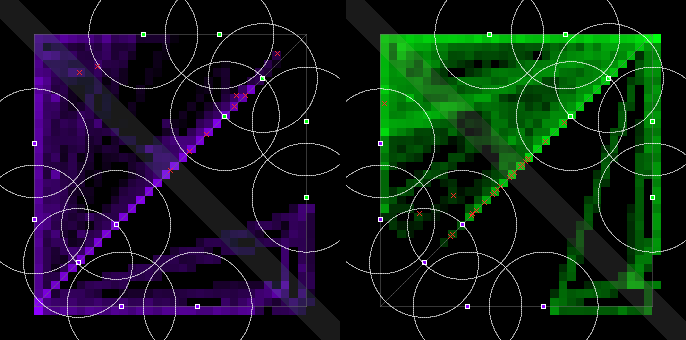
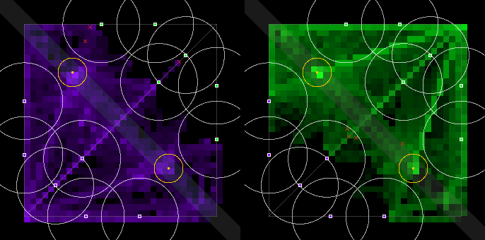

# The Bandstand on Jev — the §9.8 measurement (2026-09-30)

The river objective (`river-1`, [`docs/economy-spec.md`](../docs/economy-spec.md) §9, Q14–Q17 ruled
option A) measured the way §9.8 pre-registered it: plain `pvp-1` (**P**) against `pvp-1` + the
Bandstand (**O**), same compiled house schemas, 24 seed pairs on Jev.

## Verdict: FAIL by the pre-registered lines — the target passes, the objective stalls

- **The target passes.** Team fights per match go from **2.46 to 6.29**, Δ **+3.83** with 95% CI
  [+1.21, +6.50]. That clears both the "O mean ≥ 4.6" line and the "Δ CI wholly above 0" line. 5.83
  of those fights a match start at an open Bandstand.
- **Two keep-lines fail, on very few events.**
  - Deaths under the killer team's tower: O is 87.5%, against a line of ≤ 75.3%. That is 7 of 8
    deaths.
  - First blood: O's mean is 423 s, against a line of ≤ 402 s. Only 8 of the 24 O matches had a
    first blood at all.
  - Neither CI lies wholly on the wrong side of 0, so each line fails on its level alone.
- **Two "in use" lines fail.**
  - Median captures per match are **0.5**, against a line of ≥ 3.
  - The capture split is **20.8%**, against a line of ≥ 50%.
- **Why: the Bandstand turns into a stalemate.**
  - In **all 12 hard-vs-hard O matches**, the first stage opens at 1:30 and stays contested for the
    rest of the match (500–510 s). Nobody takes it and nobody dies.
  - O matches are 22 draws out of 24, against 4 of 24 in P. Towers destroyed fall from 1.17 a match
    to 0.08.
- **What §9.8 prescribes, and why it is not done here.** A regressing keep-line gets one tuning pass,
  and the objective is cut if it still regresses. That pass is **not run**, for two reasons:
  - **Budget.** A second O run is about $2.1, which would take total spend past the brief's $5
    ceiling.
  - **The levers don't fit the failure.** §9.8's tuning levers (set length 20 s, radius 80, Encore
    +20%) are for a missed target. The target passed; what failed is the freeze rule meeting house
    bots that never leave the stage. A longer set or a wider stage would only lengthen the stand-off.
  - So Ceryce rules on the way forward (Q17's gate, Sun 10-04). The options are at the end.

## Setup

- **Backend.** Jev, TypeSafe default with Workers AI fallback, from a private
  `tools/jev/schema_server.py --port 8861 --budget-usd 4.80`. Cadence 2 s, Jam roster, full
  10-minute matches, map `pvp-1` in both conditions.
- **Prompts.** The checked-in house schemas `prompts/pilots/house-{medium,hard}.schemas.json`, the
  same files in P and O:
  - the tier cascades measured in `runs/house-tiers-2026-09-30.md` and `runs/balance-pvp-2026-09-30.md`;
  - plus the §9.7 Bandstand rules, spliced in right after each instrument's low-hp recall, with
    every other rule byte-identical;
  - medium gains one rule: the stage is open, no enemy bearbot is in sight, and hp is above half;
  - hard gains three: medium's rule; contested or the enemy is gaining, with hp above 40%; opening
    within 10 s and under 400 away.
  - In P the description says "There is no Bandstand in this match.", so the only difference between
    P and O is the layer.
- **Pairings.** Medium (violet) vs hard (green), and hard vs hard, which are the balance study's.
- **Seeds.** The study's 7, 11, 42 and 101, plus 3, 5, 13, 17, 19, 23, 29 and 31, which were fixed
  before the run (in `pl_queue.sh`). That is 24 pairs and 48 matches.
- **Running.** Each pair's P and O ran side by side, so both shared the backend's time window.
- **Clean run.**
  - 78,615 Jev calls, 0 errors, 0.244 s mean.
  - 2 calls failed over to Workers AI, with 0 fallback errors.
  - Every one of the 48 logs replay-verifies (all checkpoints, objective state included).
- **Spend: $3.96**, the schema server's own estimate. That includes a $0.017 two-minute smoke match
  before the run. It is over the brief's ≈ $3 estimate and under its $5 ceiling. Hard-vs-hard pairs
  cost about $0.175 each, medium-vs-hard about $0.155.
- **Jev on a stage that isn't there: 0.** No P decision came from a Bandstand rule, so Jev never
  answered "yes" about the Bandstand when the description said there was none. In O, 23,135
  decisions did.

## The pre-registered table

The verdict table below is printed by `--prereg bandstand`. Δ is O − P, seed-paired, with a 95%
bootstrap CI over the 24 pairs. Full tables are in
[`bandstand-2026-09-30-metrics.md`](bandstand-2026-09-30-metrics.md) and the raw numbers in
[`bandstand-2026-09-30-metrics.json`](bandstand-2026-09-30-metrics.json).

| line | metric | P | O | Δ [95 % CI] | pass line | result |
|---|---|---:|---:|---|---|---|
| target | team fights / match | 2.46 | 6.29 | +3.83 [+1.21, +6.50] | O mean ≥ 4.6 and Δ CI wholly above 0 | PASS |
| keep | damage / min, PvP (bot → enemy bot) | 177.3 | 265.4 | +88.09 [-6.47, +186.71] | O ≥ 161 and CI not wholly below 0 | PASS |
| keep | PvP damage taken in neutral ground | 61.8% | 81.4% | +19.6pp [+12.2pp, +26.2pp] | O ≥ 41.5 % and CI not wholly below 0 | PASS |
| keep | bot-time under an enemy tower | 9.9% | 2.2% | -7.7pp [-8.9pp, -6.4pp] | O ≤ 13.7 % and CI not wholly above 0 | PASS |
| keep | deaths under the killer team's tower | 65.2% | 87.5% | +22.2pp [-33.3pp, +72.2pp] | O ≤ 75.3 % and CI not wholly above 0 | **FAIL** |
| keep | first blood at, s | 320 | 423 | +21.92 [-125.37, +223.06] | O ≤ 402 and CI not wholly above 0 | **FAIL** |
| in use | Bandstand captures / match, median | – | 0.5 | – | median ≥ 3 per match | **FAIL** |
| in use | openings contested (both teams on the stage), pooled | – | 93.3% | – | ≥ 50 % of openings | PASS |
| in use | team fights starting at an open Bandstand / match | – | 5.83 | – | mean ≥ 1 per match | PASS |
| in use | capture split: the fewer-captures team took ≥ 1 | – | 20.8% | – | ≥ 50 % of matches | **FAIL** |
| reported | bot-time on opponent's side | 21.5% | 14.9% | -6.6pp [-8.4pp, -4.4pp] | – | reported |
| reported | decided (not a draw) | 83.3% | 8.3% | -75.0pp [-91.7pp, -58.3pp] | – | reported |
| reported | towers destroyed / match | 1.17 | 0.08 | -1.08 [-1.29, -0.88] | – | reported |
| reported | bot-time engaged in PvE only | 17.7% | 3.8% | -13.9pp [-16.0pp, -11.8pp] | – | reported |
| reported | swinginess (gold-proxy), per min | 128 | 19 | -108.33 [-125.75, -90.00] | – | reported |
| reported | the team with more captures won | – | 100.0% | – | – | reported |
| reported | Jev decisions from a Bandstand rule (in P: about nothing) | 0 | 23,135 | – | – | reported |

## What the matches did

| | P | O |
|---|---:|---:|
| deaths, all 24 matches | 51 | 8 |
| … of which under the killer team's tower | 31 | 7 |
| matches with a first blood | 22 | 8 |
| draws | 4 | 22 |
| Bandstand captures, hard vs hard (12 matches) | – | 0 |
| Bandstand captures, medium vs hard (12 matches) | – | 1–4 each, 29 in all (violet 24, green 5) |

**Hard vs hard.** Hard's three rules send all six bots to the stage, and keep them there while it is
contested.

- The first opening was never taken in any of the 12 matches: contested for 500–510 s, 0 deaths,
  all draws.
- Hard recalls at under 90 hp and comes straight back (its "opens soon" and "contest it" rules), so
  nobody stays dead or gone long enough for the other team to clear the stage.
- Under Q14-A any enemy freezes the bar, so the stand-off has no end.

**Medium vs hard.** Medium only goes to an open stage when no enemy bearbot is in sight, so the
stage changes hands. There were 29 captures over 12 matches, 24 of them by medium's violet side.
Even here, 10 of 12 matches were draws.

**Where the PvP went.** PvP damage per minute rose 50% (its CI just includes 0). The share of PvP
damage on neutral ground rose to 81%. Time under enemy towers fell to 2.2%.

But kills fell from 51 to 8. Bots now trade damage on the stage and recall before they die, so the
fights the metric counts are long brawls without deaths. Of the 8 deaths O did have, 7 were tower
dives. That is why the deaths-under-tower and first-blood lines read as regressions on so few
events.

Heatmaps (violet left, green right; gold rings are the two Bandstand sites):

| P | O |
|---|---|
|  |  |

## For Ceryce: the ways forward (Q17's gate, Sun 10-04)

§9.8 says "a keep-line regresses: one tuning pass; if it still regresses, the objective is cut". The
data points at the contest rule, not at §9.8's three tuning levers. These are the options as I see
them, not rulings:

1. **Cut it for the Jam.** This is §9.8's literal outcome if no tuning pass is funded. The Jam runs
   on `pvp-1` at about 2.5 team fights a match.
2. **Fund one tuning pass (about $2.1) aimed at the stalemate.** Two candidates:
   - *The bigger group moves a contested bar*, at the rate of the difference in bots. This departs
     from Q14-A's "any enemy freezes it", so it needs a new ruling.
   - *A contested stage drains*, so a stand-off ends in a reset and a re-race rather than a freeze.
     This is closer to the ruling.

   Either is a constants-plus-one-branch change in `src/objective.ts`; re-run O on the same seeds.
3. **Ship as is** under Q17's "it did no harm" clause. It did harm, though: matches go from 83% to
   8% decided, and towers stop falling. So this option is weak.
4. **Change the house bots, not the rule.** Hard's "contest it" rule is what parks all six bots on
   the stage. Entrants may not write it, but the house tiers set the placement bar, so this is a
   house-tier decision.

## Logs and reproduction

- **Logs.** The 48 logs are not in git; their filenames are in `.gitignore`. They are on the
  [`data-bandstand-2026-09-30`](https://github.com/kumouri/promptlane/releases/tag/data-bandstand-2026-09-30)
  prerelease as `runs/bandstand-2026-09-30-<P|O>-<pairing>-seed<N>.json`.
- **Reproduce.**

```sh
# a match (P: --objective none; O: --objective river-1)
npm run match -- --a prompts/pilots/house-violet.md --a-schemas prompts/pilots/house-medium.schemas.json \
    --name-a medium --b prompts/pilots/house-hard.prose.md --b-schemas prompts/pilots/house-hard.schemas.json \
    --name-b hard --jev-schema http://127.0.0.1:8861/ --cadence 2 --seed 7 --map pvp-1 --objective river-1 --out runs/x.json
# metrics and the verdict; the first --group is P
npm run metrics -- --group P runs/bandstand-2026-09-30-P-*-seed*.json --group O runs/bandstand-2026-09-30-O-*-seed*.json \
    --prereg bandstand --md out.md --json out.json --heatmaps runs/out-heatmap
```
