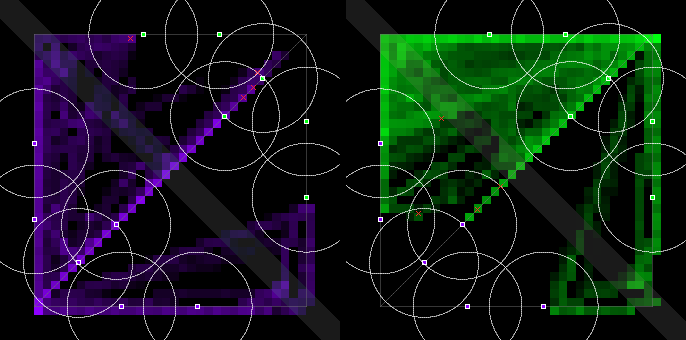
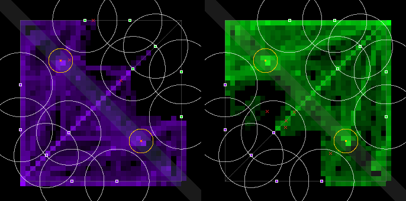
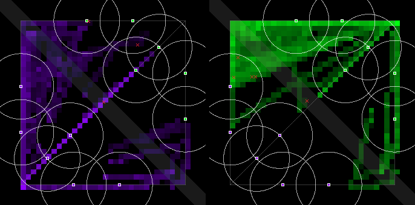
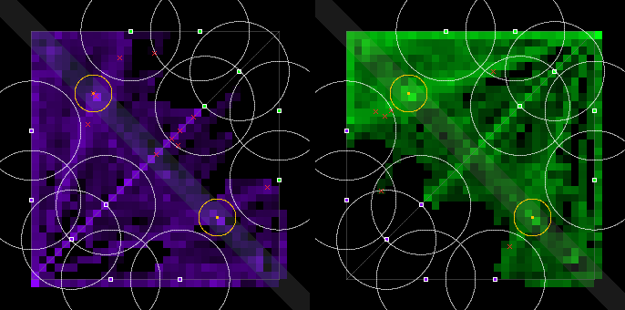

# Bandstand 3: `recall-2` with tiers that leave reach first, on the fixed map (2026-10-01)

Ceryce's ruling (Telegram picker 29287b22, 2026-10-01 00:02 CT): **"Wait for the violet fix, then one
~$2 re-run"**. The violet fix is `simultaneous-1` (#56, [`side-fairness-2026-10-01.md`](side-fairness-2026-10-01.md)).
The run it re-measures is [`bandstand-2-2026-09-30.md`](bandstand-2-2026-09-30.md). There, `recall-2` could not
be judged: the house tiers recalled mid-lane, minions broke every channel, and 31 of 65 deaths came before
1:30. The pre-registered lines are §9.8's ([`docs/economy-spec.md`](../docs/economy-spec.md)), unchanged.

## Verdict

- **The tier fix works: no channel was broken by damage.**
  - Every tier now walks home while any enemy is in sight, and recalls only once none is.
  - **Bandstand 2 (old tiers, `recall-2`):** of 38.5 channels a match, 5.0 got home and 26.6 were
    broken by a hit.
  - **Now:** of the channels the bots chose, 80 % got home in P2 and 87 % in O2, and none was broken.
    The rest were dropped on purpose, mostly because an enemy walked into sight.
  - Deaths per match fell from 5.42 to 2.12 (P2). Deaths before 1:30 fell from 31 of 65 to 10 of 17.
- **As briefed (P2 = `recall-2`, O2 = `river-2` + `recall-2`): FAIL, 5 of 10 lines pass.**
  - **The objective is now in use:**
    - captures per match, median 4.0 (PASS);
    - capture split 100 % (PASS);
    - team fights 0 → 1.88 a match, with the Δ CI wholly above 0.
  - **Misses:**
    - team fights 1.88 against the 4.6 line;
    - PvP damage 96.5 a minute against 161;
    - contested openings 45.2 % against 50 %;
    - team fights at an open stage 0.88 against 1;
    - first blood, which comes 18 s *later* with the objective. Its CI [+4.7, +36.9] is wholly above
      0, which the line counts as a regression.
- **Every remaining early death is a hard bot that started walking out too late.**
  - All 38 deaths in P2 and O2 came while the dying bot's walk-home rule was firing. The median was
    1.4 s after the walk began.
  - Hard's trigger is 90 hp, set for the specimen's 3× run home. On foot, out of an enemy tower's
    range or away from a wave, 90 hp is not enough.
  - Medium's trigger reads 75 % of max (about 100–165 hp). Medium lost no bot before 1:30.
- **`river-2` with today's recall, on the fixed map (R vs P): 6 of 10 lines pass, against 8 of 10 on
  the biased map.**
  - **Fewer passes, for two reasons:**
    - Deaths under the killer team's tower went from 60.0 % to 79.2 %, against a line of 75.3 %.
      There are only 11 deaths in 8 matches, and this run's P is at 94.4 %.
    - The capture split fell from 50 % to 37.5 %.
  - **Team fights:** 3.63 a match (it was 3.92). The Δ CI now spans 0.
  - **Still passing:** captures (median 3.0) and fights at an open stage (1.25).
- **Violet still takes most captures, though the sim and both layers are mirror-exact.**
  - **By side:** R went 19–4 to violet (sign test p = 0.003) and O2 23–12 (p = 0.09). Hard vs hard
    went 18–7 pooled (p = 0.04).
  - **The new mirror test:** a scripted mirror match with `river-2` and `recall-2` stays its own
    mirror image for all 600 s. The sim, the objective and the recall layer cannot be the cause.
  - **What's left is the Jev pilot path.** Its mirror probe (#56) used observations with no Bandstand
    lines. That is untested here.
- **Spend: $2.28** (budget about $2.10, ceiling $3).

## What changed in the tiers

Only the recall rules changed. Each tier's low-hp recall became a pair on the same threshold:

| tier | before | after |
|---|---|---|
| easy | hp below 100 → recall | hp below 100 **and an enemy minion, tower or bearbot in sight → move home**; hp below 100 **and no enemy in sight** → recall |
| medium | hp below 75 → recall | the same pair at 75 |
| hard | hp below 90 → recall | the same pair at 90 |
| medium-eco | low-hp recall; "can afford the next item, no foe in sight → recall to shop" | the low-hp pair; "can afford it, no enemy bearbot or minion in sight, an enemy tower in sight → move home", then "can afford it, no enemy in sight → recall" |
| hard-eco | low-hp recall; "can afford it, no enemy bearbot in sight → recall"; "carrying ≥ 300, a stronger enemy bearbot in sight → recall to spend it" | the low-hp pair; the shopping pair (minion or tower in sight → move home; nothing in sight → recall); the 300-gold rule **walks home** |
| easy-eco | low-hp recall | the low-hp pair |

- **Why "in sight".**
  - Vision is 260. That is beyond a tower's 160 range and a minion's 130 aggro radius plus its 30
    attack range. So "no enemy in sight" means out of reach.
  - Jev reads it straight off its description ("No enemies visible.").
  - A channel isn't re-issued into the same damage: if a hit breaks it, the next decision sees the
    enemy and walks.
- **Files.**
  - The prose: `house-{easy,hard}{,-eco}.prose.md`.
  - The worksheet side files for qwen: `house-{violet,green}.md`, `house-eco-{violet,green}.md`,
    `house-hard-{violet,green}.md` and `house-easy-{violet,green}.md`. Each file is renumbered, its
    examples are fixed, and its intro says a hit breaks a recall.
- **The six schemas were recompiled with `compile.py --backend ollama`, exactly as before.**
  - Only the new recall rules were taken from the compile. They replace the old recall rule objects.
    Every other rule object, the root default and the build are kept byte for byte, the way #53
    spliced in the Bandstand rules.
  - A fresh compile also rewords the untouched rules (6–10 of them per instrument here). Taking it
    whole would have changed more than the recall.
  - **Selection rule** (as for medium-eco in the economy work): per instrument, the first sample of
    the final wording whose new questions name only what Jev's description states. "An enemy in
    sight" and "no enemy in sight" qualify; worksheet names (`foe`, `null`, `self.hp`) do not.
    - Easy, hard and hard-eco took their first sample.
    - Easy-eco took its second for drums and violin.
    - Medium took s5. Medium-eco took s32, s37 and s29.
  - **Medium's and medium-eco's worksheet lines were reworded on the way.** The translator copied
    `foe or tower is not null` and then `next is not null` into Jev's questions.
    - The final lines say "an enemy bearbot, minion or tower is in sight".
    - Medium-eco's shopping lines say "you can afford your next item (gold is next or more)".
    - The 28 samples compiled from earlier wordings were set aside.
  - **Thresholds.**
    - Medium keeps the old compile's "75 % of its max".
    - Medium-eco now reads "75" on all three instruments. Its old keytar rule said 75 %.
- **The rule-by-rule diff** is in [`bandstand-3-2026-10-01-tier-recall-diff.md`](bandstand-3-2026-10-01-tier-recall-diff.md).
  Representative (hard drums):

```diff
- recall_low_hp: "is this bot's hp below 90?" -> recall
+ recall_hp_low_enemy_present: "is this bot's hp below 90 and is an enemy minion, enemy tower, or enemy bearbot in sight?" -> move home
+ recall_hp_low_no_enemy: "is this bot's hp below 90 and are no enemy units in sight?" -> recall
```

- **This moves the placement bar.** Medium is the arena's bar, so a ladder restarted on these files
  plays the new pair. Under the specimen's 3× recall, the default, the change only delays a recall
  until the bot is out of sight.
- **Not changed:** the shadow worksheet bot's code twins (`tools/jev/rules.py`,
  `tools/match/jevPilot.ts`). Their ground truth is logs played under the old rule 1, and their
  docstrings now say so.
- **Tests.**
  - `test_house.mjs`: every recall rule, in every tier's schema and side file, follows a move home
    and asks that no enemy is in sight. No example reply recalls with an enemy in its worksheet.
  - `test_resolution.mjs`: the mirror match with `river-2` and `recall-2`.
  - `test_instrument_scope.py`: renumbered.

## The pre-registered table, as briefed: P2 (`recall-2`) vs O2 (`river-2` + `recall-2`)

Δ is O2 − P2, seed-paired, with a 95 % bootstrap CI over the 8 pairs. It is printed by `--prereg
bandstand`. Full tables: [`bandstand-3-2026-10-01-metrics-recall2.md`](bandstand-3-2026-10-01-metrics-recall2.md).

| line | metric | P2 | O2 | Δ [95 % CI] | pass line | result |
|---|---|---:|---:|---|---|---|
| target | team fights / match | 0.00 | 1.88 | +1.88 [+0.75, +3.13] | O mean ≥ 4.6 and Δ CI wholly above 0 | **FAIL** (CI passes, mean misses) |
| keep | damage / min, PvP | 49.1 | 96.5 | +47.36 [+28.27, +69.21] | O ≥ 161 and CI not wholly below 0 | **FAIL** (CI passes, level misses) |
| keep | PvP damage taken in neutral ground | 48.9 % | 68.0 % | +19.1pp [+9.1pp, +29.4pp] | O ≥ 41.5 % and CI not wholly below 0 | PASS |
| keep | bot-time under an enemy tower | 9.3 % | 7.3 % | −2.1pp [−3.1pp, −0.9pp] | O ≤ 13.7 % and CI not wholly above 0 | PASS |
| keep | deaths under the killer team's tower | 72.9 % | 69.8 % | −3.1pp [−16.7pp, +11.5pp] | O ≤ 75.3 % and CI not wholly above 0 | PASS |
| keep | first blood at, s | 84 | 103 | +18.21 [+4.74, +36.91] | O ≤ 402 and CI not wholly above 0 | **FAIL** (later, not earlier) |
| in use | Bandstand captures / match, median | – | 4.0 | – | median ≥ 3 | PASS |
| in use | openings contested, pooled | – | 45.2 % | – | ≥ 50 % | **FAIL** |
| in use | team fights at an open Bandstand / match | – | 0.88 | – | mean ≥ 1 | **FAIL** |
| in use | capture split | – | 100 % | – | ≥ 50 % | PASS |
| reported | decided (not a draw) | 12.5 % | 25.0 % | +12.5pp [−25.0pp, +50.0pp] | – | reported |
| reported | towers destroyed / match | 0.63 | 0.25 | −0.38 [−1.00, +0.13] | – | reported |
| reported | swinginess, per min | 67 | 103 | +36.13 [+2.88, +66.63] | – | reported |
| reported | Jev decisions from a Bandstand rule | 0 | 1,217 | – | – | reported |

Against Bandstand 2's O2 (old tiers, biased map; descriptive, not paired):

| | Bandstand 2 O2 | O2 |
|---|---:|---:|
| captures / match, median | 1.0 | 4.0 |
| openings contested | 10.0 % | 45.2 % |
| team fights / match | 0.00 | 1.88 |
| team fights at an open stage / match | 0.00 | 0.88 |
| PvP damage / min | 28.8 | 96.5 |

**Is any line meaningless now?** No. The early deaths no longer swamp the map, so every line reads
the objective again.
- **First blood.** In P2, first blood is at 84 s on average, and it is a hard bot dying on its way out
  (below). O2's stage pulls bots off the lanes, which delays that.
- **PvP damage.** It is lower under `recall-2` in both arms. A bot that walks out and channels spends
  longer away from the fight than a 3× run takes.

## `river-2` with today's recall, on the fixed map: P vs R

P and R use the same tier files Bandstand 2's P and R used (`origin/develop` at 37410a9, today's
tiers) and the specimen recall. The only change from Bandstand 2 is the map fix (`simultaneous-1`) and
the side balance. Full tables: [`bandstand-3-2026-10-01-metrics-river2.md`](bandstand-3-2026-10-01-metrics-river2.md).

| line | metric | P | R | Δ [95 % CI] | pass line | result | Bandstand 2 (biased map) |
|---|---|---:|---:|---|---|---|---|
| target | team fights / match | 2.88 | 3.63 | +0.75 [−1.00, +2.63] | O mean ≥ 4.6 and Δ CI wholly above 0 | **FAIL** | 3.92, CI [+0.42, +2.75]: FAIL |
| keep | damage / min, PvP | 150.0 | 199.9 | +49.95 [−1.01, +105.16] | O ≥ 161 and CI not wholly below 0 | PASS | 190.2: PASS |
| keep | PvP damage taken in neutral ground | 60.9 % | 73.0 % | +12.1pp [−0.7pp, +25.2pp] | O ≥ 41.5 % … | PASS | 71.2 %: PASS |
| keep | bot-time under an enemy tower | 9.8 % | 7.9 % | −1.9pp [−3.2pp, −0.6pp] | O ≤ 13.7 % … | PASS | 8.0 %: PASS |
| keep | deaths under the killer team's tower | 94.4 % | 79.2 % | −22.2pp [−61.1pp, +11.1pp] | O ≤ 75.3 % … | **FAIL** | 60.0 %: PASS |
| keep | first blood at, s | 242 | 283 | +101.61 [−69.27, +267.17] | O ≤ 402 … | PASS | 295: PASS |
| in use | captures / match, median | – | 3.0 | – | ≥ 3 | PASS | 3.5: PASS |
| in use | openings contested, pooled | – | 45.0 % | – | ≥ 50 % | **FAIL** | 49.2 %: FAIL |
| in use | team fights at an open Bandstand / match | – | 1.25 | – | ≥ 1 | PASS | 1.08: PASS |
| in use | capture split | – | 37.5 % | – | ≥ 50 % | **FAIL** | 50.0 %: PASS |
| reported | decided | 50.0 % | 25.0 % | −25.0pp [−75.0pp, +37.5pp] | – | reported | 100 % → 50 % |
| reported | towers destroyed / match | 1.50 | 0.25 | −1.25 [−1.63, −1.00] | – | reported | 1.00 → 0.50 |
| reported | the team with more captures won | – | 50.0 % | – | – | reported | 40.0 % |

- **The capture split fails because one team took every capture** in 4 of 8 matches, violet in all
  4. A fifth match had no capture.
- **Deaths under the killer team's tower is the noisiest line here.** R had 11 deaths in 8 matches,
  and the CI runs from −61 to +11 points.
- **Smaller sample:** 8 pairs here against Bandstand 2's 12 (see Setup), with sides balanced this
  time.

## Recalls

Per match, by how each channel or run home ended. "Re-issued at the fountain" is explained below the
table.

| | P (specimen) | R (specimen) | P2 (`recall-2`) | O2 (`recall-2`) | Bandstand 2 P2 (old tiers) |
|---|---:|---:|---:|---:|---:|
| started (as counted by the metric tool) | 68.3 | 57.4 | 83.1 | 66.3 | 38.5 |
| … re-issued at the fountain | – | – | 28.0 | 22.1 | not separated |
| … chosen recalls | 68.3 | 57.4 | 54.4 | 43.6 | – |
| got home | 63.0 | 52.6 | 43.3 | 38.0 | 5.0 |
| **broken by damage** | – | – | **0** | **0** | **26.6** |
| dropped: an enemy came into sight, so it walked | – | – | 10.0 | 4.5 | – |
| dropped: another rule | 4.8 (cancelled) | 3.8 | 1.1 | 1.1 | – |
| died while recalling | 0.25 | 0.63 | 0 | 0 | – |
| bot-time recalling | 6.9 % | 6.1 % | 9.6 % | 7.8 % | 4.9 % |

The chosen and re-issued rows add up to slightly less than "started": 6 channels in P2 and 4 in O2
were still running when the match ended.

- **Re-issued at the fountain (a `recall-2` quirk, not the tiers'):**
  1. A channel completes and teleports the bot home.
  2. On that same tick, the bot's 2 s decision, made before the teleport, says "recall" again.
  3. So a second channel starts at the fountain, and the next decision, now at full hp, cancels it.
  - Each one costs at most 2 s standing at the fountain at full hp.
  - It inflates "started", "cancelled" and recalling time in the metric tool, here and in Bandstand 2.
  - **Not fixed: it is the recall rule's, outside this brief.** A fix is for `recall-2` to drop a
    `recall` that arrives for a bot whose channel completed on that tick.
- **"Dropped: an enemy came into sight"** is the intended behaviour: rule 1 fires, the bot walks, and
  the channel ends before a hit can break it.

## Deaths before 1:30

| | P | R | P2 | O2 | Bandstand 2 P2 |
|---|---:|---:|---:|---:|---:|
| deaths / match | 1.25 | 1.38 | 2.12 | 2.62 | 5.42 |
| deaths before 1:30 | 0 of 10 | 0 of 11 | **10 of 17** | **5 of 21** | 31 of 65 |
| … of them hard bots | – | – | 10 | 5 | – |
| … killed by a tower / minions | – | – | 6 / 4 | 2 / 3 | – |

- **Every death in P2 and O2, early or late, came while the bot was walking out.** That is 38 of 38:
  the bot's last fired rule was its low-hp walk home.
- **The time from the walk's first firing to death:**
  - median 1.4 s;
  - 12 of 38 died within 0.5 s;
  - only one bot lasted more than 4.1 s.
- **The typical case** (P2, hard vs hard, seed 7, violet drums):
  - It attacks the mid tower with its wave from 48 s ("take the objective").
  - Its hp crosses 90 at 56.9 s, and rule 1 sends it home on foot.
  - Minions kill it at 60.2 s, 3.3 s later, still in the lane.
  - Under the specimen recall, the same rule would have run it home at three times that speed.
- **So the threshold is now the weak point, not the recall.** Hard's 90 hp, already "recalls too
  late" on Jev (`runs/house-tiers-2026-09-30.md`), is too late to leave on foot. Medium's
  75 %-of-max trigger fires at about 100–165 hp, and medium lost no bot early.
- **Not changed here: the brief kept the rest of each tier as it was.** A hard threshold for walking
  out (say 50 % of max) would be the next tier change if `recall-2` is ruled in.

## Captures per match, by side

Each cell gives violet–green captures, then untaken closes, then deaths violet–green and the winner (V,
G, or draw). The first tier named is violet.

| slot | P | R (`river-2`) | P2 (`recall-2`) | O2 (`river-2` + `recall-2`) |
|---|---|---|---|---|
| medium–hard, seed 7 | 1–0 d, draw | 0–0 (+4), 0–1 d, draw | 0–2 d, V | 5–1 (+0), 0–2 d, draw |
| hard–medium, seed 7 | 0–0 d, draw | 4–0 (+1), 0–1 d, V | 0–1 d, draw | 2–2 (+1), 1–0 d, G |
| hard–hard, seed 7 | 1–0 d, G | 2–0 (+3), 1–0 d, draw | 1–2 d, draw | 2–2 (+1), 3–0 d, G |
| medium–hard, seed 11 | 1–1 d, draw | 1–2 (+2), 0–1 d, V | 1–1 d, draw | 5–1 (+0), 1–2 d, draw |
| hard–medium, seed 11 | 0–0 d, draw | 6–0 (+0), 0–2 d, draw | 0–1 d, draw | 1–3 (+1), 2–1 d, draw |
| hard–hard, seed 11 | 1–1 d, G | 2–1 (+2), 3–0 d, draw | 1–2 d, draw | 3–1 (+1), 3–1 d, draw |
| hard–hard, seed 42 | 1–2 d, V | 2–1 (+2), 1–0 d, draw | 1–1 d, draw | 3–1 (+1), 2–0 d, draw |
| hard–hard, seed 101 | 1–0 d, G | 2–0 (+3), 0–1 d, draw | 2–1 d, draw | 2–1 (+2), 2–1 d, draw |

| | R | O2 |
|---|---:|---:|
| captures, violet–green | 19–4 (p = 0.003) | 23–12 (p = 0.09) |
| hard vs hard, violet–green | 8–2 (p = 0.11) | 10–5 (p = 0.30) |
| medium vs hard (both ways), by tier: medium–hard | 1–12 | 15–5 |
| … of hard's, taken as violet | 10 of 12 | 3 of 5 |
| openings / contested / closed untaken | 40 / 18 / 17 | 42 / 19 / 7 |
| captures per match, sorted | 0 2 2 3 3 3 4 6 | 3 4 4 4 4 4 6 6 |

*p is a two-sided sign test against an even split.*

- **The hard-vs-hard one-sidedness is smaller but not gone.**
  - Bandstand 2's R went 11–0 to violet. Here R went 8–2 and O2 10–5, and green now takes stages.
  - Pooled across R and O2, violet leads 18–7 (p = 0.04) in hard vs hard, and 42–16 (p = 0.0009)
    overall.
- **The sim and the layers can't be the cause.** A scripted mirror match with `river-2` and
  `recall-2` attached (`test_resolution.mjs`) stays its own mirror image every tick for 600 s:
  - Both sites lie on the mirror axis.
  - Every opening was contested, there were 0 captures each, and the result was a draw.
  - Three stage-going variants, run by hand, gave the same.
- **What's left is the pilot path, or chance.**
  - #56's probe found Jev's answers 97.5 % mirror-consistent. But its 402 observations came from
    matches with no objective, so none had the Bandstand lines.
  - Jev's view names the team and gives raw coordinates and the stage's distance.
  - A Bandstand-state mirror probe would settle it at about $0.05. It was not run here.
- **Medium vs hard swings with the recall.**
  - Under the specimen recall (R), hard took 12 of 13 captures, 10 of them as violet.
  - Under `recall-2` (O2), hard's early walk-out deaths hand the stage to medium, 15–5.

## Where the bots were

Violet's positions are on the left, green's on the right; the gold rings are the two sites.

| P | R (`river-2`) | P2 (`recall-2`) | O2 (`river-2` + `recall-2`) |
|---|---|---|---|
|  |  |  |  |

## Options for the gate (not rulings)

1. **Re-tune hard's trigger for walking out, then re-measure P2 and O2 (about $1.05 for these 8
   slots).**
   - Every remaining `recall-2` death is a hard bot leaving too late.
   - The misses that `recall-2` causes (PvP damage, first blood, and part of the team fights) all
     trace to time spent walking and channelling, and to bots dying in it.
2. **Fix the fountain re-channel in `recall-2`** before anything else is measured on it. It is
   small, but it pads "started" and recalling time.
3. **Run the Bandstand-state mirror probe (about $0.05)** before reading any capture split. 42–16 to
   violet across R and O2 is not chance-sized, and the map no longer explains it.
4. **Ship `river-2` with the specimen recall.** On the fixed map it passes 6 of 10. Its misses are
   the contested share (45 %), the target (3.63 against 4.6), and two lines tied to the side lead and
   to 11 deaths.

## Setup

- **Backend.** Jev (`jev-latest` = `jev-1.13.0`, $0.042 per million input tokens, output free; per
  TypeSafe's live models page, read today), TypeSafe default with Workers AI fallback.
  - Two private servers, `tools/jev/schema_server.py`:
    - `:8871`, `--budget-usd 1.55`, for P2, O2 and the smoke;
    - `:8872`, `--budget-usd 1.40`, for P and R.
  - Each pair of arms had its own cap, so the briefed pair could not be starved.
  - Cadence 2 s, full 10-minute matches, map `pvp-1`, `--resolution simultaneous-1`.
- **Arms.**
  - **P** = no flags.
  - **R** = `--objective river-2`.
  - **P2** = `--recall recall-2`.
  - **O2** = `--objective river-2 --recall recall-2`.
  - P and R ran from a clean checkout of `origin/develop` (37410a9), so their logs carry today's tier
    files under their usual paths. P2 and O2 ran from this branch.
- **Slots, fixed before any match ran, the same for all four arms:**
  - medium–hard and hard–medium on seeds 7 and 11 (each pairing both ways);
  - hard–hard on seeds 7, 11, 42 and 101.
  - That is 8 seed pairs per comparison.
- **Why 8 and not Bandstand 2's 12.**
  - Four arms with sides balanced would be 18 matches each at Bandstand 2's six seeds. Even 12 each
    is 48 matches at $0.075, which is $3.60, over the $3 ceiling.
  - So the first two seeds carry the side-swapped medium–hard pairs, and hard–hard keeps four.
  - P and R ran slots 1–6 first, 12 matches for $0.90. Slots 7–8 were then added for all four arms,
    with the whole run projected at about $2.35, before P2 and O2 started.
- **Smoke.** Before the arms ran: medium vs hard, `river-2` + `recall-2`, 180 s. It had 11 channels,
  9 got home and 0 were broken.
- **Clean run.**
  - 46,226 Jev calls with 0 call errors, 0 failovers and 0 parse errors. The mean call took 0.24 s.
  - All 32 logs replay-verify.
- **Spend: $2.2750** by the servers' own ledgers:
  - P2, O2 and the smoke: $1.0497;
  - P and R: $1.2253;
  - the smoke alone: about $0.018.
  - Compiles were local (`ollama:qwen3.5:9b`, $0).

## Logs and reproduction

- **Logs.** The 32 logs are not in git; their names are in `.gitignore`. They are on the
  [`data-bandstand-3-2026-10-01`](https://github.com/kumouri/promptlane/releases/tag/data-bandstand-3-2026-10-01)
  prerelease as `bandstand-3-match-logs-2026-10-01.zip`, with a `SHA256SUMS`.
  - Unzip at the repo root.
  - Each is `runs/bandstand-3-2026-10-01-<P|R|P2|O2>-<violet tier>-<green tier>-seed<N>.json`.
- **Reproduce.**

```sh
# P2/O2 (this branch's tiers); P/R the same from origin/develop 37410a9, without --recall
python tools/jev/schema_server.py --port 8871 --budget-usd 1.55
npm run match -- --a prompts/pilots/house-hard.prose.md --a-schemas prompts/pilots/house-hard.schemas.json --name-a hard \
    --b prompts/pilots/house-violet.md --b-schemas prompts/pilots/house-medium.schemas.json --name-b medium \
    --jev-schema http://127.0.0.1:8871/ --cadence 2 --seed 7 --map pvp-1 --resolution simultaneous-1 \
    --objective river-2 --recall recall-2 --out runs/x.json
# the briefed verdict, and river-2 on the fixed map
npm run metrics -- --group P2 runs/bandstand-3-2026-10-01-P2-*.json --group O2 runs/bandstand-3-2026-10-01-O2-*.json --prereg bandstand
npm run metrics -- --group P runs/bandstand-3-2026-10-01-P-*.json --group R runs/bandstand-3-2026-10-01-R-*.json --prereg bandstand
# the transparency view of any tier's checked-in schema (no model, no spend)
python tools/jev/compile.py prompts/pilots/house-hard.prose.md --schema-in <one instrument's schema JSON>
```
