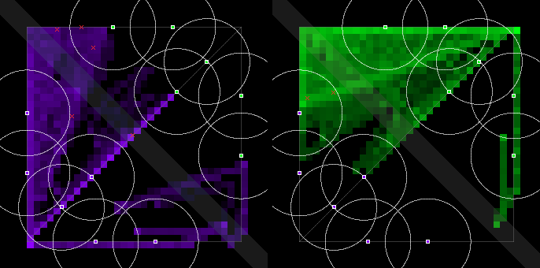
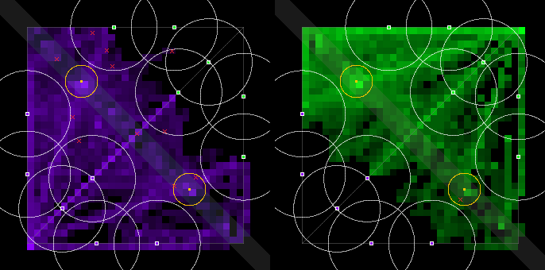
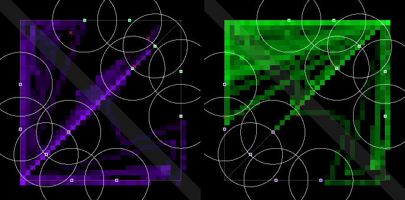
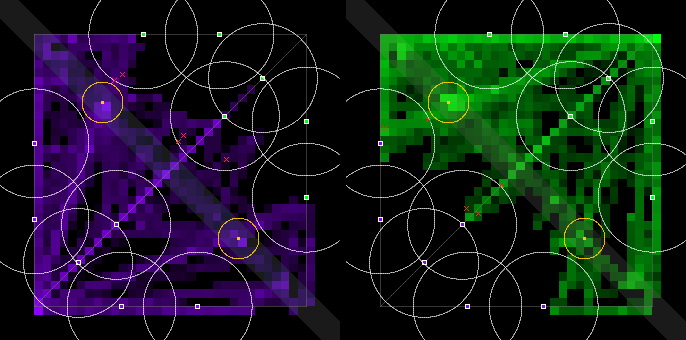

# Bandstand 4: hard leaves earlier, and a Bandstand-state mirror probe (2026-10-01)

Ceryce's ruling (Telegram picker, Thu 2026-10-01 ~08:59 CT): **"Bandstand: one more ~$2 read before
Sunday? -> Yes: hard recalls earlier + the $0.05 Jev symmetry probe"**. The run it re-measures is
[`bandstand-3-2026-10-01.md`](bandstand-3-2026-10-01.md) (#57). That run left two leads:
- every early death under `recall-2` was a hard bot already walking home;
- violet still took most captures, though a scripted mirror match stays mirrored.

The pre-registered lines are §9.8's ([`docs/economy-spec.md`](../docs/economy-spec.md)), unchanged.

## Verdict

- **Jev reads the Bandstand the same for both sides. The probe found no side bias.**
  - **What it did:** 400 real decisions from Bandstand 3's O2 matches (`river-2` + `recall-2`), 240
    of them with the stage open. Each went to Jev as played, again, and mirrored.
  - **Open stage:** 0 of the 236 stable answers changed under the mirror. A Bandstand rule fired
    156 times seen as violet and 156 times seen as green.
  - **Each Bandstand question's P(yes), violet minus green:** within ±0.005, and every CI spans 0.
  - A follow-up also swapped the entity ids, so the mirror is exactly what green is handed. It
    gave the same result.
- **But there is a side asymmetry in the pilot path, outside Jev: the "nearest allied minion"
  target.**
  - At the fountain, all three lanes' minions are the same distance away, 42.5 units.
  - `tools/jev/target_resolve.py` breaks that tie on floating-point noise. #56 measured the sim
    mirror-exact only to about 1e-11, which is enough to decide the tie.
  - **The result:** when lanes tied, green bots were sent up the top lane 135 times of 136 here (117
    of 117 in Bandstand 3). Violet bots went mostly down mid (104 of 152).
  - Neither the probe nor #56's scripted mirror test could see this. The probe mirrors one
    observation, floats and all. The scripted pilot never targets a minion.
  - **So capture-split and side lines still can't be judged on Jev until this is fixed.**
  - Hard vs hard, violet took 11 captures to green's 1 (p = 0.006). Across Bandstand 3's R and O2
    and this run's O2 and R, violet took the 90 s opening in 12 of 14 hard-vs-hard matches. Green
    took none; the other 2 went untaken. All 14 matches used the same 4 seeds, so they are not 14
    independent samples.
  - Deaths, recalls and fights below are unaffected by this and stand.
- **Hard's new trigger, 65 % of max hp, ended the early deaths.**
  - **Before 1:30:** 0 deaths in P2 and in O2, from 10 and 5.
  - **Deaths per match:** P2 1.12 (from 2.12); O2 1.50 (from 2.62).
  - **Hard drums**, the bots that died: 8 of 247 walks home ended in death, from 18 of 88.
  - Still no `recall-2` channel broken by damage.
- **As briefed (P2 vs O2): FAIL, 7 of 10 lines pass** (Bandstand 3: 5).
  - **Now pass:** PvP damage (175.5 against 161), first blood (330 s), and the capture split.
  - **Still fail:**
    - the target: team fights 3.25 a match against 4.6, Δ +1.50 with a CI of [−0.13, +2.88];
    - contested openings: 48.8 % against 50 %;
    - team fights at an open stage: 0.63 against 1.
  - All six keep-lines pass, so §9.8's own rule applies: one tuning pass on O, then Ceryce rules.
- **`river-2` with the specimen recall (R vs P), on 4 of the 8 slots: 5 of 10.** Bandstand 3 got 6
  of 10 on the same 4 slots, which is noise at n = 4.
  - **The cost of the new trigger shows here:** hard now leaves at 65 % even under the 3× run home.
    R's team fights fell from 4.75 to 2.50 a match, and PvP damage from 239 to 139.
- **Spend: $2.041** (budget about $2.05, ceiling $3):
  - probes $0.086;
  - smoke $0.018;
  - P2 and O2 $1.324;
  - P and R $0.613, which includes two matches played again (see Setup).

**Recommendation for Sunday's gate (10-04).**
1. Don't read capture splits or side results yet.
2. First fix `target_resolve.py`'s nearest-minion tie, so it uses a tolerance and prefers the bot's
   own lane. Add a mirror test whose pilot targets the nearest allied minion.
3. Then run §9.8's one tuning pass on O2 (`river-2` + `recall-2` + this hard trigger) on the same 8
   slots, about $1.40.

`recall-2` with these tiers is now measurable: no early deaths and no broken channels. Its misses
are the objective lines, not the recall. If the gate can't wait, ruling `recall-2` + `river-2` in on
7 of 10 is defensible on deaths, recalls and fights, but not on the side lines.

## The probe: does Jev read the Bandstand differently for violet and green?

#56's method ([`side-fairness-2026-10-01.md`](side-fairness-2026-10-01.md)), on matches with the
Bandstand:
- **Source:** Bandstand 3's 8 O2 logs, replayed so each real decision's observation is recovered
  (`verifyReplay`'s `onObservation`).
- **Sample:** stratified, seed 20261001, fixed before any call: 240 with the stage open, 60 with it
  upcoming, 100 with it closed or done.
- **How each state was asked:** three ways, through the private schema server, so its ledger is the
  record:
  - as played;
  - as played again, which measures Jev's own noise;
  - mirrored: teams swapped and every (x, y) → (y, x). Both sites lie on the mirror axis, so the
    stage's site and position don't change.
- **Check:** the mirror of violet's opening observation equals green's real one, apart from ids.

| states | same rule asked twice | as played vs mirrored | stable states that changed under the mirror |
|---|---:|---:|---:|
| all 400 | 98.8 % | 98.0 % | 5 of 395 |
| stage open (240) | 98.3 % | 98.8 % | **0 of 236** |
| stage upcoming (60) | 98.3 % | 100.0 % | 0 of 59 |
| stage closed or done (100) | 100.0 % | 95.0 % | 5 of 100 |

| stage open, the same states seen as violet / as green | violet | green |
|---|---:|---:|
| fired a Bandstand rule | 156 | 156 |
| fired a low-hp walk or recall | 36 | 36 |
| fired another rule | 48 | 48 |
| a Bandstand rule on one side only | 0 | 0 |

| question (stage open) | n | P(yes) as violet | as green | violet − green [95 % CI] | noise: asked twice [95 % CI] |
|---|---:|---:|---:|---|---|
| `bandstand_open_take_it` | 240 | 0.3823 | 0.3821 | +0.0002 [−0.0010, +0.0015] | +0.0003 [−0.0009, +0.0014] |
| `bandstand_contest_it` (hard) | 164 | 0.6838 | 0.6826 | +0.0012 [−0.0020, +0.0043] | +0.0005 [−0.0018, +0.0030] |
| `bandstand_opening_soon_nearby` (hard) | 164 | 0.4042 | 0.4087 | −0.0045 [−0.0117, +0.0030] | −0.0045 [−0.0103, +0.0014] |

- **Every gap sits inside Jev's own ask-twice noise.** By played side and tier (medium and hard,
  each played as violet and as green), the take-it gap is at most 0.0014.
- **The resolved actions mirror too.** In all 390 states with a stable answer, the action kind
  matched, and the target was the mirror of the played one.
- **Follow-up, with ids:** violet's bots, towers and minions carry the lower id in each block.
  - So a second pass also swapped every id for its mirror twin, the exact observation green would
    be handed (checked against green's real opening observation, ids included).
  - **Same result:** the open stage changed 1 stable answer of 236, and a Bandstand rule fired 156
    vs 156.
  - **P(yes) violet − green:** take-it −0.0003 [−0.0016, +0.0009]; contest +0.0023 [−0.0010,
    +0.0055]; opening soon −0.0051 [−0.0120, +0.0016].
- **Cost:** $0.0645 for the probe (1,200 calls) and $0.0215 for the follow-up (400 calls).

## What does lean violet: the nearest-minion tie at the fountain

A trace of Bandstand 3's O2, hard vs hard, seed 7, at 61.25 s: both mid keytars stand at their own
fountain, and both fire `push_with_wave` ("move to the nearest allied minion").

| | the minions it can see | `nearby_minion` sends it to |
|---|---|---|
| violet `bot 1`, at (100, 900) | mid (130.05, 869.95), top (100.0, 857.5), bottom: all 42.5 away | **mid** |
| green `bot 4`, at (900, 100) | top (857.5, 100.0), bottom (900.0, 142.5), mid: all 42.5 away | **top** |

- `target_resolve.py` takes a plain `min()` over float distances: there is no tolerance and no
  side-neutral tie-break.
- The first step sets the lane, and every later step follows the now-unambiguous nearest minion.
- Over every real decision whose winning rule targets the nearest allied minion, where two or more
  lanes tied:

| | Bandstand 3 O2 | Bandstand 4 O2 |
|---|---|---|
| green, sent to the top lane | **117 of 117** | **135 of 136** (1 to bottom) |
| violet, sent to mid / top / bottom | 69 / 20 / 2 | 104 / 44 / 4 |

- **Green's bots pile onto the top lane after every fountain visit. Violet's spread out, mostly
  down mid.**
  - Mid is the lane that passes the map's centre, 283 units from both stage sites.
- **Not proven here: that this is what gives violet the captures.** It is the only side asymmetry
  found anywhere on the Jev path.
  - The sim, the objective and the recall layers are mirror-exact under a scripted pilot (#57's
    test).
  - Jev's reading is mirror-exact (above).
  - Decision ticks are identical for both sides.
  - The capture step in `src/objective.ts` treats the two teams the same.
- **Also noted:** wave spawns put violet's minions `18·i` along the y axis and green's `18·i` the
  other way along y, not along x. So they aren't each other's mirror. The offset is gone at the
  next tick, so no pilot is likely to see it.

## What changed in the tiers

Only hard's low-hp trigger: **90 hp → 65 % of max hp**, in both rules of the walk-home/recall pair,
in `house-hard.prose.md` and `house-hard-eco.prose.md`.

| | drums (max 220) | keytar (max 140) | violin (max 150) |
|---|---:|---:|---:|
| before | 90 (41 %) | 90 (64 %) | 90 (60 %) |
| after | 143 | 91 | 97.5 |

### The derivation, from Bandstand 3's own walks

Bandstand 3's P2 and O2 logs were replayed to recover each bot's hp at every decision, about every
0.5 s. A **walk** runs from the first firing of the low-hp "enemy in sight → move home" rule to the
next real decision with another rule (normally "no enemy in sight → recall"), or to death.

| hard | walks (first firing at ≤ 90 hp) | died on the way | early deaths (before 1:30) |
|---|---:|---:|---:|
| drums | 84 | **18 (21.4 %)** | **15 of 15** |
| keytar | 244 | 5 (2.0 %) | 0 |
| violin | 185 | 10 (5.4 %) | 0 |

- **What has to be survived** is the damage from the moment hp crosses the trigger to being out of
  sight. That is two parts:
  - the lag, up to one 2 s decision, before the rule fires;
  - the walk itself.
- **Walks that got out after taking damage:**
  - from the last sample at or above 90 hp to the walk's end: median 8.0 s for drums, 7.7 s for
    keytar, 6.5 s for violin (p90 9.5–11 s);
  - hp lost: median 54–60, p90 72–84;
  - rate: median 7–9 hp/s.
- **Walks that died:**
  - lost about 90–120 hp within 1.6–5.6 s of crossing 90;
  - median rate 31 hp/s for drums, 51 for keytar, 34 for violin.
- **The repeatable one is hard drums' opening tower dive.** Seven matches died exactly this way:
  - it attacks with its wave from about 48 s;
  - crosses 90 hp at 55 s;
  - dies 5.6 s later at 16.9 hp/s, still in the lane.
  - **The arithmetic:** at that rate, the 8.0 s a hurt drums walk takes to get out needs 16.9 × 8.0
    ≈ **135 hp at the crossing**. That is 61 % of 220.
- **Keytar and violin don't need more.** Their deaths are 30–60 hp/s focus bursts. No trigger below
  full hp covers 8 s of those. At 90 hp, 94.6–98 % of their walks already got home, and none died
  early.
- **So the trigger is a fraction of max**, which is how medium's (75 %) and hard's own Bandstand rules
  (50 %, 40 %) already read. Jev reads it straight off its description ("Its own hp is 96 out of 140
  (69%)").
  - **65 % is the smallest whole-5 % fraction that lowers no instrument's trigger:** keytar's 90 is
    64.3 % of 140.
  - It gives drums 143. That covers the 135 with a little room.
- **Side effect:** a hard drums at 110–143 hp now walks home rather than contesting the stage. The
  stage rules need over 50 % and over 40 % of max, but the walk-home rules come first.

### How it played (P2 and O2 here, against Bandstand 3)

| hard | walks | died on the way | hp at the walk's start, median |
|---|---:|---:|---:|
| drums | 88 → 247 | 18 → **8** (3.2 %) | 58 → 126 |
| keytar | 312 → 286 | 5 → 4 | 86 → 86 |
| violin | 274 → 303 | 10 → 5 | 82 → 84 |
| all hard | 674 → 836 | 33 → **17** (2.0 %) | |

The first column of each pair counts every walk, including Jev misfires above the trigger. That is
why drums shows 88 here and 84 in the derivation table.

### The diff

- **Recompiled exactly as before:** `compile.py --backend ollama` (the `qwen3.5:9b` translator, door
  A, $0), three samples per source.
- **Spliced as #57 did:** only the low-hp pair (rules 1–2) was taken from the compile.
  - Every other rule object, the root default and the build are byte for byte. A script checked
    this per instrument.
  - The selection rule: per instrument, the first sample whose two new questions read 65 % of max
    hp and name only what Jev's description states. All six took s1.

```diff
# house-hard.schemas.json, drums (keytar and violin alike)
- recall_hp_low_enemy_present: "is this bot's hp below 90 and is an enemy minion, enemy tower, or enemy bearbot in sight?" -> move home
- recall_hp_low_no_enemy:      "is this bot's hp below 90 and are no enemy units in sight?" -> recall
+ recall_low_hp_threat: "is this bot's hp below 65% of its max hp AND is an enemy minion, tower, or bearbot in sight?" -> move home
+ recall_low_hp_safe:   "is this bot's hp below 65% of its max hp AND is no enemy in sight?" -> recall
# house-hard-eco.schemas.json, drums (keytar and violin alike)
- recall_low_hp_threat: "is this bot's hp below 90 and is an enemy minion, tower, or bearbot in sight?" -> move home
- recall_low_hp_safe:   "is this bot's hp below 90 and no enemy is in sight?" -> recall
+ recall_low_hp_threat: "is this bot's hp below 65% of its max hp AND is an enemy minion, enemy tower, or enemy bearbot in sight?" -> move home
+ recall_low_hp_safe:   "is this bot's hp below 65% of its max hp AND is no enemy in sight?" -> recall
```

- **The six new pairs**, ids as compiled:
  - hard keytar: `recall_hp_low_enemy_sight` / `recall_hp_low_no_enemy_sight`;
  - hard violin, and hard-eco on all three instruments: `recall_low_hp_threat` /
    `recall_low_hp_safe`.
  - The questions differ only in "AND"/"and" and "no enemy"/"no enemies".
- **The samples reworded 6–13 of the untouched rules.** Those were discarded, as in #57.
- **The worksheet side files** `house-hard-{violet,green}.md`:
  - Rules 1–2 now say "hp less than 65% of self.maxHp", as rules 3–4 already do.
  - The one example that goes to the Bandstand with a foe in sight had 120 hp. That is under 65 % of
    a drums' max, so it now has 150.
- **Tests.** `tools/arena/test_house.mjs` pins the 65 % in both prose files, both cascades and both
  side files, and checks that every side-file example that doesn't head home is above 65 % of 220.
- **Unchanged:** easy and medium, every other hard rule, and the shadow worksheet bot's code twins.
  Medium is the placement bar, so the arena's bar does not move.

## The pre-registered table, as briefed: P2 (`recall-2`) vs O2 (`river-2` + `recall-2`)

Δ is O2 − P2, seed-paired, with a 95 % bootstrap CI over the 8 pairs, from `--prereg bandstand`.
Full tables: [`bandstand-4-2026-10-01-metrics-recall2.md`](bandstand-4-2026-10-01-metrics-recall2.md).

| line | metric | P2 | O2 | Δ [95 % CI] | pass line | result | Bandstand 3 |
|---|---|---:|---:|---|---|---|---|
| target | team fights / match | 1.75 | 3.25 | +1.50 [−0.13, +2.88] | O ≥ 4.6 and Δ CI wholly above 0 | **FAIL** (both) | 1.88: FAIL |
| keep | damage / min, PvP | 113.1 | 175.5 | +62.42 [+20.95, +103.03] | O ≥ 161, CI not wholly below 0 | PASS | 96.5: FAIL |
| keep | PvP damage taken in neutral ground | 63.1 % | 67.9 % | +4.9pp [−5.9pp, +15.5pp] | O ≥ 41.5 % … | PASS | PASS |
| keep | bot-time under an enemy tower | 8.6 % | 6.7 % | −1.9pp [−2.8pp, −1.0pp] | O ≤ 13.7 % … | PASS | PASS |
| keep | deaths under the killer team's tower | 35.7 % | 47.2 % | +5.6pp [−41.7pp, +38.9pp] | O ≤ 75.3 % … | PASS | PASS |
| keep | first blood at, s | 227 | 330 | +83.63 [−18.42, +186.96] | O ≤ 402, CI not wholly above 0 | PASS | 103: FAIL |
| in use | captures / match, median | – | 3.5 | – | ≥ 3 | PASS | 4.0: PASS |
| in use | openings contested, pooled | – | 48.8 % | – | ≥ 50 % | **FAIL** | 45.2 %: FAIL |
| in use | team fights at an open Bandstand / match | – | 0.63 | – | ≥ 1 | **FAIL** | 0.88: FAIL |
| in use | capture split | – | 50.0 % | – | ≥ 50 % | PASS | 100 %: PASS |
| reported | decided (not a draw) | 25.0 % | 0.0 % | −25.0pp [−62.5pp, +0.0pp] | – | reported | 12.5 → 25.0 % |
| reported | towers destroyed / match | 0.25 | 0.00 | −0.25 [−0.63, +0.00] | – | reported | 0.63 → 0.25 |
| reported | swinginess, per min | 78 | 62 | −16.25 [−27.13, −4.63] | – | reported | 67 → 103 |
| reported | Jev decisions from a Bandstand rule | 0 | 2,047 | – | – | reported | 1,217 |

- **The metric tool's verdict:** target FAIL, keep-lines pass, objective in use FAIL. Its
  pre-registered next step: one tuning pass (set 15 → 20 s, else radius 60 → 80, else Encore +15 →
  +20 %), re-run O only on the same seeds, then Ceryce rules (Q17).
- **What the trigger fixed is in the keep-lines.** Bots alive longer meant PvP damage up 82 % in O2
  (96.5 → 175.5) and first blood pushed out to 330 s.
- **The "capture split" line now passes at 50 %,** 4 of 8 matches. Given the tie above, don't read
  it as evidence of fairness.

## `river-2` with the specimen recall: P vs R, on 4 slots

- **Which slots:** medium–hard and hard–medium on seed 7, and hard–hard on seeds 7 and 11 (slots 1,
  2, 3, 6). That set is side-balanced.
- **Why only 4:** pre-registered at 09:30 CT, before any P2 or O2 result was read. The full 8 would
  have taken the job to about $2.6.
- Both arms ran on this branch's tiers.
- Full tables: [`bandstand-4-2026-10-01-metrics-river2.md`](bandstand-4-2026-10-01-metrics-river2.md).

| line | metric | P | R | Δ [95 % CI] | result | Bandstand 3, same 4 slots |
|---|---|---:|---:|---|---|---|
| target | team fights / match | 0.50 | 2.50 | +2.00 [+0.00, +4.00] | **FAIL** | 4.75: FAIL |
| keep | damage / min, PvP | 99.2 | 139.1 | +39.96 [+7.72, +85.55] | **FAIL** (level) | 239.4: PASS |
| keep | PvP damage taken in neutral ground | 58.6 % | 64.8 % | +6.2pp [−5.4pp, +17.9pp] | PASS | PASS |
| keep | bot-time under an enemy tower | 10.5 % | 6.2 % | −4.3pp [−6.3pp, −2.6pp] | PASS | PASS |
| keep | deaths under the killer team's tower | 83.3 % | 87.5 % | +4.2pp [−25.0pp, +43.8pp] | **FAIL** | 58.3 %: PASS |
| keep | first blood at, s | 210 | 130 | −80.00 [−205.07, −9.78] | PASS | 305: FAIL |
| in use | captures / match, median | – | 4.0 | – | PASS | 2.5: FAIL |
| in use | openings contested, pooled | – | 35.0 % | – | **FAIL** | 57.9 %: PASS |
| in use | team fights at an open Bandstand / match | – | 2.00 | – | PASS | 2.00: PASS |
| in use | capture split | – | 75.0 % | – | PASS | 25.0 %: FAIL |

- **5 of 10 here, against 6 of 10 on Bandstand 3's same four slots.** With 4 pairs, CIs this wide and
  lines this close, that is noise.
- **The level that does move is fights.** Under the 3× run home, hard now leaves at 65 % too, and
  R's team fights and PvP damage are about half Bandstand 3's.
- **If `river-2` ships with the specimen recall,** hard's trigger should be checked under it rather
  than inherited from `recall-2`.

## Recalls (`recall-2`)

Per match, by how each channel ended. "Re-issued at the fountain" is the double-recall quirk
described in Bandstand 3. It is counted separately, and it is not fixed.

| | P2 | O2 | Bandstand 3 P2 | Bandstand 3 O2 |
|---|---:|---:|---:|---:|
| started, as the metric tool counts | 94.6 | 90.0 | 83.1 | 66.3 |
| … re-issued at the fountain | 31.0 | 31.8 | 28.0 | 22.1 |
| … chosen recalls | 63.6 | 58.3 | 55.1 | 44.1 |
| got home | 52.0 (82 %) | 50.4 (86 %) | 43.3 (78 %) | 38.0 (86 %) |
| **broken by damage** | **0** | **0** | 0 | 0 |
| dropped: an enemy came into sight, so it walked | 10.9 | 6.5 | 10.0 | 4.5 |
| dropped: another rule | 0 | 0 | 1.1 | 1.1 |
| still running at the end | 0.75 | 1.4 | 0.75 | 0.5 |
| died while recalling | 0 | 0 | 0 | 0 |
| bot-time recalling | 8.9 % | 8.3 % | 9.6 % | 7.8 % |

- **More recalls, because bots live longer.**
- **The fountain quirk grew with them**, from 28.0 to 31.0 in P2. A completed channel and a
  same-tick decision to recall again still cost up to 2 s at full hp each time.
- **The fix is unchanged:** `recall-2` should drop a `recall` that arrives for a bot whose channel
  completed on that tick.

## Deaths before 1:30, by tier

| | P | R | P2 | O2 | Bandstand 3 P2 | Bandstand 3 O2 |
|---|---:|---:|---:|---:|---:|---:|
| deaths / match | 2.00 | 3.25 | **1.12** | **1.50** | 2.12 | 2.62 |
| deaths before 1:30 | 0 | 0 | **0** | **0** | 10 (hard drums 10) | 5 (hard drums 5) |
| … hard / medium | 0 / 0 | 0 / 0 | 0 / 0 | 0 / 0 | 10 / 0 | 5 / 0 |
| all deaths, hard / medium | 7 / 1 | 12 / 1 | 6 / 3 | 11 / 1 | 14 / 3 | 19 / 2 |
| deaths while the low-hp walk was firing | 7 of 8 | 13 of 13 | 9 of 9 | 12 of 12 | 17 of 17 | 21 of 21 |
| earliest death, s | 143 | 121 | 112 | 201 | 60 | 60 |

- **One correction to the brief:** Bandstand 3's 38 `recall-2` deaths were 33 hard and 5 medium. All
  15 early ones were hard drums.
- **Bots still die on the walk home,** but later and less often.

## Captures per match, by side

Each cell gives violet–green captures, then untaken closes, then deaths violet–green and the winner.
The first tier named is violet.

| slot | P2 | O2 | P | R |
|---|---|---|---|---|
| medium–hard, seed 7 | 1–0 d, draw | 3–1 (+1), 0–0 d, draw | 0–3 d, V | 4–0 (+1), 0–3 d, V |
| hard–medium, seed 7 | 0–0 d, draw | 3–1 (+1), 0–0 d, draw | 1–1 d, draw | 1–1 (+3), 1–1 d, draw |
| hard–hard, seed 7 | 1–0 d, G | 5–0 (+1), 2–1 d, draw | 1–0 d, G | 2–2 (+1), 3–1 d, draw |
| medium–hard, seed 11 | 1–0 d, draw | 0–2 (+3), 1–0 d, draw | – | – |
| hard–medium, seed 11 | 0–1 d, draw | 3–2 (+0), 1–0 d, draw | – | – |
| hard–hard, seed 11 | 1–1 d, draw | 2–0 (+3), 2–0 d, draw | 2–0 d, G | 2–2 (+1), 3–1 d, draw |
| hard–hard, seed 42 | 1–0 d, G | 2–0 (+3), 2–0 d, draw | – | – |
| hard–hard, seed 101 | 2–0 d, draw | 2–1 (+2), 3–0 d, draw | – | – |

| | O2 | R (4 slots) | Bandstand 3 O2 | Bandstand 3 R |
|---|---:|---:|---:|---:|
| captures, violet–green | 20–7 (p = 0.019) | 9–5 (p = 0.42) | 23–12 (p = 0.09) | 19–4 (p = 0.003) |
| hard vs hard, violet–green | **11–1 (p = 0.006)** | 4–4 | 10–5 | 8–2 |
| medium vs hard, by tier: medium–hard | 6–9 | 5–1 | 15–5 | 1–12 |
| … by side, violet–green | 9–6 | 5–1 | 13–7 | 11–2 |
| openings / contested / closed untaken | 41 / 20 / 14 | 20 / 7 / 6 | 42 / 19 / 7 | 40 / 18 / 17 |
| captures per match, sorted | 2 2 2 3 4 4 5 5 | 2 4 4 4 | 3 4 4 4 4 4 6 6 | 0 2 2 3 3 3 4 6 |

*p is a two-sided sign test against an even split. It treats captures as independent, but they
cluster by match and the same four hard-vs-hard seeds recur.*

- **In the medium-vs-hard matches, played both ways, the sides came out about even** (9–6).
- **The lean is in hard vs hard.** Violet took the 90 s opening in every hard-vs-hard match where
  anyone did: 12 of 14 across both runs' objective arms, with the other 2 untaken.

## Where the bots were

Violet's positions are on the left, green's on the right; the gold rings are the two sites.

| P2 (`recall-2`) | O2 (`river-2` + `recall-2`) | P (4 slots) | R (`river-2`, 4 slots) |
|---|---|---|---|
|  |  |  |  |

## Setup

- **Backend.** Jev (`jev-latest`, TypeSafe default with Workers AI fallback; 0 failovers), on one
  private `tools/jev/schema_server.py` on `:8881`.
  - **Its first process, `--budget-usd 3.00`,** served the probes, the smoke and every match.
  - **A second one** on the same port served the two replayed matches, capped at $1.09: what was left
    under the $3 ceiling.
  - **Settings:** cadence 2, full 10-minute matches, map `pvp-1`, `--resolution simultaneous-1`.
- **Arms.**
  - **P** = no flags; **R** = `--objective river-2`.
  - **P2** = `--recall recall-2`; **O2** = `--objective river-2 --recall recall-2`.
  - All four ran on this branch's tiers.
- **Slots.** Bandstand 3's, in Bandstand 3's order:
  - medium–hard and hard–medium on seeds 7 and 11, each pairing played both ways;
  - hard–hard on seeds 7, 11, 42 and 101.
  - P and R played slots 1, 2, 3 and 6 only (above).
- **Smoke.** Before the arms: hard vs hard, `river-2` + `recall-2`, seed 7, 120 s.
  - 0 deaths;
  - 8 channels, 8 home, 0 broken;
  - it replay-verifies.
- **Two matches played again: my error, not the game's.** P and R slot 6 were still running when I
  stopped the server, because I read the first of two "arm done" lines.
  - From 255 s (P) and 409 s (R) every call failed, so the bots held.
  - Both matches were played again in full on a restarted server. The broken logs are not in the
    data.
- **Clean run.**
  - 24 logs with 0 call errors, 0 parse errors and 0 failovers.
  - All 24 replay-verify.
- **Spend: $2.041** by the servers' own ledgers:

| | |
|---|---:|
| probe (1,200 calls) | $0.0645 |
| follow-up probe, ids swapped (400 calls) | $0.0215 |
| smoke | $0.0182 |
| P2 and O2, 16 matches | $1.3239 |
| P and R, first pass (6 good matches + 2 cut short) | $0.4779 |
| P and R slot 6, played again | $0.1353 |
| **total** | **$2.0413** |

Compiles were local (`ollama:qwen3.5:9b`, $0).

## Logs and reproduction

- **Logs.** The 24 logs are not in git; their names are in `.gitignore`.
  - **Where:** the [`data-bandstand-4-2026-10-01`](https://github.com/kumouri/promptlane/releases/tag/data-bandstand-4-2026-10-01)
    prerelease, as `bandstand-4-match-logs-2026-10-01.zip`.
  - **Alongside them:** the probe's rows (`bandstand-4-2026-10-01-jev-mirror-probe.json`,
    `bandstand-4-2026-10-01-jev-mirror-probe-ids.json`) and a `SHA256SUMS`.
  - **To use them:** unzip at the repo root. Each log is
    `runs/bandstand-4-2026-10-01-<P|R|P2|O2>-<violet tier>-<green tier>-seed<N>.json`.
- **Reproduce.**

```sh
python tools/jev/schema_server.py --port 8881 --budget-usd 3.00
npm run match -- --a prompts/pilots/house-hard.prose.md --a-schemas prompts/pilots/house-hard.schemas.json --name-a hard \
    --b prompts/pilots/house-hard.prose.md --b-schemas prompts/pilots/house-hard.schemas.json --name-b hard \
    --jev-schema http://127.0.0.1:8881/ --cadence 2 --seed 7 --map pvp-1 --resolution simultaneous-1 \
    --objective river-2 --recall recall-2 --out runs/x.json
npm run metrics -- --group P2 runs/bandstand-4-2026-10-01-P2-*.json --group O2 runs/bandstand-4-2026-10-01-O2-*.json --prereg bandstand
npm run metrics -- --group P runs/bandstand-4-2026-10-01-P-*.json --group R runs/bandstand-4-2026-10-01-R-*.json --prereg bandstand
```
