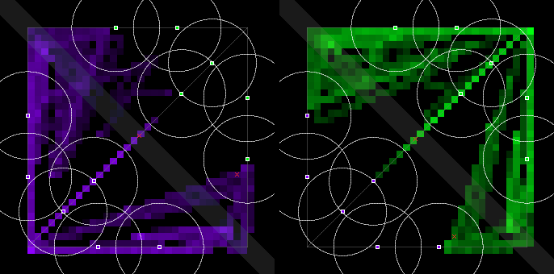
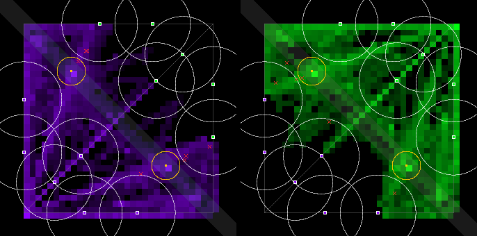

# Bandstand 5: the lane fix, and §9.8's one tuning pass on O2 (2026-10-01)

Ceryce's ruling (Telegram picker, Thu 2026-10-01 ~11:20 CT): **"Fix tie, then O2 pass"**.
- **The tie fix** is #62: targeting rule `own-lane-1`. From its own fountain, a bot heads down its
  own lane before riding the nearest allied minion.
- **This run is §9.8's single tuning pass after Bandstand 4's FAIL**
  ([`bandstand-4-2026-10-01.md`](bandstand-4-2026-10-01.md)), played on top of that fix.
- **Pre-registered lines:** §9.8's ([`docs/economy-spec.md`](../docs/economy-spec.md)), unchanged.

## Verdict

- **The violet lean is gone, as far as 8 matches can show.**
  - **Captures, violet–green:** 12–8 (p = 0.50). Bandstand 4 had 20–7.
  - **Hard vs hard:** 2–1. Bandstand 4 had 11–1.
  - **The first opening:** violet took it 2 times, green 2, and 4 closed untaken. In Bandstand 4,
    violet took 4 of the 5 that were taken.
  - **The fountain rule fired evenly:** 296 times for violet and 294 for green in P2; 148 and 136 in O2.
  - **Medium vs hard, played both ways:** by side 10–7. By tier, medium took 14 and hard 3.
- **As pre-registered (P2 vs O2, both re-played on the lane fix): FAIL, 6 of 10.**
  - **The target fails:** team fights 2.75 a match, against 4.6.
    - Its Δ is now clearly positive: +2.75 [+2.00, +3.63].
  - **Every "objective in use" line passes:**
    - openings contested: 86.8 % (Bandstand 4: 48.8 %);
    - fights at an open stage: 2.00 a match (Bandstand 4: 0.63);
    - captures: median 3.0;
    - capture split: 50 %.
  - **Three keep-lines fail on their Δ-CI clause only:** time under an enemy tower, deaths under
    the killer's tower, and first blood. Every keep-line *level* stays on `pvp-1`'s side of its
    midpoint.
- **On the spec's own wording ("re-run O only"), measured against Bandstand 4's P2: 9 of 10.**
  - Only the target fails (2.75 against 4.6, Δ CI [−0.75, +2.50]). That is §9.8's case 2, and it
    goes to Ceryce under Q17.
- **Why the two readings differ: the lane fix moved the P baseline more than the tuning moved O.**
  - **With every bot taking its own lane, the no-objective game became three lane duels:**
    - 0 team fights in all 8 P2 matches (Bandstand 4: 1.75 a match);
    - PvP damage 353 a minute (from 113);
    - 1.6 % of bot-time under an enemy tower;
    - first blood at 136 s.
  - Against that baseline, adding the Bandstand pulls bots off their lanes and onto the stage. It
    makes all of the team fights, and it also costs some of the duels.
- **Two measurement caveats.**
  1. **§9.8's levels (4.6 fights and the keep-line midpoints) come from the `pvp-1` balance study.**
     That study ran on compiled schemas through `schema_server.py`, so under `first-min`. They
     were set on the play this fix just changed.
  2. **The 4 P2 hard-vs-hard matches are the same match, byte for byte** (120 of 120 checkpoints).
     - With the pilot path mirror-exact, nothing varies a hard-vs-hard match without the
       objective: the seed only jitters minion spawns by ±5 units, which the same step usually
       erases, and Jev gave the same answers.
     - Both sides trade 580 PvP damage a minute, walk home at 65 % together, and nobody dies.
     - So half the P2 "pairs" are one sample, and the paired CIs overstate the evidence.
- **Hard vs hard now freezes at the stage.** Equal numbers on the stage freeze it, as `river-2`
  intends. So 15 of 16 hard-vs-hard openings closed untaken, and there were 3 captures in 4 matches.
- **Deaths before 1:30: 0 in both arms.**
  - **Deaths a match:** O2 2.38 (17 hard, 2 medium); P2 1.00.
  - No `recall-2` channel was broken by damage, and 94–97 % of chosen channels got home.
- **Spend: $1.2442** (approved about $1.40, ceiling $2.00): the smoke $0.0185, P2 $0.6639 and O2
  $0.5618.

## Recommendation for Sunday's gate (10-04)

1. **Merge #62 first, whatever the gate rules.**
   - Until then a Jev match's capture and side results are decided partly by float noise.
   - Every Bandstand number before this run was measured with that lean.
2. **Read this as a Q17 ruling, not an automatic cut. I recommend shipping `river-2-set10` +
   `recall-2` for the Jam.**
   - **The objective does what it is for:**
     - it is the only source of team fights in the fixed game (0 without it, 2.75 with it);
     - its contests happen (86.8 %);
     - the fights are at the stage (2.0 a match);
     - neither side gets it for free.
   - **The keep-line misses are against a lane-duel baseline, not against `pvp-1`.** Every level
     stays on `pvp-1`'s side. The degenerate part of that baseline is the mirror match.
   - **Medium vs hard is the shape the Jam actually plays** (unlike prose against unlike prose).
     There, O2 had 3.5 team fights a match, 3.25 at an open stage, and 17 captures in 4 matches.
3. **If Ceryce reads §9.8 to the letter on the clean comparison, it is a cut.** A keep-line still
   regresses after the one pass. That cut doesn't touch `recall-2`, which stands on its own in P2
   (97 % of chosen channels home, 0 broken, 0 early deaths).
4. **Known costs to accept with the ship:**
   - the 4.6 target is not met;
   - mirror matches freeze at the stage and rarely capture;
   - the 2 s fountain double-recall quirk is still there (46 a match in P2).
   - §9.8 allows no third pass before the Jam.

## The knob, chosen before the run

§9.8, case 2 (the target fails, no keep-line regressed in Bandstand 4) allows **one** tuning pass,
in this order of preference: set length 15 → 20 s, else radius 60 → 80, else Encore +15 → +20 %.
Then it re-runs O only, on the same seeds.

- **Bandstand 4's misses all point at the first knob:**
  - team fights 3.25 against 4.6;
  - openings contested 48.8 % against 50 %;
  - fights at an open stage 0.63 against 1.
  - All three are about contests at the stage, and §9.8 gives the longer set for exactly that: "so
    contests last longer".
- **`river-2` had already halved river-1's set.** One bot fills it in 7.5 s, not 15. So §9.8's step
  is applied in proportion (×4/3, as 15 → 20): `setSec` **7.5 → 10 s**.
  - With 1 / 2 / 3 bots on it, a set now takes 10 / 6.7 / 3.3 s.
  - Nothing else changes.
  - The ruleset is `river-2-set10` (`src/objective/river-2-set10.json`; a test pins it as `river-2`
    except `setSec`).
- **One deviation from "re-run O only": P2 was played again too, on the same 8 slots.**
  - #62 changes how every bot moves, in both arms, so Bandstand 4's P2 is no longer this O2's
    control.
  - Comparing against it would credit the tuning with the lane fix's effects.
  - Both readings are reported. The cost was the ~$1.40 approved for this pass.

## The pre-registered table: P2 vs O2, both on `own-lane-1`

Δ is O2 − P2, seed-paired, with a 95 % bootstrap CI over the 8 pairs, from `--prereg bandstand`.
Full tables: [`bandstand-5-2026-10-01-metrics.md`](bandstand-5-2026-10-01-metrics.md).

| line | metric | P2 | O2 | Δ [95 % CI] | pass line | result | Bandstand 4 (O2) |
|---|---|---:|---:|---|---|---|---|
| target | team fights / match | 0.00 | 2.75 | +2.75 [+2.00, +3.63] | O ≥ 4.6 and Δ CI wholly above 0 | **FAIL** (level) | 3.25: FAIL |
| keep | damage / min, PvP | 352.6 | 194.1 | −158.5 [−330.8, +19.3] | O ≥ 161, CI not wholly below 0 | PASS | 175.5: PASS |
| keep | PvP damage taken in neutral ground | 59.0 % | 77.2 % | +18.3pp [+11.6pp, +24.3pp] | O ≥ 41.5 % … | PASS | 67.9 %: PASS |
| keep | bot-time under an enemy tower | 1.6 % | 3.7 % | +2.0pp [+0.8pp, +3.3pp] | O ≤ 13.7 %, CI not wholly above 0 | **FAIL** (CI) | 6.7 %: PASS |
| keep | deaths under the killer team's tower | 50.0 % | 52.1 % | +29.2pp [+8.3pp, +50.0pp] | O ≤ 75.3 %, CI not wholly above 0 | **FAIL** (CI) | 47.2 %: PASS |
| keep | first blood at, s | 136 | 185 | +94.3 [+38.1, +150.6] | O ≤ 402, CI not wholly above 0 | **FAIL** (CI) | 330: PASS |
| in use | captures / match, median | – | 3.0 | – | ≥ 3 | PASS | 3.5: PASS |
| in use | openings contested, pooled | – | 86.8 % | – | ≥ 50 % | PASS | 48.8 %: FAIL |
| in use | team fights at an open Bandstand / match | – | 2.00 | – | ≥ 1 | PASS | 0.63: FAIL |
| in use | capture split | – | 50.0 % | – | ≥ 50 % | PASS | 50.0 %: PASS |
| reported | bot-time on the opponent's side | 4.3 % | 9.1 % | +4.8pp [+2.7pp, +7.0pp] | – | reported | |
| reported | decided (not a draw) | 0 % | 0 % | – | – | reported | 0 % |
| reported | towers destroyed / match | 0 | 0 | – | – | reported | 0 |
| reported | swinginess, per min | 41 | 66 | +24.5 [+1.8, +50.8] | – | reported | 62 |
| reported | Jev decisions from a Bandstand rule | 0 | 2,159 | – | – | reported | 2,047 |

- **The metric tool's verdict:** target FAIL, keep-lines FAIL, objective in use PASS. Its rule reads
  "a keep-line regresses: one tuning pass; if it still regresses, the objective is cut".
- **"Deaths under the killer team's tower" pairs only matches with deaths in both arms.**
  - P2's hard-vs-hard matches have none, so that line rests on the 4 medium-vs-hard pairs.
  - The same goes for first blood: P2 hard vs hard has no first blood.
- **The Bandstand 4 column is O2 on `river-2` and `first-min`.** It isn't paired with this run;
  it's there for the levels.

## The spec's literal reading: O2 re-run only, against Bandstand 4's P2

| line | metric | Bandstand 4 P2 | O2 | Δ [95 % CI] | result |
|---|---|---:|---:|---|---|
| target | team fights / match | 1.75 | 2.75 | +1.00 [−0.75, +2.50] | **FAIL** |
| keep | damage / min, PvP | 113.1 | 194.1 | +81.0 [+56.2, +107.1] | PASS |
| keep | PvP damage taken in neutral ground | 63.1 % | 77.2 % | +14.2pp [+3.7pp, +24.4pp] | PASS |
| keep | bot-time under an enemy tower | 8.6 % | 3.7 % | −4.9pp [−5.9pp, −3.9pp] | PASS |
| keep | deaths under the killer team's tower | 35.7 % | 52.1 % | +9.5pp [−38.1pp, +54.8pp] | PASS |
| keep | first blood at, s | 227 | 185 | −61.6 [−152.1, +17.5] | PASS |
| in use | the four lines | – | as above | – | PASS |

**9 of 10.** The target fails and nothing regresses. Under §9.8 case 2 that is Ceryce's ruling
(Q17), but this pairing mixes the lane fix into the Δ.

## Captures per match, by side (O2)

Each cell gives violet–green captures, then untaken closes in brackets. Then come deaths
violet–green, the winner, and who took the first opening, at what time. The first tier named is
violet.

| slot | O2 (`river-2-set10`, `own-lane-1`) | Bandstand 4 O2 |
|---|---|---|
| medium–hard, seed 7 | 4–1 (+0), 0–2 d, draw; first: violet at 122.2 s | 3–1 (+1), 0–0 d; first: green |
| hard–medium, seed 7 | 1–3 (+1), 1–0 d, draw; first: green at 123.8 s | 3–1 (+1), 0–0 d; first: violet |
| hard–hard, seed 7 | 0–0 (+4), 1–1 d, draw; first: untaken | 5–0 (+1), 2–1 d; first: violet |
| medium–hard, seed 11 | 4–0 (+1), 1–2 d, draw; first: violet at 122.2 s | 0–2 (+3), 1–0 d; first: untaken |
| hard–medium, seed 11 | 1–3 (+1), 2–1 d, draw; first: green at 126.2 s | 3–2 (+0), 1–0 d; first: violet |
| hard–hard, seed 11 | 1–1 (+3), 1–2 d, draw; first: untaken | 2–0 (+3), 2–0 d; first: untaken |
| hard–hard, seed 42 | 1–0 (+4), 2–1 d, draw; first: untaken | 2–0 (+3), 2–0 d; first: untaken |
| hard–hard, seed 101 | 0–0 (+4), 1–1 d, draw; first: untaken | 2–1 (+2), 3–0 d; first: violet |

| | O2 | Bandstand 4 O2 |
|---|---:|---:|
| captures, violet–green | **12–8 (p = 0.50)** | 20–7 (p = 0.019) |
| hard vs hard, violet–green | **2–1** | 11–1 (p = 0.006) |
| medium vs hard, by side, violet–green | 10–7 | 9–6 |
| medium vs hard, by tier, medium–hard | 14–3 | 6–9 |
| first opening taken by violet / green / nobody | 2 / 2 / 4 | 4 / 1 / 3 |
| … in hard vs hard | 0 / 0 / 4 | 2 / 0 / 2 |
| openings / contested / closed untaken | 38 / 33 / 18 | 41 / 20 / 14 |
| captures per match, sorted | 0 0 1 2 4 4 4 5 | 2 2 2 3 4 4 5 5 |

*p is a two-sided sign test against an even split. It treats captures as independent, but they
cluster by match.*

- **The violet lean is gone at this sample size.**
  - Neither side took the first opening more often, and hard vs hard is level.
  - 20 captures can't rule out a small lean, but the 11–1 and the top-lane pile-up are gone.
- **The first opening now falls at about 2:02, not 1:32.** With the longer set, both teams reach
  the 1:30 opening, and the first capture comes about 30 s into a contest.
- **Hard vs hard freezes.** Two identical pilots bring equal numbers, so the stage holds until the
  close timer (30 s, at most 45 s) shuts it.
  - All 12 of Bandstand 4's hard-vs-hard captures were uncontested, and 11 of them were violet's.
- **In medium vs hard, medium takes the stage (14–3).** Hard walks home at 65 % of max hp, so it
  leaves contests that medium stays in.

## Deaths before 1:30, by tier

| | P2 | O2 | Bandstand 4 P2 | Bandstand 4 O2 |
|---|---:|---:|---:|---:|
| deaths / match | 1.00 | **2.38** | 1.12 | 1.50 |
| deaths before 1:30 | **0** | **0** | 0 | 0 |
| all deaths, hard / medium | 4 / 4 | 17 / 2 | 6 / 3 | 11 / 1 |
| earliest death, s | 136 | 140 | 112 | 201 |

- **More deaths in O2 than in Bandstand 4's O2.** The longer, contested sets keep both teams on the
  stage, and that is where they fight.
- P2 hard vs hard has no deaths at all (see the caveat above).

## Recalls (`recall-2`)

Per match, by how each channel ended. The definitions are Bandstand 3's. "Re-issued at the
fountain" is the double-recall quirk, counted separately and still not fixed.

| | P2 | O2 | Bandstand 4 P2 | Bandstand 4 O2 |
|---|---:|---:|---:|---:|
| started, as the metric tool counts | 116.4 | 73.0 | 94.6 | 90.0 |
| … re-issued at the fountain | 46.1 | 27.0 | 31.0 | 31.8 |
| … chosen recalls | 70.3 | 46.0 | 63.6 | 58.3 |
| got home | 68.0 (97 %) | 43.3 (94 %) | 52.0 (82 %) | 50.4 (86 %) |
| **broken by damage** | **0** | **0** | 0 | 0 |
| dropped: an enemy came into sight, so it walked | 1.25 | 2.75 | 10.9 | 6.5 |
| dropped: another rule | 0 | 0 | 0 | 0 |
| still running at the end | 1.0 | 0 | 0.75 | 1.4 |
| died while recalling | 0 | 0 | 0 | 0 |
| bot-time recalling | 10.8 % | 8.2 % | 8.9 % | 8.3 % |

- **More of the chosen channels get home: 97 % and 94 %, from 82 % and 86 %.** A bot in its own
  lane meets its opposite number, not a crowd. When it gets low, nothing is close enough to make
  it walk instead.
- **P2's recall count is the lane-duel loop.** Both bots trade to 65 %, both channel, both come
  back down their own lane.

## The fountain rule in play

Real decisions only (not the 0.5 s cached repeats) whose move target is the bot's own lane start:

| | violet | green |
|---|---:|---:|
| P2 | 296 | 294 |
| O2 | 148 | 136 |

- **Each fountain visit costs one such decision.** Then the bot follows its own wave out.
- **Bandstand 4, under `first-min`:** in the same situation green's bots went up the top lane 135
  times of 136.

## Where the bots were

Violet's positions are on the left, green's on the right; the gold rings are the two sites.

| P2 (`recall-2`) | O2 (`river-2-set10` + `recall-2`) |
|---|---|
|  |  |

## Setup

- **Branch.** `runs/bandstand-5`: `origin/develop`, which carries #60's 65 % hard trigger, with
  #62 merged in.
- **Backend.** Jev (`jev-latest`, Jev 1.13; TypeSafe default with Workers AI fallback; 0
  failovers), on one private `tools/jev/schema_server.py` on `:8871`, `--budget-usd 2.00`.
  - **Settings:** cadence 2, full 10-minute matches, map `pvp-1`, `--resolution simultaneous-1`,
    `--targeting own-lane-1`.
  - **The house tiers are develop's** (`house-hard.schemas.json`, `house-medium.schemas.json`),
    with nothing recompiled. So no compile ran, and no qwen.
- **Arms.**
  - **P2** = `--recall recall-2`;
  - **O2** = `--objective river-2-set10 --recall recall-2`.
- **Slots.** Bandstand 3's and 4's, in their order:
  - medium–hard and hard–medium on seeds 7 and 11;
  - hard–hard on seeds 7, 11, 42 and 101.
  - Each slot played P2, then O2.
- **Smoke.** Before the arms: hard vs hard, O2's flags, seed 7, 120 s.
  - 0 deaths;
  - 8 channels, 8 home, 0 broken;
  - it replay-verifies.
- **Clean run.**
  - 16 logs with 0 call errors and 0 parse errors;
  - 24,208 Jev calls;
  - all 16 replay-verify.
- **Spend: $1.2442** by the server's own ledger:

| | |
|---|---:|
| smoke (120 s) | $0.0185 |
| P2, 8 matches | $0.6639 |
| O2, 8 matches | $0.5618 |
| **total** | **$1.2442** |

## Logs and reproduction

- **Logs.** The 16 logs are not in git; their names are in `.gitignore`.
  - **Where:** the [`data-bandstand-5-2026-10-01`](https://github.com/kumouri/promptlane/releases/tag/data-bandstand-5-2026-10-01)
    prerelease, as `bandstand-5-match-logs-2026-10-01.zip`, with a `SHA256SUMS`.
  - **To use them:** unzip at the repo root. Each log is
    `runs/bandstand-5-2026-10-01-<P2|O2>-<violet tier>-<green tier>-seed<N>.json`.
- **Reproduce.**

```sh
python tools/jev/schema_server.py --port 8871 --budget-usd 2.00
npm run match -- --a prompts/pilots/house-hard.prose.md --a-schemas prompts/pilots/house-hard.schemas.json --name-a hard \
    --b prompts/pilots/house-hard.prose.md --b-schemas prompts/pilots/house-hard.schemas.json --name-b hard \
    --jev-schema http://127.0.0.1:8871/ --cadence 2 --seed 7 --map pvp-1 --resolution simultaneous-1 \
    --targeting own-lane-1 --objective river-2-set10 --recall recall-2 --out runs/x.json
npm run metrics -- --group P2 runs/bandstand-5-2026-10-01-P2-*.json --group O2 runs/bandstand-5-2026-10-01-O2-*.json --prereg bandstand
```
